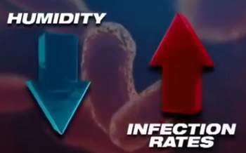

**Dirty electricity** is a form of electromagnetic pollution or radiation. It is also called **EMI** or electrical "noise". It refers to powerful, high frequency electrical energy traveling along the wiring in buildings where only standard 60-Hertz AC electricity **should be**. It is also frequently referred to as harmonic distortion as it interferes with and distorts the fundamental 60 Hertz sinusoidal wave form. This distortion also results in unusable energy that is usually called reactive energy.

The **human nervous system** is in essence an **electrical system** that through **electromagnetism** governs our bodily functions. Because it is electrical, it can be **influenced** by **outside** electrical and magnetic fields which in turn **can impact** how effectively the nervous system and related systems communicate and function. In particular it may result in **neuro-endocrine stress** as a result of its impact on both the sympathetic and parasympathetic control systems. Symptoms such as high blood pressure, sleep disorders due to melatonin deficiencies, nervousness, etc. are common. Multiple studies correlate EMF exposure with diseases such as cancer, neurological disease, reproductive disorders, immune dysfunction, and electromagnetic hypersensitivity. [source](https://saticshield.com/faq/)

>**EMI** = electromagnetic interference  
>**RFI** = radio frequency interference  
>**EMF** = electromagnetic field  

## EMI doubts
1. Do you get electrical buzz when touching the laptop ? Translated into a **90 Hz** vibration!! use **Power Surge** , removes dirty electricity (the **hard disk** will be thankful too!).  
	* [APC PM1W-FR](https://www.apc.com/shop/us/en/products/APC-Essential-SurgeArrest-1-outlet-230V-France/P-PM1W-FR) (**EMI** and **RFI** noise filtering)
		* when 'Maximum Input Current' = 16A  
	can cover 2 laptops + 2 monitors.
1. Play with apartment **electric power box switches**, switch off individually, wait **>= 1h** to see if there is a difference, is not appearing immediately!!! Perfectly, switch off, go for a walk outside.

 

more about [EMF](https://www.pipiscrew.com/threads/electromagnetic-waves.12018)..  

---

## Humidifiers vs Dehumidifiers

**Static electricity**, which builds up inside your home when the rooms are **dry**, actually attracts dust and makes it cling stubbornly to surfaces. Install a humidifier. [source](https://www.bobvila.com/articles/how-to-get-rid-of-dust#install-a-humidifier)  

**Humidifiers** add moisture to the air when it is too dry. Humidifiers in the wintertime to combat the dryness of winter air. Ideal values :  
* humidity 40 - 60%
* temprature 19 - 25°C

**Dehumidifier** take moisture out of the air when it is too humid. Dehumidifiers are used during the spring and summer. 

**Moisture** (aka humidity) levels above 70% are considered high, high levels of moisture may facilitate the **growth** of biological organisms in the environment.  

To determine the **humidity level** in your home pick up a **hygrometer** is cheap, you can find it at a home improvement store. Below 50% use humidifier above 50% use dehumidifier. [source](https://burkholders-hvac.com/humidifiers-vs-dehumidifiers/)  

**Dry air** equals with more **infections**. [video - Humidifiers using 3% hydrogen peroxide](https://youtu.be/uCo5s9mg77o) &nbsp; [[2](https://airlucent.com/hydrogen-peroxide-air-purifier/)]

* (2020) [Might hydrogen peroxide reduce the hospitalization rate](https://www.ncbi.nlm.nih.gov/pmc/articles/PMC7308628/)
* (2014) [Evaluating the virucidal efficacy of hydrogen peroxide vapour (HPV)](https://www.ncbi.nlm.nih.gov/pmc/articles/PMC7132520/) - Virucidal for structurally distinct viruses dried on surfaces

---

**Dust** is a problem for multiple reasons: Tiny particles of skin, dirt, pollen, and dander can coat the surfaces of your furniture and walls, and as gross as it sounds they can also fill your **lungs**, which is why dust is often the underlying cause of **allergies**.

