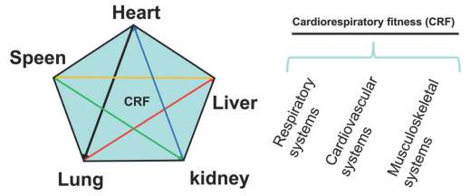

**Aerobic** exercises are continuous exercises that use your body's oxygen as fuel. 

**Anaerobic** exercises are start-and-stop exercises that require huge bursts of energy.

## push-ups

Type : Anaerobic 

[NEXT Workout - Push Up That Will Change Your Life](https://www.youtube.com/watch?v=S_gIr7FfWi4)  

[How to Master the Push-Up](https://www.nytimes.com/2022/05/18/well/move/how-to-master-the-push-up.html)  

## yoga

Type : Aerobic  

Continue [reading](https://pipiscrew.com/yoga/) 

## weights

Type : Anaerobic  

Three days per week, [those](https://vimeo.com/showcase/8220991) target the whole body.  
[MuscleWiki](https://musclewiki.com/) - Find exercises that work specific muscles.  

## sprint

Type : Anaerobic  

Between 2 street lights for example. You **sprint** as much you can in one direction and then **walk back**... Time to **rest** is time to go **back**... This will **help** your **heart** immensely...  

So original is **20 seconds** sprint, **10 seconds** walk, for 10 **rounds**...

But because cant do it from the beginning, you **start** with **10 seconds sprint** and **20 seconds walk**, slowly increase the distance until you get the needed **20 second sprint** and 10 (or 20) **walk**....

Rounds are always 10. Avoid sprinting on asphalt / concrete.

There are generally three different sprint distances:  

* 100m  
* 200m
* 400m  

In an original Olympic event was a sprint of around 180m.  

## squats

Type : Anaerobic  

* [howto](https://youtu.be/YaXPRqUwItQ?t=81)
* also [superman](https://www.youtube.com/watch?v=z6PJMT2y8GQ) / [plank](https://www.youtube.com/watch?v=pSHjTRCQxIw) / [reverse lunge](https://www.youtube.com/watch?v=xrPteyQLGAo) [[2](https://www.youtube.com/watch?v=v791YUqiE-o)] / [body weight rows](https://youtu.be/rloXYB8M3vU?t=48) [[2](https://youtu.be/OYUxXMGVuuU?t=33)] / [more ideas](https://news.ycombinator.com/item?id=40532788)

## tabata protocol

Continue [reading](http://tabataprotocol.com/)  

## walking

Type : Aerobic

* [Benefits of Walking](https://klimy.co/blog/benefits-of-walking)  
* [Don’t Underestimate the Power of a Walk](https://hbr.org/2021/02/dont-underestimate-the-power-of-a-walk)  
* [Why Walking Helps Us Think](https://www.newyorker.com/tech/annals-of-technology/walking-helps-us-think)  
* [Walking improves creativity](https://news.stanford.edu/2014/04/24/walking-vs-sitting-042414/)
* [The benefits of walking and how to get the most out of it](https://www.cbc.ca/life/wellness/the-benefits-of-walking-and-how-to-get-the-most-out-of-it-1.5145418)
* [Better than microdosing: walks in nature](https://victorrotariu.com/2021/06/better-than-microdosing-walks-in-nature/)  
* [7,000 steps can save your life](https://www.axios.com/walking-exercise-10000-steps-c714bf7b-8528-496c-9981-67bc566b1b81.html) ([ref](https://news.ycombinator.com/item?id=30918081))  
* [Walking is good for health but walking faster is even better](https://www.theguardian.com/australia-news/2022/sep/13/step-on-it-walking-is-good-for-health-but-walking-faster-is-even-better-study-finds)
* [How does nature nurture the brain?](https://www.mpg.de/19168412/0905-bild-how-does-nature-nurture-the-brain-149835-x)  

Wendy Suzuki - Why your brain loves it when you exercise
--------------------------------------------------------

* increase levels of neurotransmitters :  

	* dopamine
	* serotonin
	* noadrenaline (aka norepinephrine)
* improve reaction times  
* exercise changes the brain anatomy, physiology and function. Actually produces brand new brain cells.  
* improve attention function Every time you work out, your brain gets a "neurochemical bubble bath".  

[TED video](https://www.ted.com/talks/wendy_suzuki_the_brain_changing_benefits_of_exercise)

[Why your brain loves it when you exercise, plus 3 easy ways to work out at home](https://ideas.ted.com/why-your-brain-needs-you-to-exercise-plus-3-easy-ways-to-work-out-at-home/)

[How can we keep our brains healthy?](https://www.ted.com/playlists/644/how_can_we_keep_our_brains_healthy)  

[Exercise keeps your brain healthy and protects it against depression (2021)](https://theconversation.com/the-exercise-pill-how-exercise-keeps-your-brain-healthy-and-protects-it-against-depression-and-anxiety-155848)  

Why Morning Exercise Sets You Up for Success
--------------------------------------------------------
When you **elevate your heart rate** through exercise, it **increases blood flow** throughout the **body**. Your blood among other things **carries oxygen and glucose**. Oxygen and glucose are **fundamental** fuel components for most of the chemical reactions in our body. The **brain** uses **glucose** for fuel and accounts for about 20% of our daily glucose consumption, which is impressive given that the brain makes up only about 2% of our bodyweight.

Increased blood flow increases oxygen delivery, which is one of the reasons you feel **clear headed after exercise**. Short story, exercise increases the **delivery** of **key nutrients** to the brain. But that isn’t the interesting part, because when you finish exercising the increased blood flow will start to decline as your heart rate returns to its baseline. The fascinating and awesome thing is what happens after you exercise.

**Executive Function** is a term used by psychologists and some neuroscientists to describe **our ability to engage in goal-directed behavior**. It can be thought of as the collection of processes in your brain that **act as “CEO”** of your brain. Specifically, it covers our ability to manage and control the following things (technical terms in parentheses):

* Sustained attention (Selective Attention)
* Moving from one task to the next (Task Switching)
* Managing our impulses (Inhibitory Control)
* Holding information in our mind that we need to solve problems or complete tasks (Working Memory)
* Planning and execution
* Adaptation to new information or unfamiliar situations

**Executive function** is a big deal. When it functions well you’re **better** able to make choices that align with your goals, **focus** on what’s important to you, hold your tongue when your significant other says something that upsets you, **learn** new information, and **solve** problems.

When you exercise your brain both elevates and balances the levels of the **neurotransmitters** dopamine, norepinephrine, and serotonin. All three are **highly involved** in **executive function** because of their action as **regulators** of important **signaling processes** in the brain.  

**Dopamine** is involved in learning, attention, and our reward system, which helps us associate goal-oriented behavior with satisfaction.  

**Norepinephrine** influences attention, perception, motivation, and arousal (the technical term for being alert and able to respond).  

**Serotonin** influences mood, impulsivity, anger, and aggressiveness with research pointing to it as a regulator of mental activity that gets out of balance. That means serotonin can help prevent something like depression from spiraling out-of-control.

The key is that **physical** exercise elevates and balances the levels of the neurotransmitters associated with executive function. Many of the drugs psychiatrists **prescribe** work by addressing neurotransmitter levels that are either high or low. **Zoloft**, for instance, increases synaptic levels of serotonin, while **Adderall** increases levels of dopamine, norepinephrine, and epinephrine (adrenaline). The brain is a **highly interdependent system** and **when** neurotransmitter levels are **out-of-balance** cognitive function can be impaired and mood disorders can **occur**. In fact, many of the side effects from drugs **prescribed** by psychiatrists occur because in the process of elevating or suppressing a specific neurotransmitter the **overall balance** in the brain **isn’t** quite where it needs to be.

> Dr. John J. Ratey said : I tell people that going for a run is like taking a little bit of Prozac and a little bit of Ritalin because, like the drugs, exercise elevates the neurotransmitters.

Students that **exercise before** school **perform better** in school.

Exercise also **increases** the production of a protein called brain-derived neurotrophic factor (**BDNF**). The human brain has over **85 billion neurons**, which along with glia are the cells that compose the brain. Neurons receive information from the environment, communicate changes to other neurons through electrical and chemical signals and control the body’s responses to the environment. Neurons are the “thinking” portion of the brain.

**BDNF** improves the function of neurons, encourages the growth of neurons, and protects existing neurons from cell death.  

[source](https://frankcdale.com/when-you-exercise-is-as-important-as-how-21191f683a03)

--

# Percussive massage guns

* [Massage Guns](https://www.nytimes.com/wirecutter/reviews/best-massage-guns/)
* [headquarters - Theragun](https://www.therabody.com) - see about page - `unknowingly creating the first Theragun`

--

* [What Are the Advantages of Nose Breathing vs Mouth Breathing?](https://www.healthline.com/health/nose-breathing)
* [13 Benefits of Working Out in the Morning](https://www.healthline.com/health/exercise-fitness/working-out-in-the-morning)
* [Benefits of Morning Exercises](https://www.auroramornings.com/blogs/the-matinee/best-morning-workouts)
  * [Exercise boosts blood flow to the brain](https://www.eurekalert.org/pub_releases/2021-03/usmc-ebb032321.php)
  * [Excessive exercise training causes mitochondrial functional impairment and decreases glucose tolerance](https://www.sciencedirect.com/science/article/abs/pii/S1550413121001029)
* [Iowa University - Exercise may reduce depression symptoms, boost effects of therapy](https://www.news.iastate.edu/news/2022/03/30/exercise-depression)
* [Brisk 22-minute walk could offset harmful effects of sitting](https://www.theguardian.com/society/2023/oct/24/brisk-minute-walk-offset-harmful-effects-sitting-study)  

--

# Cardiorespiratory fitness

> **HIIT** (High-Intensity Interval Training)  
> **RT** (Resistance Training)  
> **MICT** (Moderate-Intensity Continuous Training)  
> **IT** (Interval Training) - alternates between periods of high-intensity exercise and periods of lower-intensity exercise.  
> **SIT** (Sprint Interval Training)  
> **CRT** (Circular Resistance Training)  
> **CRF** (Cardiorespiratory Fitness)  

Cardiorespiratory fitness CRF **refers** to the capacity of the circulatory and respiratory systems to supply oxygen to skeletal muscle **mitochondria** for **energy production** needed during physical activity. It is an **intermediate variable** between physical activity behavior and health outcomes and **reflects** the ability of many body organs (such as heart, lungs, and muscles) to generate **energy** during physical activity and exercise.  

The current physical activity **guidelines** recommend that all adults engage in at least **150 min** of <u>moderate-intensity</u> exercise or **75 min** of <u>vigorous-intensity</u> exercise **per week**. To improve CRF, current evidence suggests that physical exercise must achieve a minimum intensity of at least 45% of the oxygen absorption reserve in the general population and at least 70–80% in athletes.  

**HIIT** has been promoted as a **superior**, <u>time-saving exercise</u> strategy to enhance CRF in the **middle-aged (ages 45-59 years)**. A systematic review of evidence suggested that both interval training and MICT could significantly improve CRF in middle-aged and elderly people; however, MICT has no significant effect on improving VO2max (maximum amount of oxygen your body can utilize during intense exercise) in middle-aged compared with HIIT and sprint interval training. However, **HIIT is still the preferred training method**.  

> **ANS** (Autonomic Nervous System)  
> **HRV** (Heart Rate Variability)  
> **HR** (Heart Rate)  
> **PA** (Physical Activity)  
> **PR** (Pulmonary Rehabilitation)  

Cardiovascular function is **regulated** by the ANS. The main objective of autonomic cardiovascular regulation is to control cardiac output and the **distribution** of blood at the central and peripheral levels. HR and the contractile properties of the myocardium, are modulated by the main components of ANS: the **parasympathetic** and **sympathetic** nervous systems. The activity of these two **ANS branches** with <u>opposite effects</u> on HR causes continuous fluctuations in HR, which is called HRV.  

Under normal conditions, the **conduction process** begins in a particular area of the heart, named the **atrial sinus node**, whose **electrical properties** can generate the action potential that spreads quickly through specialized **fibres to the heart**, resulting in **contraction** of the **entire cardiac muscle**. In addition to this intrinsic mechanism that determines the basal cardiac rhythm, the ANS plays an important role in controlling the **heart function** and **vascular system** through the **sympathetic ** and **parasympathetic fibres to the heart**, and through the **sympathetic fibres** to the **vessels**. The **two branches** of the ANS, i.e., the sympathetic and parasympathetic fibres, act in an <u>opposite way</u>, providing **fine adjustment** to the cardiac tissues **in response** to different stimuli and daily activities. However, an **imbalance** between **sympathetic ** and **parasympathetic ** drives has been proposed as a potential mechanism in some cardiovascular diseases such as arterial hypertension, heart failure, and myocardial infarction.  

  

*The ability of yin and yang to sustain cardiorespiratory fitness level of exertion is dependent on the integration of the respiratory, cardiovascular, and musculoskeletal systems.* 

[source](https://href.li/?https://www.intechopen.com/books/11656)  

references :  
* video - [20 Minute Full Body Cardio HIIT Workout](https://www.youtube.com/watch?v=M0uO8X3_tEA)  
* Jumping Jacks - [5 Exercises for HIIT Beginners to do in 10 Minutes](https://www.lifemark.ca/blog-post/5-exercises-hiit-beginners-do-10-minutes)  [[all variants](https://www.youtube.com/watch?v=DbWxZIfyTAg)]  