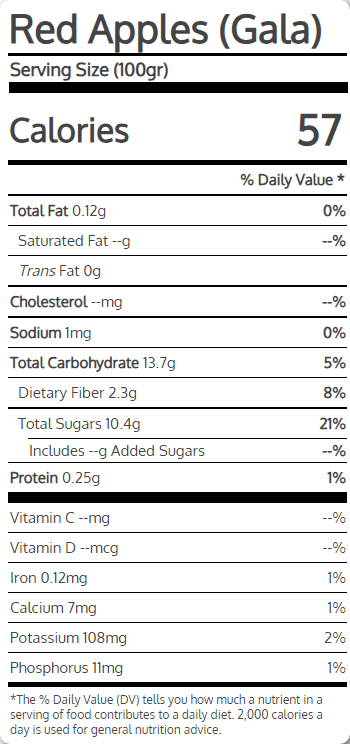
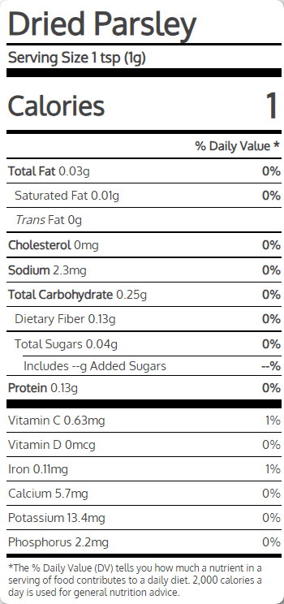

The following data, have source the [USDA Food Data Central](https://fdc.nal.usda.gov/).  

Remember those data are `ancient`, calculate accordingly by the year you living now. 😃

Is just a mockup to show where a specific food `fail` or not. By clicking any image you going to [myfooddata](https://tools.myfooddata.com/nutrition-facts/).

## animal

  

  

  

## vegetables

  

## fruits

  

## herbs

  

* find you [dietary reference intakes](https://www.nal.usda.gov/human-nutrition-and-food-safety/dri-calculator) (DRI) by USDA (change the metric system)
  * exceeded protein (aka [non complete protein](https://pipiscrew.github.io/timeline/#/health/introduction?id=proteins)) turned to glucose (carbohydrates)
    * exceeded protein illustrated on **UREA** blood test (getting high)
* if you need carbohydrates, at least, do it the right way. Stay **low carb** during the day and then have one higher carb meal at the end of the day. Works best in the evening, at the end of your eating window. Try to keep **net carbohydrates** (carbs minus fiber) less of 100 grams a day (max : two potatoes OR 1/2 cup of rice OR four apples)
  * **protein meal** is when protein grams are equal or higher than the energy grams (fat plus net carbs)
* always follow the **12h fasting** (example 8pm - 8am) 
  * liver glycogen drops
  * gut starts cleansing processes
* **walk** after lunch, 10 minutes (1km), is major help for digestion
* [PE Diet - Meal protein-fats-carbs percentage](https://href.li/?https://proteinpercent.com/) + food database

> If you overfeed someone with **fat**, you do **not** increase their cancer risk at all. You overfeed someone with **carbohydrates** and you dramatically **increase** their cancer risk. And protein is halfway in between. ([Dr. Craig B. Thompson](https://www.mskcc.org/about/leadership/office-president/craig-b-thompson-biography), the head of Memorial Sloan Kettering)  

---

# cutted by Ted Naiman - The PE Diet

* [homepage](https://href.li/?https://pedietbook.com/)  

The ultimate strategy for maximally up-regulating fat oxidation (body breaks down fat molecules and converts them into energy) ? Never eat any carbs to **begin** with. This is certainly the strategy of those who go on a pure carnivore diet and it be honest, this **works** pretty damn well for a growing number of people. But there are **some reasons** why you might want to **include** some **carbs** in your diet.  

When your **liver glycogen** is completely empty, your `sympathetic nervous` system (increased heart rate / dilation of the airways / inhibition of digestion / release of adrenaline) is more active. This is sort of your `fight or flight` mode. People are usually more alert and more focused when they are low on liver glycogen. This is where some of the **mental benefits** of `ketosis` come from. It makes sense from an evolutionary perspective to be more **alert** and **active** when you have the highest need to look for food. After a **large carbohydrate** meal, however, with lots of liver glycogen storage, our `parasympathetic nervous` system (slowing heart rate / constriction of the airways / stimulation of digestion / promotion of restorative functions) is activated. this is `rest and digest` time. This is **why we feel so tired and sluggish** after a giant lunch of pasta or some other **carbohydrate bomb**. If you have difficulty sleeping on a very low carbohydrate diet, you could eat carbs once a day (maybe 100 grams or so) and time this in the **evening**. `Timing carbs` in the evening has a few benefits. first of all, your **sleep** might **benefit** from the `parasympathetic dominance` of the **carb fed state**. And of course you will be more **alert** during the day, when your glycogen is low after your **overnight fast**. Secondly, by eating carbs in the **evening**, you are possibly less likely to be effected by the downstream hunger that can occur 3-4 hours after eating carbohydrate.  

**High-intensity exercise** of extended duration will definitely **require carbohydrates** during the event. **Even** the most fat-adapted **elite athletes** can only participate in maximum intensity exercise for 2 hours at the very most before completely running out of muscle and liver glycogen and `hitting the wall`, a state of `hypoglycemia` where your body pretty much **stops** doing what you have been asking it to do. Typically anyone who is engaging in very high intensity exercise for anything over an hour will **benefit** from some **carbohydrate** during the event.  

Carbs may **offer** a significant **satiety** benefit for some people. For example, if you are **hungry** and you are in a **low glycogen** state, it might take hundreds of calories of fat and/or protein for you to feel even slightly less hungry. But **at that moment**, some people might feel far more **satiety** from just a **small** quantity of **carbohydrate**, as it is really that **liver glycogen** they are looking for **rather than** more **fat and protein** calories. When using carbohydrates for satiety, you really want to **choose** foods with the **very lowest energy density**. In other words, pick foods with as much water, fiber, and protein as possible. These foods will provide the **highest satiety** for the **lowest actual carbohydrate** content. If eating zero carbohydrates ever was the ultimate secret to leanness, every single bodybuilder would be on a zero carbohydrate pure carnivore diet. `But that is not the case`. Instead, physique athletes choose the foods that provide the highest satiety for the lowest amount of energy. In practice, these foods are usually very high in protein, fiber, water, and micronutrients (with very **judicious** and strategic use of carbohydrates and fats).  

If you want to maintain maximal metabolic flexibility, it really does **not** make much **sense** to never eat any **carbohydrates** ever. But it DOES make sense to have very clear periods of time when you are in a **carb-depleted state** of maximal fat oxidation (read: ketosis), as well as times when you do have incoming dietary carbohydrate to deal with (instead of fat). Probably the easiest way to implement this is **intermittent fasting**, and **limiting** glycemic carbohydrate frequency. Our favorite way of accomplishing this in real life? `Stay very low carb during the day and then have one higher carb meal at the end of the day` (keeping protein percentage as high as possible, of course).  

> **Carbs** are unique in that they offer an initial **satiety for a few hours**, followed by a literal **increase** in hunger as blood sugar **falls**. But for now, the goal is targeting **protein** first and **foremost**.  

>  Meat, eggs, and green vegetables are **good**, grains are **bad**. fish is the greatest thing **ever**, and sugar and oil are the worst things **ever**.  

> Start with one or two **protein sources** in your meal (e.g. beef and eggs) and then include some **veggies**. Simple as that!  

* Always choose animals that are eating what THEY are supposed to be eating.
* Opt for grass-fed meats, free range organic chicken, and pastured pork when possible.
* Opt for pasture-raised, organic eggs when possible. Opt for wild-caught fish and seafood when possible. 
* Always buy the highest quality that you can afford.  

Remember, you want to keep dietary **fat moderate**. This is not popular `Keto` where you are `dousing` everything in butter and MCT oil. It’s best to **simply** consume whole food fats (meaning the fats you’re already getting from your meat, eggs, and seafood sources).  

We recommend minimizing nuts, cheeses, butter, dark chocolate, avocados, and other high fat foods—these extra fat calories can add up fast! Rather, prioritize protein-dense foods like beef and eggs while incorporating fibrous leafy greens and other high protein and mineral foods.  

> If consuming some occasional carbs, try to **avoid** eating fat at the **same** meals.  

Your body is **designed** to smoothly **transition** between two different and opposing states: `Fed`, and `Fasted`. In the `fed` state, **insulin** is **elevated**, and this signals your body to **store** excess calories in your **fat cells**. In the presence of insulin, the **burning** of fat is **reduced**, while the body burns **glucose** (from your last meal) instead.  As we mentioned before, the primary signal of the `fed` state is glucose **entering** the body from the diet and being **stored** in the `liver as glycogen`. In the `fasted` state, liver glycogen has gradually **drifted down** to baseline, and with it **declines** blood glucose and insulin. In the `fed` state, insulin and glucose and glucose **oxidation** (burning) are all increased, while in the `fasted` state, **insulin is low** (while glucagon and fat oxidation are elevated). When you are in the `fasted` state, the body **ramps up** its mobilization of **stored body fat** from your fat cells and is **actively** burning this fat for energy (**instead** of glucose).  

The practical **importance** of all this? You are more likely to burn **stored body fat** while in the `fasted` state, and you are more likely to **store body fat** while in the `fed` state.  

**Unfortunately**, over time we seem to be spending less and less of our time in the `fasted` state and more and more time in the `fed` state. As a result, our bodies and our cells spend less and less time mobilizing and burning stored body fat for energy, and the **glucose-burning pathways** are `overused`.  

Sadly however, we tend to overeat **carbs** and **fats** together, and of course now you know why this combo is `irresistibly tasty and addictive`.  

Over time, this overeating **leads** to **excessive fat gain** and the subsequent **energy toxicity** of **insulin resistance**, or `metabolic syndrome`: abdominal fat storage, high triglycerides, low HDL, and elevated glucose with eventual type 2 diabetes (1 in 12 humans on earth currently have full blown type 2 diabetes, while 35% of adults and 50% of older adults have Metabolic Syndrome, or pre- diabetes).

Most people with `insulin resistance` are **disproportionately burning glucose** on the **cellular** level, and they often **displace** burning body fat due to the amount of dietary glucose coming in from carbohydrates. When these people **run out** of glucose from their last meal, instead of easily **transitioning** over to the `fasted` state to **burn fat**, they become hungry for more glucose (from carbohydrates) as their bodies and cells have `decreased capacity for` mobilizing and **burning fat** for energy.  

The cells can burn either **glucose** (sugar) or **fat** for `fuel`, and over time they will have a **preference** for one over the other, `sugar burners` have increased the **cellular pathways** that burn **glucose** and **decreased**, the **underused pathways** for burning **fat**. So what happens to the overweight `sugar burner` who stops eating for a few hours? As they **run out** of **glucose** from their last meal, **instead** of seamlessly **transitioning** to the fasted state and mobilizing and burning stored body fat, they **become HUNGRY for MORE GLUCOSE**, from carbohydrates! They will spend most of the day trapped in a **cycle** of `eating every few hours`, spiking glucose, and then **becoming hungry** when blood sugar drops.  

## Fat Adaptation
Humans have the ability to become `fat-adapted` and **improve** their ability to **fuel** themselves with stored body fat **instead** of glucose. However, this takes time and practice, and your body has to do a number of things to slowly **increase** your **fat-burning pathways**. This includes **improving** insulin sensitivity to lower insulin and promote fat mobilization into **free fatty acids** from the `adipocytes` (fat cells) as well as up-regulating the fat-burning pathways at the cellular level.  

There are several ways to improve `fat adaptation` (the ability to successfully burn stored body fat for energy), and these include the following:  
* **Low carbohydrate diets** - Eating a low carb diet improves the body’s ability to utilize fat for energy rather than glucose. 
* **Exercise** - High-intensity exercise depletes glucose and glycogen rapidly, forcing the body to switch over and utilize more fat for fuel. Exercise also improves insulin sensitivity.
* **Caloric restriction**
* **Intermittent fasting** and spending more time in the fasted state, which gives the body more `practice` at burning fat.  

> Spending time in the fasted state is actually a form of exercise, a **METABOLIC WORKOUT**!  

`Fasting` does all of the following great things:  
* Decreases blood glucose. 
* Decreases insulin level. 
* Increases insulin sensitivity. 
* Increases lipolysis and free fatty acid mobilization. 
* Increases cellular fat oxidation. 
* Increases glucagon (the opposite of insulin). 
* Increases growth hormone (the opposite of insulin).  

**Extending** your time in the **fasted state** is actually a form of `metabolic exercise`, in which you **train** your body to rapidly and efficiently mobilize **free fatty acids** from your `adipose stores` (fat tissue), something you absolutely can get **better and better** at with the metabolic *practice* of fasting.  

Train yourself to `eat two meals` a day (and eliminate snacking). The easiest and best way to accomplish this? Leverage your natural overnight fast by **skipping breakfast** (drinking coffee makes this easier and more enjoyable, plus coffee has numerous health benefits). No breakfast, lighter lunch, and larger dinner also maximizes the **body natural shifts** between sympathetic (`fight or flight`) and parasympathetic (`rest and digest`) nervous system tone, with higher alertness and activation from `sympathetic tone` during the day while under-eating, and higher parasympathetic `resting tone` in the evening during the fed state.  

Typically, the `fed state` starts when you begin eating and for the next **three to five hours** your body digests and absorbs the food you just ate. Insulin rises significantly, to some degree **shutting off** fat-burning and also triggering **excess** calories to be stored as **fat**. After the first few hours mentioned above, your body goes into what is known as the `post–absorptive state`, during which the components of the last meal are still in the **circulation**. The post–absorptive state lasts until `8 to 12 hours` after your **last meal**, which is when you **enter** the **fasted state**. `It typically takes 12 hours after your last meal to fully enter the fasted state`.  

When you’re in the fasted state your body can **burn fat** that has been **inaccessible** during the `fed state`. Because **we don’t completely enter** the `fasted state` until around **12 hours after our last meal**, it’s rare that our bodies are in this fat burning state in the modern food environment. This is one of the reasons why many people who start **intermittent fasting** will lose fat without changing what they eat, how much they eat, or how often they exercise. Fasting **puts** your body in a `fat burning state` that you rarely get to enter during a normal eating schedule.  

Eating carbohydrates, especially `refined carbohydrates` with no fiber, **overdrives** the `fed state`, as carbohydrates raise both **glucose** and **insulin** higher than other **macronutrients**. In general, when you eat a meal, your body spends a **few hours processing** that food and burning what it can from what you just consumed. Because it has all of this readily available, **easy to burn energy** in its blood stream (thanks to the food you ate), your body **will choose** to use **that** as energy rather than the **fat** you have **stored**.  This is ESPECIALLY true if you just consumed **carbohydrates**, because these are rapidly `converted to glucose` and your body **has** to burn sugar as energy **before** any other source (you have limited glucose storage, and high glucose is `toxic`, your body burns extra glucose **preferentially** to **get rid** of it, much in the same way that the body burns **alcohol consumed** for energy prior to other energy calories, alcohol therefore also **sabotages** fat loss).  

> Once you have **passed** the 12 hour mark from dinner the night before, you are **truly in a fasted state** and you begin to **rely** on stored body fat for fuel. If you can maintain this intermittent fast for 20 to 24 hours you will achieve a very high rate of `lipolysis` (breakdown of stored body fat into free fatty acids, available for burning in the cells) and fat oxidation (burning of fat in the **mitochondria**).  

> Following a **low carb** diet **pairs** nicely with intermittent **fasting**. It is perfectly fine to **exercise** while fasting, either cardio or lifting weights.  

## Nutrient hunger

Your body is the most `complicated chemistry lab` in the `entire universe`. Every second, there are `trillions of chemical reactions` taking place in your body. In order for all of this to function, you need a lot of `STUFF`. And except for `air` and `water` and `sunlight`, all of this `stuff` comes directly from your `diet`. You need **dozens** of  
* vitamins 
* minerals
* essential amino acids
* essential fats  

from your diet, and if you don’t get these, things are going to **stop working properly**. Thankfully, your body gives you some hints when you are low on raw materials but the **main signal** of hunger is a bit non-specific. We know from human and animal studies that if you have a specific dietary deficiency (protein or minerals), for example you will be **hungrier** and more driven to **eat**. What your `poor body` doesn’t know is that most of the food in your **environment** is food like `garbage`. So you eat and eat, but you might not **get** what your body is **looking** for. **Non protein** ENERGY is everywhere but protein and minerals are **few** and far between. So we are getting fatter in our **ill fated** attempts to **supply** our bodies with the things they `really` need. The **primary goal** of your body is to `keep your DNA alive` long enough to **pass** it on to the next **generation**.  For this reason, your very best strategy is targeting `NUTRIENTS first`, by eating **protein** and other **nutrient dense foods** first and **foremost**.  

It is a `scientific fact` - there is `ZERO requirement` for **carbohydrate** in the human **diet**. But the **reality** is that you **DO need glucose**, at **all times**, just to stay **alive**. Your **liver** can make all the **glucose** you need **out** of **protein**, but this is a **little more difficult** than **just eating** all your **glucose** (especially eating glycemic carbs 8 times a day, for 16 hours out of every 24, like the average American).  

> Putting a bunch of fat in your coffee allows you to push your first meal out a few hours. But this fat is nutritionally empty and is just more fat you have to burn to reach your goals.  

## Superfoods
* Grass-fed beef 
* Pastured eggs 
* Wild-caught salmon 
* Plain Greek yogurt 
* Low sugar fruit 
* Shellfish
* Chicken breasts  

Set yourself up for success by having these foods available as **often as possible**. Keep **emergency** protein sources nearby (our favorites are hard) **boiled eggs** and individually packaged [beef sticks](https://www.aufschnittmeats.com/products/aufschnitt-meats-original-beef-jerky) without sugar. If you are eating **carbohydrates**, make sure you have some `low energy density high satiety` choices available, like :  
* apples
* carrots
* berries
* potatoes  

fiber sources :  
* arugula
* endive
* broccoli
* spinach
* kale
* turnip greens
* Chinese cabbage
* mushrooms
* artichoke
* cauliflower
* watercress
* collard greens
* celery

> If you are actually hungry, eat **protein**.  

Animals are at a **higher trophic** level than plants. Because they are higher on the food chain, they automatically **bioaccumulate** more protein and minerals and micronutrients, and **eating** animals always provides **higher quality protein** and a **higher density of nutrients**.  

**Plants** create all `dietary ENERGY`, storing `solar energy` as CARBS and FATS. Plants create all `dietary PROTEIN`, using `nitrogen` and other `minerals` from the **soil**. `Animals` receive both of these by **eating plants** (or other animals that have **eaten plants**).  

## cooking
`carbs + fase` this **combination** is **rarely** found in **nature**. These foods produce a **drug** like `dopamine reward` in the brain and are `highly addictive`.  

It is easier than ever to go through your entire life **without cooking**. Unfortunately, this has been an **unmitigated disaster** for our **health**. The reality is that everyone who is in the **business of selling food** is trying to **profit** as much as possible. And when you are trying to profit from selling food, the `less protein` you give people **the better**.  

> Kosher salt

* heating the pan (medium high heat for a couple minutes)
* add a few tablespoons of oil
* when the oil starts to shimmer add the **meat**, after 3 minutes turn side, leave it for 3 minutes  

### day 1
* (morning) coffee with cream
* (lunch) grilled chicken
* (snack) raw vegetables
* (dinner) tbone steak with asparagus  

### day 2
* (morning) bone broth
* (lunch) salmon with asparagus
* (snack) hard boiled eggs
* (dinner) pot roast  

### day 3
* (morning) black coffee
* (lunch) 2 eggs with bacon
* (snack) sardines with olive oil
* (dinner) lamb chops  

### day 4
* (morning) tea
* (lunch) cobb salad
* (snack) salami and cheese
* (dinner) chicken wings  

### day 5
* (morning) coffee
* (lunch) strip steak
* (snack) greek yogurt
* (dinner) turkey with vegetables  

### day 6
* (morning) coffee with cream
* (lunch) beef burgers with cottage cream
* (snack) beef jerky (sugar free)
* (dinner) liver with onions  

### day 7
* (morning) diet soda
* (lunch) bacon wrapped salmon
* (snack) oysters with lemon
* (dinner) smoken salmon omelette  

## Exercise

Exercise has a singular purpose: self-improvement. If done correctly, exercise provides a stimulus to your body that leads to **positive adaptation**. The adaptations to exercise are numerous, and can include increased muscular strength and size, improved **stamina**, improved **cardiovascular** fitness, an increase in **metabolic rate**, improvements in **glucose metabolism**, and increased **fat oxidation**. **Diet is important**, but you will never reach your health and body composition goals without **proper exercise**!   

> Fat **exits** your body via **mitochondria**. Training **doubles** your mitochondria.