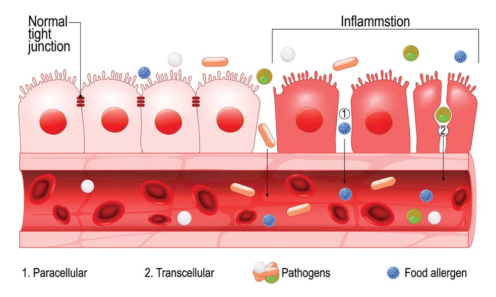
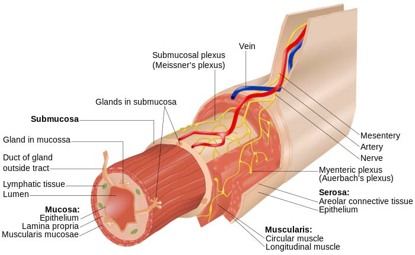
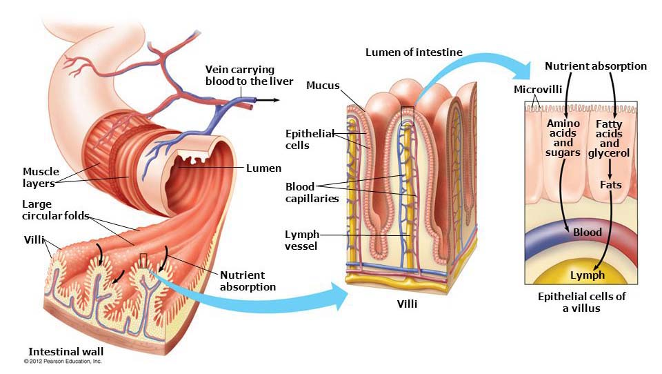

## introduction

Human vandalized his body every day. Take a look, what is as raw food in comparison of what you eat. If you consider that :

* 80% of immune system is on gut.
* till as 2022, doctors they not taught about small intestine, even gastrologists going till the entrance of [duodenum](https://www.innerbody.com/image_dige02/dige21.html) (the first part of small intestine).  

we have to be more protective for our **gastrointestinal system**.  

Have in mind that **garlic**, **antibiotics** destroy the intestinal microflora (kill bad & good bacteria). They saying, that, when take 1 pill antibiotic, to recover as was, takes 6 months. Thats why the **new ERA** doctors when prescribe antibiotics always add probiotics as well (2 hours before or after the bomb).  

**Probiotics** (green / animal) are the good bacteria that should be present in a healthy intestinal tract.  

**Prebiotics** (aka fermentable fiber) is what good bacteria eating to thrive, grow, properly colonize, and ensure they do not quickly **die off**....  

-----  

In a very short description, on how it works, when you eat something goes to stomach then to [small intestine](https://www.britannica.com/science/small-intestine) (where the absortion is made) then throw the waste to [large intestine](https://www.britannica.com/science/large-intestine) then poop.  

This **century** health problem, has to do with **small intestine**. More and more new diseases popping out. Responsible is what we eat, or more specific how the `raw` products we buying from super market `cultivated`, `grow`, `prepared` and `preserved`. Something change on production line (compared to previous century) yeah the people made more greedy and profitable....  

And guess what(?), still, there is no **home device** to drop a food and analyze it if is good/bad for eating... Anyway, the consumer has to rethink what is buying as `food` because in most situations is not `food`, is garbage.  When garbaging your body for years diseases occurring.  

This affect any mothefucker, vegan or carnivore.  

## realization & diagnosis

2020 - A team, led by Magnus Simrén, MD, PhD, Professor of Gastroenterology at Sahlgrenska Academy, University of Gothenburg, found nearly **40% of adults suffer from a functional gastrointestinal disorder** in a 73,000 people, 33 country survey.

`leaky-gut` is the precursor to food sensitivities, rashes, hormones imbalance, cognitive issues, and even autoimmune disease.

You can not feel anything at the moment and nobody can diagnosed **leaky-gut** except if you do [Zonulin poop examination](#zonulin) or a `Pathological examination by Bioresonance` (find doctor with [Asyra](https://www.asyra.co.uk/)), there will show **epithelial cells** have a gap (aka inflammation).. When there is gap on epithelial cells **shits** going in to your blood stream, unfiltered.  

  

read more [here](https://www.gastrosav.com/blog/leaky-gut-what-it-is-and-how-to-heal-it/).  

The body starts with a **skin condition** like flares, rashes, hives, papules, eczema, dermographism, gynecomastia due high estrogen hormone, you name it... Then the **traditional doctors** can diagnosed histamine intolerance / IBS / Crohn / Colitis...  

I would like to point out that `Interventional Radiology` doctors can diagnose **gastrointestinal cysts**.  

`histamine intolerance` is assumed to be due to a **deficiency** of the gastrointestinal (GI) enzyme `DAO` (diamine oxidase) and, therefore, the food component histamine not being degraded and/or absorbed properly within the GI tract.   [source](https://www.ncbi.nlm.nih.gov/pmc/articles/PMC8069563/)  
Since your intestines are where most of the `DAO` enzyme is produced, your body may produce less DAO when the **gut is inflamed** (`leaky-gut`), thus leading to a build up of histamine.  [source](https://rootfunctionalmedicine.com/curing-histamine-intolerance)  

## food

I can understand, that till now, some people, eat to insure that are not hungry.. You have to delete this from your dashboard and take care seriously what you add to your mouth... There is no special recipe, each person is different, you have to perform tests on your daily foods. From my understandings the following must be avoided on all situations : 
* garlic
* vinegar
* tomato
* chocolate (except small portions of [Milka](https://www.milka.be/) (ganze haselnusse / plain) or [Magnum](https://www.magnumicecream.com/us/en/flavors/icecream-bars/double-chocolate-ice-cream-bar.html))
* ham
* milk
* aged cheese
* wine
* spinach
* can foods (tuna included)
* yogurt
* fermented foods (example pickle / kombucha / kimchi / sauerkraut)
* curcumin
* spicy (even pepper or oregano)
* limit bread
* limit vegetables  

easy to cook 5 days schedule : 
* pasta (130gr) w/ frozen vegs (100gr)
* meat (chicken breast / liver / pork tomahawk) (~250gr-300gr) w/ 80gr rice
* pasta (130gr) w/ scrambled eggs (3)
* fish (COD / tuna / salmon) fresh or frozen (~250gr-300gr) w/ 80gr rice
* legumes (blackeye / lentils) (100gr)

when eat outside (max 2 days / week) preferred cuisines :
* Asian
* Vietnamese
* Thai  

those cuisines don't have garlic or tomatoes in their plates....  

* pasta prefer `durum wheat`, soak for 15min, when is not spaghetti.
* rice ( jasmin / basmati ) soak for 15min.
* for liver [soak in milk](https://therustyspoon.com/why-do-you-soak-liver-in-milk-before-cooking/)
* for beans soak overnight, make sure cooked for 1h
* do [spouting](/health/sprouting.md) with mung beans (aka green small beans), eat 3 times / day one palm.
* breakfast bran or oat flakes or [granola](https://www.healthline.com/nutrition/muesli-vs-granola). (50gr with 140gr water)
* eggshell must be hard, when soft is nutritionless.  
* half cucumber / day
  * B12 - may help to reduce inflammation in the gut.
  * Vitamin K - important for proper blood clotting, may have anti-inflammatory effects in the body.
  * Magnesium | Potassium | Manganese | Vitamin C - may have anti-inflammatory effects and may be beneficial for gut health.  

for cereal & bread, choose only whole wheat.
* the mutligrain bread, is made by white floor and include grains.
* the whole wheat bread is made by wholemeal.

## medicines

For starters, start ASAP getting `PREBIOTIC` of type `Psyllium` (always prefer capsule no powder) - 30min before lunch..

The following are discovered over the internet, all tried by myself, use it on your own risk...  
* (rebuild) `L-Glutamine` 3g / day (or as [product](https://store.amymyersmd.com/products/leaky-gut-revive))
* (rebuild) `Fulvic acid` 5ml x 3 times / day as a [product](https://intelligenceofnature.com/) - Terrahydrite is a lignite which contains humic acid within turn contains fulvic acid.
* (rebuild) `Quercetin` 500mg x 2 times / day ([suggested by](https://chriskresser.com/quercetin-heal-leaky-gut/)) - flavonoid found in high amounts in onions, kale and apples.
* (rebuild+detox) `Aloe vera` gel - 50mg x 3 times / day ([proven by](https://www.ncbi.nlm.nih.gov/pmc/articles/PMC2763764/))
* (detox) `Activated vegetable carbon` 3x200mg x 3 times / day (max 2 weeks) - stool may turn black is harmless.
* (rebuild) `probiotics` - four products, see at the end of the page
* (rebuild) `CBD 10mg` - 15mg  x 2 times per day - 1 dose first thing in the monring, 1 dose last thing before bed.
* (rebuild) `Propolis` - 240mg per day ([1ml](https://www.apivita.com/en/organic-propolis-solution-food-supplement-10-10-60-267.html)).  

ps :  
* **Coffee** aggravates the acidity, no good when subject has gut inflammation as **cannot heal**. Replace completely for **a month** (or at least 20 days) coffee with green tea (2 cups / day), I had tried also in the past but saw difference with this specific **Sencha** variant called **Satsuma** (Sencha Satsuma).. Strange I know!  

In case of `PROBIOTICS` and the subject is with `histamine intolerance` the following found through internet :   
* Number of `strains` may be reduced, specific some Lactobacillus strains can be beneficial, but they produce enough histamine that may cause trouble for those with histamine intolerance.
* Finally the Lactobacillus strains must be avoided due **histamine-producing** (found in most yogurts and fermented foods) are :   
  * Lactobacillus casei
  * Lactobacillus reuteri
  * Lactobacillus bulgaricus [source](https://www.bulletproof.com/supplements/dietary-supplements/what-are-probiotics/)  
* this [supplement](https://www.seekinghealth.com/products/probiota-histaminx-60-capsules) includes only those
  * Bifidobacterium bifidum & BB536 & 35624
  * Lactobacillus salivarius
  * Lactobacillus plantarum
  * Bifidobacterium lactis
  * Bifidobacterium breve  

> All people must follow the 12h fasting (example 8pm - 8am) every day. Because when gut is empty, allowing to start cleansing processes.  [source](https://old.reddit.com/r/GutHealth/comments/y1hlza/what_people_should_know_about_detoxification/) &nbsp;&nbsp;([mirror](https://www.pipiscrew.com/threads/49249/))  

Links :  
* [Maximilian Kohler extended research](https://github.com/MaximilianKohler/HumanMicrobiome/wiki/Probiotic-Guide)
* [reddit - HistamineIntolerance](https://old.reddit.com/r/HistamineIntolerance/)
* [reddit - GutHealth](http://old.reddit.com/r/GutHealth/)
* [reddit - Leaky Gut](http://old.reddit.com/r/LeakyGutSyndrome/)  

mysterious high prices :  
* [harmonelo - Tailor-made probiotics - 1500e for 6 months supply](https://href.li/?https://pro-biotika.harmonelo.shop/e-shop.php)
* [Ladislav Kuzela - 300e for consultation](https://href.li/?https://www.kuzela.sk/)  

In general, all over the internet there are con man, trying to [convince](https://www.youtube.com/watch?v=XajrAN3Y_0c) you that can solve your problem BEWARE!  

-----  

## (probiotic) Alflorex (Bifidobacterium longum 35624)  

per capsule : 1 billion CFU (coloning forming units)  
dose : strictly one capsule per day  

### leaflet  

Bifidobacterium 35624 culture was isolated from the **healthy human gut** and has been extensively characterised and tested by scientists, clinicians and gastroenterologists. It is backed by over 15 years of research and over 50 scientific publications. Strain belongs to the family of bacteria that are **passed** from mother to baby at **birth** and live naturally in the human gut. It passes through the digestive system and reaches the intestine alive.

### What is the intestinal microbiota?  

The intestinal microbiota (formerly known as "gut flora") is the totality of all microorganisms, especially bacteria and yeasts, in the intestine. Almost **100 billion microorganisms live in a natural balance in the intestine**. There are ten times more microorganisms in the human gut **than** there are cells in the human body. It has now been established that the intestinal microbiota plays an **important** role in maintaining human health, **particularly** in the area of the digestive system. The balance of the intestinal microbiota can be **disturbed** by various factors. The resulting **imbalance** in the intestinal flora is referred to as `dysbiosis`. This dysbiosis can adversely affect our health and digestive functions.  

When gut microbiota remains in balance, all other systems will also work correctly. However, many significant health problems can occur once gut integrity goes out of balance (`dysbiosis`). This is one of the reasons it is essential to maintain gut health.  

* (IE) [PrecisionBiotics](https://www.precisionbiotics.com/) - official producer of alflorex ([symbiosys](https://www.symbiosys.com/) is distro / [akacia](http://www.akacia.eu/) is distro)
  * [UK Shop](https://www.precisionbiotics.co.uk/)
  * [PrecisionBiotics Group](https://precisionbioticsgroup.com/)
  * (2020) (DK) [Novozymes acquires PrecisionBiotics Group](https://www.novozymes.com/en/news/news-archive/2020/6/novozymes-acquires-precisionbiotics-group-to-advance-its-business-within-human-health)
  * [Novozymes Acquisitions](https://www.crunchbase.com/organization/novozymes)
  * [Novozymes - Vanguard hit again](https://finance.yahoo.com/quote/NZYM-B.CO/holders?p=NZYM-B.CO)
* (IE) [Alimentary Health](https://www.crunchbase.com/organization/alimentary-health)
* (IE) [APC Microbiome Institute](https://www.ucc.ie/en/apc/)
* [Biocodex Microbiota Institute](https://www.biocodexmicrobiotainstitute.com/en/pro) - international platform to house data on human microbiota
* [World Gastroenterology Organization](https://www.worldgastroenterology.org/) - focused on the improvement of standards in training, education, and the practice of gastroenterology

each capsule contains : 
* E331 Sodium Citrate
* E464 Hydroxypropyl methyl cellulose
* E470b Magnesium Stearate  

> (2018) Bifidobacterium longum (including 35624) strains originally isolated from human **vaginal microbiota**  &nbsp;&nbsp;  [source](https://www.ncbi.nlm.nih.gov/pmc/articles/PMC5912743/)  

-----  

## (probiotic) Natural Factors - Travel Biotic (Bifidobacterium longum BB536)  

per capsule : 10 billion CFU (coloning forming units)  
dose : 1-6 capsules per day  

Is one of the most well-established, clinically effective probiotic strains that confers numerous profound beneficial effects on humans. BB536 possesses a proven track record of safety and clinical efficacy in improving gastrointestinal, immunological and infectious conditions, as demonstrated in more than 200 scientific studies. All started from a Japanese company produce dairy milk, BB536 is a registered trademark of Morinaga Milk Industry. [source](https://morinagamilk-ingredients.com/probiotics/bb536/)  

Today, different medicinal substances, yoghurts and other dairy products are specifically bifidobacterium enriched. Research shows that strain BB536 can inhibit the production of the human antibody immunoglobulin E (IgE) under laboratory conditions.  [source](https://www.vitalstoffmedizin.com/bifidobacterium-longum-bb536/)  

* (CA) [product page](https://naturalfactors.com/products/travelbiotic-bb536-probiotic) - domain created 1996  
* [ISURA verified](https://isura.ca/)  
* [iHerb page](https://iherb.com/pr/natural-factors-travel-biotic-bb536-10-billion-60-vegetarian-capsules/71125)  

-----  

## :star: :star: :star: (probiotic) Optibac For Cholesterol (Lactobacillus plantarum CECT 7527 / 7528 / 7529)

per sachet : 1.2 billion CFU (coloning forming units)  
dose : 1 per day  

Initially searching for Lactobacillus plantarum 299v but due unavailability bought this. **Tremendous** difference compared to 2 Bifidobacterium products above.  

* (UK) [product page](https://www.optibacprobiotics.com/product/probiotics-for-cholesterol)  

> Adhesion capacity to **mucus** and intestinal **epithelial cells** of strains of L. plantarum CECT 7527, CECT 7528 and CECT 7529 was compared with those of L. rhamnosus GG and L. plantarum 299V commercial strains. Strains L. plantarum CECT 7527, CECT 7528 and CECT 7529 showed four times higher adherence values to **mucus**.  [source](https://doi.org/10.1002/jsfa.6467)  

ingredients :  
* Live probiotic cultures 50 mg
* (Omega3) Alpha-linolenic acid ([ALA](https://www.healthline.com/nutrition/3-types-of-omega-3)) 300mg (derived from chia seeds)
  * [proven](https://pipiscrew.github.io/timeline/#/health/inflammatory?id=omega-3) anti-inflammatory actions in inflammatory bowel disease, colitis, atopic dermatitis and epithelial cells.
* Vitamin B1 0,22 mg  

-----  

## :star: :star: :star: (probiotic) Optibac Everyday (Lactobacillus / Bifidobacterium / Lactococcus strains)

per capsule : 5 billion CFU (coloning forming units)  
dose : 1-2 capsules per day  

Multi-strain probiotic with prebiotic FOS, providing natural daily support for gut health and general wellbeing. Each capsule contains highly researched probiotic strains shown in gold-standard clinical trials to benefit digestive health. From first day, eczema points have to legs start recovering..  

* (UK) [product page](https://www.optibacprobiotics.com/product/every-day-probiotics)  

ingredients :  
* Live probiotic cultures 141 mg
  * Lactobacillus rhamnosus Rosell-11
  * Lactobacillus acidophilus/helveticus Rosell-52
  * Bifidobacterium longum Rosell-175
  * Bifidibacterium breve Rosell-70
  * Bifidobacterium bifidum Rosell-71
  * Lactococcus lactis Rosell-1058
* (prebiotic) Fructooligosaccharides (aka FOS) 88mg  ([proven](https://www.researchgate.net/publication/258149706) suppress toxic bacteria [[2](https://www.savant-health.com/blogs/wellness/fos-in-probiotics-good-or-bad)])

-----  

## Optibac references

[Optibac - probiotics help with eczema](https://www.optibacprobiotics.com/uk/professionals/latest-research/general-health/do-probiotics-help-with-eczema)  

### Probiotics with antibiotics
Best probiotic to take with antibiotics are particular strains that can be taken **alongside** antibiotics, rather than **separately**. Can be taken at exactly the same time as antibiotic medication [source](https://www.optibacprobiotics.com/learning-lab/in-depth/general-health/probiotics-with-antibiotics). These particular strains are :  
* Lactobacillus acidophilus Rosell-52
* Lactobacillus rhamnosus Rosell-11
* Bifidobacterium lactis Lafti B94  

find all together, on a product [Optibac - For Those On Antibiotics](https://www.optibacprobiotics.com/uk/product/for-those-on-antibiotics-10-capsules)  

[Optibac - product vs live culture strains](https://www.optibacprobiotics.com/uk/about-us/live-cultures)  

[Optibac - probiotics database](https://www.optibacprobiotics.com/uk/professionals/probiotics-database)  

-----  

### Mast Cells  

The gastrointestinal tract harbours the **largest** population of **mast cells** in the body. Mast cells react to external and internal **stimuli** thanks to the variety of **receptors** they express, and carry out effector and regulatory **tasks** by means of the **mediators** of different natures they produce. Mast cells are **fundamental elements** of the intestinal barrier as they **regulate epithelial** function and integrity, modulate both innate and adaptive `mucosal immunity`, and maintain neuro-immune interactions, which are **key** to functioning of the gut. **Disruption** of the intestinal barrier is associated with **increased** passage of **luminal antigens** into the `mucosa`, which further **facilitates** `mucosal mast cell` **activation**, **inflammatory** responses, and altered mast cell–enteric nerve interaction. Despite intensive research showing gut **dysfunction** to be associated with **increased** intestinal permeability (`leaky-gut`) and `mucosal mast cell` **activation**, the specific mechanisms linking mast cell activity with altered intestinal barrier in human disease remain **unclear**. &nbsp;&nbsp; [read more](https://doi.org/10.3390%2Fcells8020135) ([mirror](https://www.ncbi.nlm.nih.gov/pmc/articles/PMC6407111/))  

`Mucosa` = Is a term used to describe the **innermost** layer of the intestine (or other organs), while **mucus** refers to a type of **slippery**, slimy **substance** that is produced by certain cells in the body, including goblet cells in the mucosa of the intestine. Mucus is **one** of the components of the **mucosa** and helps to lubricate and moisten the **mucosa**, which helps to protect it from damage and irritation. The **mucosa** is made up of many different types of cells, including goblet cells, and it plays a vital role in the digestion and absorption of nutrients from food.  

`Mucosal immunity` = refers to the immune system's response to pathogens that come into contact with **mucous membranes** (`mucosa`) which exist as **oral**, **esophageal**, **gastric** and **intestinal** mucosa. Mucosal immunity is important because these areas are often the **first line** of defense against infection. The immune system in the mucosa produces antibodies and other immune substances that help to **protect** against infection and disease.  

`Mucosal mast cells` are a type of **immune** cell that are found in **mucous membranes** (`mucosa`), particularly in the lining of the **respiratory** and **gastrointestinal** tracts. Mast cells are a **key** part of the immune system and play a role in the body **response** to **allergens** and **infections**. Mucosal mast cells are activated when they **encounter** an allergen or pathogen, and they **release** histamine and other chemicals that help to **protect** against infection and **promote** inflammation. This helps to **protect** the body from harm and **promotes** the healing of damaged tissues.  

> calicobrak said : Probiotics are very iffy. Some people do well with them, while some get worse. The idea is, if your **mucosal mast cells** (aka MMC) is messed up, taking probiotics, will make them **accumulate** in areas they should **not** be, making you **feel worse** (SIBO). Have to get your MMC working before probiotics. However, there are **many** other factors that can **contribute** to the development of SIBO, including changes in the gut **microbiome**, problems with the **muscles** in the intestine, and underlying conditions such as Crohn's disease or celiac disease.  

-----  

### What is mucus in small intestine ?  

The small intestine is a tube-like organ that is part of the digestive system and is responsible for **absorbing nutrients** from food. Is a thick, slippery substance that is produced by the small intestine and other parts of the body. In the small intestine, mucus helps to **lubricate the lining** of the intestine and protect it from damage. Mucus is produced by cells called goblet cells, which are found throughout the small intestine. Mucus is composed of water, salts, and mucins, which are large, complex proteins that give mucus its **slippery consistency**. In addition to lubricating the small intestine, mucus also helps to protect the intestinal lining from the **corrosive effects** of stomach **acid** and digestive **enzymes**. It also plays a role in the absorption of nutrients and the regulation of the **movement** of material through the intestine. Mucus is a normal component of the digestive system and is essential for maintaining the health of the small intestine. However, an excess of mucus or changes in its composition can be a sign of an underlying problem, such as an infection or inflammatory condition (`leaky-gut`). &nbsp;&nbsp; [read more](https://www.dropbox.com/s/ho18oy2h1yee5y2/Importance%20of%20Gut%20Mucus%20to%20Your%20Health.pdf?dl=1)  

-----  

## Zonulin

Is a **protein** that regulates tight junctions. Research has shown that **higher** levels of this protein may **loosen** tight junctions and **increase** intestinal **permeability**.  
  
**Zonulin test** - [Alessio Fasano - role of zonulin on leaky gut](https://www.ncbi.nlm.nih.gov/pmc/articles/PMC6996528/)  
* [A Way to Test for Leaky Gut](https://drgoodmannd.com/2017/10/zonulin-a-way-to-test-for-leaky-gut/)
* [Testing for Leaky Gut](https://youtu.be/l8C1BzAo6-8?t=56)
* [Athens lab examination](https://athenslab.gr/exetaseis-prolipsis/zonoulini-kopranon-1521)  

> **Zonulin** may be responsible for the breakdown of both the **intestinal barrier** and the **blood–brain barrier** (BBB) in gut `dysbiosis`, thereby explaining how the gut–brain axis modulates neuroinflammation in **multiple sclerosis** (MS). [source](https://doi.org/10.1177/1352458519863133)  

`Ileitis` is an inflammation of the ileum (final and longest segment of the small intestine). It can be caused by a variety of conditions, including Crohn's disease, ulcerative colitis, and certain infections.  

> **Ileitis**, increased **zonulin** expression, and damaged intestinal **mucosal epithelial** and endothelial barriers characterize the gut of patients with **ankylosing spondylitis** (AS) and are associated with increased blood levels of zonulin and bacterial products. [source](https://doi.org/10.1136%2Fannrheumdis-2016-210000)  

`Zonulin` is a **modulator** of both **epithelial** and **endothelial** barrier functions and its role in health and disease remains an object of active research. Gut `dysbiosis` may cause the **release** of zonulin leading to the passage of **luminal** contents across the **epithelial** barrier causing the release of pro-inflammatory cytokines that themselves cause increased **permeability**. Depending on the host genetic makeup, activated T cells may **remain** within the GI tract, causing **chronic inflammatory disease** (CID) of the gut (IBD, IBS, CD, and EED). The effect of the zonulin **inhibitor** `larazotide` acetate in mitigating **inflammation** in human clinical trials **not** only confirms the **pathogenic** role of zonulin in many CIDs but also opens the possibility of **targeting** gut **permeability** in a variety of CIDs in which a pathogenic role for zonulin has been **proven**.  

-----  

## Antibiotics promote the sampling of luminal antigens and bacteria via colonic goblet cell associated antigen passages

At the time of their introduction, antibiotics were viewed as **miracle** drugs, allowing patients to survive diseases that were previously **thought** to be untreatable. However widespread exposure to antibiotics is now associated with multiple immune mediated **disorders**, which in turn have been **correlated** with antibiotic induced **alterations** of the gut **microbiota**.  

Yet how `dysbiosis` of the gut microbiota confers a **risk** for inflammatory immune responses at local and distant sites is **poorly** understood. We identified an **unappreciated** effect of antibiotics inducing the **translocation** of commensal gut bacteria and **inducing** inflammatory responses by **allowing** colonic goblet cells (GCs) to form goblet cell associated antigen passages (GAPs) and **deliver** luminal substances, including live bacteria, to **antigen** presenting cells (APCs) in the colon `lamina propria` (LP).  

`Lamina propria` is a layer of tissue that is found beneath the mucosa, or inner lining in many areas of the body, including the lining of the **digestive**, **respiratory** and **urinary** tract. It is also present in the lining of the mouth, nose, and other **mucous membranes** (`mucosa`). The lamina propria is rich in immune cells, blood vessels, and connective tissue, and it plays a **vital** role in the immune system **response** to infection and other forms of tissue damage. Helps to **protect** the body from infection and inflammation by producing immune substances and **recruiting** immune cells to the **site** of an infection or injury. It also plays a role in the **healing** of damaged tissues.  

`Luminal antigens` are substances that are found in the **lumen**, or inner space, of the small intestine. Can include food particles, bacteria, and other substances that come into **contact** with the lining of the small intestine. The immune system in the small intestine plays a critical role in **protecting** the body **from** these luminal antigens. In addition, immune cells in the small intestine, such as T cells and B cells, help to monitor the **presence** of luminal antigens and **coordinate** an appropriate immune response. &nbsp;&nbsp; [read more](https://doi.org/10.1080/19490976.2017.1299846)  

-----  
## Dr Jiwani  

* [The Good, Bad & Ugly about Caffeine](https://getnaturopathic.com/confused-about-coffee-good-bad-ugly/) &nbsp;&nbsp; ([mirror](https://www.dropbox.com/s/93jq5lj6b03re2g/naturopathic_coffee.pdf?dl=1))
* [Leaky Gut](https://getnaturopathic.com/leaky-gut-syndrome-science-symptoms-solutions/) &nbsp;&nbsp; ([mirror](https://www.dropbox.com/s/6yrb0mv6ez6l35e/naturopathic_leaky_gut.pdf?dl=1))  

-----  

author notes  
* **κολονοσκόπηση** ελέγχεται όλο το μήκος του παχέος εντέρου, κατά την **ορθοσκόπηση** ελέγχονται τα τελευταία 15-20εκ. [source](https://dr-athanasopoulos.gr/exetaseis/orthoskopisi/)
* Swallowing large amounts of methyl salicylate and hydrogen peroxide may also cause serious stomach and intestine symptoms. It can also lead to **changes** in the body **acid-base balance**. [source](https://www.mountsinai.org/health-library/poison/mouthwash-overdose)
* A **genus** contains one or more **species**. Examples of common probiotic genera include Bifidobacterium and Lactobacillus. Species refer to a type of microorganism existing within a genus or family. For example, acidophilus is the name of a species within the Lactobacillus genus. Lastly, a probiotic **strain** is a genetic variant or subtype of a species. Different probiotic supplements which may both be labeled to contain 5 billion CFUs of Lactobacillus acidophilus may contain completely different strains. This is important! One strain of Lactobacillus acidophilus is not always therapeutically equal to another Lactobacillus acidophilus strain. Strain level matters when you are aiming for a specific therapeutic effect.
* **MD Pimentel** ressearch on metabolic disease and gut microbiome [homepage](https://www.cedars-sinai.edu/research/labs/pimentel.html)  