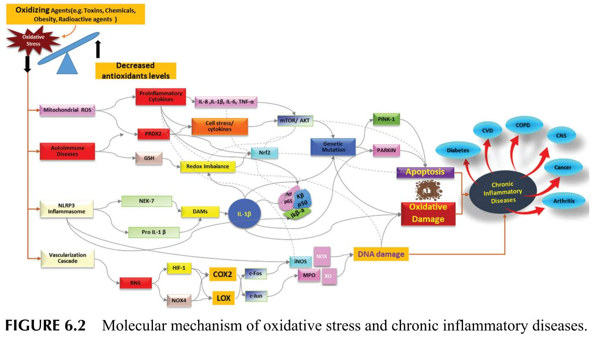

**Propolis** and its **flavonoids** have been widely **used** in folk medicine **as anti-inflammatory agents**, and as ingredients in anti-fungal antibiotics, anti-coagulants, anti-retrovirals, anti- allergic and anti-cancer drugs. Propolis **protects** the **skin** from numerous processes, such as **premature aging** (wrinkles, scaling, dryness, dilatation of blood vessels, and loss of collagen) and skin cancer. Propolis contains a large number of compounds that **accelerate skin healing** processes, such as tensile strength and elasticity, and enables growth, expansion, and migration of human keratinocytes. These properties and biochemical changes in propolis could favor re-epithelization and thus represent promising effects in wound healing.    

**IgE**\-mediated inflammatory reactions are directed towards **foreign molecules** called **allergens**. According to new research, dietary factors, especially the amount and quality of dietary fat intake (key components of a typical Western diet), significantly contribute to allergic sensitization. The hygiene hypothesis clearly shows the importance of the Th1/Th2 (cells) relationship; insufficient exposure to microbes and reduced Th1 response leads to an **increase** in the prevalence of atopic sensitization and clinical diseases such as asthma, allergic rhinitis, and **eczema**.    

The term **sensitivity** is general and may include **true** allergies, reactions that **do not affect** the immune system (and therefore are not technically allergies), and reactions for which the cause has yet to be determined.    

Certain non-allergic types of sensitivity are called intolerances and may be caused by toxins, enzyme inadequacies, drug-like chemical reactions, psychological associations, and reactions to chemicals found in :  

*   food    
*   water    
*   medications    
*   cosmetics    
*   perfumes    
*   textiles    
*   building materials    
*   plastics    

There are **immune-mediated** and **non-immune mediated** reactions among adverse reactions to food. **Immune-mediated reactions** to food are **mediated either by IgE antibodies** or other immunological pathways, whereas food intolerance causes the formation of antibodies against proteins in a certain type of food. IgE antibodies, which would indicate an allergic process, are not formed. IgA antibodies are formed in the first phase, and after multiple stimulations, IgG antibodies are formed. Food intolerances also comprise non- immunologic-mediated responses that depend on enzyme deficiencies, pharmacological reactions or arise by unknown mechanisms.    

In the USA, 32 million Americans have food allergies, and relevant studies, published in 2018 and 2019, estimated that the number of Americans of all ages who had allergic symptoms to a certain food were:  

*   8.2 million: milk    
*   6.1 million: peanuts    
*   6.1 million: tree nuts    
*   3.9 million: eggs    
*   2.6 million: fish    
*   2.6 million: wheat foods    
*   1.9 million: soy  

In developed countries, IgE-associated food allergies affect 3–8% of children and 1–3% of adults. Food allergies have increased worldwide **from** about **3%** of the population in **1960** to about **7%** in **2018**. Approximately 7.6% of children in the USA are thought to have food allergies, and 40% of them have multiple food allergies. The food we eat daily can have both **allergy-promoting** and **anti-allergic** nutrients, which indicates the possibility of allergy control through food selection. For example  

*   certain vitamins (A, C, D and E)
*   minerals (selenium, copper, zinc and magnesium)
*   probiotics and omega-3 polyunsaturated fatty acids+ (PUFAs)
*   polyphenols

have been **shown** to possess **anti-allergic properties**, whereas **omega-6 PUFAs** are precursors for leukotriene C4, which is known to **promote** **allergic inflammation**.   

Food allergens induce the production of **IgE antibodies** that have the ability to **bind** to the **surface** of **mast cells** and **basophils** distributed **throughout** the body, stimulating their **degranulation** (release of histamine from basophils and mast cells). which **cause** an allergic response in a **sensitive** person within a few minutes or, at most, a few hours. Chemically, food allergens are proteins or glycoproteins with molecular masses from ~10,000 to 70,000 daltons, and high stability to proteases and heat.  

Approximately **200 of** the **hundreds of thousands allergenic proteins** have been isolated from food and include :  

*   peanuts    
*   soybeans    
*   crustacea    
*   fish    
*   cow milk    
*   eggs    
*   tree nuts    
*   wheat  

According to [Hefle](https://doi.org/10.1016/j.jaci.2007.04.013) (2007) these allergens **make 90%** of all reported food allergies **worldwide**. The number of people suffering from **IgE-mediated** allergic diseases is constantly increasing and reached the **6th leading cause** of diseases in the US. Although the number of Americans with allergies is around 40–50 million according to the National Institute of Health, it is believed that a large number of people have not been diagnosed yet. The overall prevalence of certain allergies, such as asthma, allergic rhinitis and atopic eczema, are **increasing substantially**.  

According to the World Health Organization, the number of patients who have **asthma** is about 300 million, and it is expected to increase to 400 million by 2025. Similarly, allergic **rhinitis** occurs in more than 500 million people worldwide and also is constantly increasing. the **intake** of **probiotics** can increase the **effectiveness** in **reducing** eczema by 21%.  

Intake of **antioxidants** in diets, such as polyphenols (flavonoids, vitamin C, vitamin E and selenium coming mainly from fruit and vegetables), may have a **protective** effect.  Furthermore, different **fats** found in :  

*   milk    
*   butter    
*   vegetable oils    
*   fish  

**may have different** effects on the development of **allergies** and asthma.    

Recent research points to a central role of the **microbiome**, which is highly influenced by multiple environmental and dietary factors. It was found that **extensive** changes in the environment and nutrition **produce** **dysbiosis** in the gut, skin and lung microbiome, inducing qualitative and quantitative changes in their composition and metabolic activity.  

Dysbiosis induces qualitative and quantitative changes in the microbiota that directly affect immunological mechanisms **leading** to allergic diseases. The **role** of probiotics and prebiotics in the diet is **promising**. Therefore, it seems that the microbiota is a **very dynamic environment**, influenced by multiple environmental and nutritional factors, with a **complex role** in allergic diseases.  

Raw propolis contains 45.02–58.72% of dietary fiber and a significant amount of :  

*   sodium    
*   potassium    
*   copper    
*   zinc    
*   iron    
*   calcium    
*   potassium    
*   phosphorus    
*   manganese    
*   magnesium    
*   pyridoxine    
*   folic acid  

which indicates that it can be used as food **with a positive effect** on intestinal **microbiota**.  Foods rich in fiber and antioxidants, such as polyphenolic constituents of plants and bee products including propolis, stimulate the activity and formation of “good bacteria”, reducing and acting as a bactericidal on pathogenic bacteria; and can reduce and prevent numerous allergic reactions. The bifidogenic effect of bee products has been known for a long time and can be useful in **treating allergic** reactions.  

| Effects                                                                                                                                    | Probiotic                                                                                                                                                                                                                                                                                                                                                                                                                                                                                                                                                                                                                                                                              | Mechanism of action                                                                                                                                                                                                                                                                                                                                                                                                                                                                                                                                                                                                                                                                                                                                                                                                                                                                                                                                                                                                                                                                                                                                                                                                                                                                                                                                                                                                                                                                                                                                                                                                                                                                                                                                                                                  |
| ------------------------------------------------------------------------------------------------------------------------------------------ | -------------------------------------------------------------------------------------------------------------------------------------------------------------------------------------------------------------------------------------------------------------------------------------------------------------------------------------------------------------------------------------------------------------------------------------------------------------------------------------------------------------------------------------------------------------------------------------------------------------------------------------------------------------------------------------- | ---------------------------------------------------------------------------------------------------------------------------------------------------------------------------------------------------------------------------------------------------------------------------------------------------------------------------------------------------------------------------------------------------------------------------------------------------------------------------------------------------------------------------------------------------------------------------------------------------------------------------------------------------------------------------------------------------------------------------------------------------------------------------------------------------------------------------------------------------------------------------------------------------------------------------------------------------------------------------------------------------------------------------------------------------------------------------------------------------------------------------------------------------------------------------------------------------------------------------------------------------------------------------------------------------------------------------------------------------------------------------------------------------------------------------------------------------------------------------------------------------------------------------------------------------------------------------------------------------------------------------------------------------------------------------------------------------------------------------------------------------------------------------------------------------- |
| Maintain the balance of intestinal microflora                                                                                               | Lactobacilli and bifidobacteria                                                                                                                                                                                                                                                                                                                                                                                                                                                                                                                                                                                                                                                         | Maintain a healthy balance of intestinal flora by producing organic compounds such as lactic acid, hydrogen peroxide, and acetic acid that increase the acidity of the intestine and inhibit the reproduction of many harmful bacteria.                                                                                                                                                                                                                                                                                                                                                                                                                                                                                                                                                                                                                                                                                                                                                                                                                                                                                                                                                                                                                                                                                                                                                                                                                                                                                                                                                                                                                                                                                                                                                               |
| Inhibit the growth of harmful bacteria Improving good digestion Strengthen immune function Strengthening resistance to infections | Acidophilus Bifidobacterium bifidum Bifidobacterium longum Lactobacillus acidophilus Lactobacillus casei Saccharomyces boulardii Lactobacillus rhamnosus GG                                                                                                                                                                                                                                                                                                                                                                                                                                                                                                             | Produce bacteriocins, which act as natural antibiotics to kill undesirable microorganisms Proteases and lipases production; of enzymes which help digest proteins, and fat Stimulate Th1 cells and production IL-12 and IFN-γ Prevent vaginal yeast infection Inhibition Candida overgrowth                                                                                                                                                                                                                                                                                                                                                                                                                                                                                                                                                                                                                                                                                                                                                                                                                                                                                                                                                                                                                                                                                                                                                                                                                                                                                                                                                                                                                                                                                              |
| Protection of intestinal bacteria                                                                                                          | Lactobacillus acidophilus Lactobacillus rhamnosus Lactobacillus plantarum                                                                                                                                                                                                                                                                                                                                                                                                                                                                                                                                                                                                        | Involved in the production of several 'gut nutrients', such as short-chain fatty acids, and the amino acids, arginine, cysteine, and glutamine Remove toxins from the gut and exert abeneficial effect on cholesterol levels                                                                                                                                                                                                                                                                                                                                                                                                                                                                                                                                                                                                                                                                                                                                                                                                                                                                                                                                                                                                                                                                                                                                                                                                                                                                                                                                                                                                                                                                                                                                                                       |
| Reduce intestinal permeability and inflammatory cytokines                                                                                   | Lactobacillus (all variants)                                                                                                                                                                                                                                                                                                                                                                                                                                                                                                                                                                                                                                                           | Attenuate pro-inflammatory responses by regulating NFκB activity                                                                                                                                                                                                                                                                                                                                                                                                                                                                                                                                                                                                                                                                                                                                                                                                                                                                                                                                                                                                                                                                                                                                                                                                                                                                                                                                                                                                                                                                                                                                                                                                                                                                                                                                      |
| Protect the digestive system from opportunistic bacterial infections                                                                       | Saccharomyces boulardii Lactobacillus rhamnosus GG(ATCC 53013) Bifidobacterium lactis Bb-12                                                                                                                                                                                                                                                                                                                                                                                                                                                                                                                                                                                       | Prevent new infections Reduce 'traveler diarrhea'                                                                                                                                                                                                                                                                                                                                                                                                                                                                                                                                                                                                                                                                                                                                                                                                                                                                                                                                                                                                                                                                                                                                                                                                                                                                                                                                                                                                                                                                                                                                                                                                                                                                                                                                                 |
| Alleviate the consequences of acute pancreatitis                                                                                           | Lactobacillus plantarum                                                                                                                                                                                                                                                                                                                                                                                                                                                                                                                                                                                                                                                                | Reduce the number of complications after surgery                                                                                                                                                                                                                                                                                                                                                                                                                                                                                                                                                                                                                                                                                                                                                                                                                                                                                                                                                                                                                                                                                                                                                                                                                                                                                                                                                                                                                                                                                                                                                                                                                                                                                                                                                     |
| Tumor prevention                                                                                                                           | Lactobacillus casei Shirot                                                                                                                                                                                                                                                                                                                                                                                                                                                                                                                                                                                                                                                             | Reduce fecal enzyme activities Prevent superficial bladder cancer and cervical cancer                                                                                                                                                                                                                                                                                                                                                                                                                                                                                                                                                                                                                                                                                                                                                                                                                                                                                                                                                                                                                                                                                                                                                                                                                                                                                                                                                                                                                                                                                                                                                                                                                                                                                                              |
| Intestinal recolonization during and after antibiotic use                                                                                  | Bifidobacterium longum SBT 2928 Lactobacillus rhamnosus GG(ATCC 53013) Lactobacillus GG strain                                                                                                                                                                                                                                                                                                                                                                                                                                                                                                                                                                                    | Prevent infections after antibiotic use Inhibit adhesion of enterotoxigenic Escherichia coli strain Pb176 Reduce fecal enzyme activities Reduce antibiotic-associated diarrhoea in children and prevent rotavirus Relapsing Clostridium difficile diarrhoea, immune response modulation, and alleviation of atopic symptoms in children                                                                                                                                                                                                                                                                                                                                                                                                                                                                                                                                                                                                                                                                                                                                                                                                                                                                                                                                                                                                                                                                                                                                                                                                                                                                                                                                                                                                                                                   |
| Improve digestion of foods causing intolerance                                                                                             | Acidophilus Bifidobacterium bifidum Bifidobacterium longum Lactobacillus acidophilus Lactobacillus casei Saccharomyces boulardii                                                                                                                                                                                                                                                                                                                                                                                                                                                                                                                                           | Enzymes secreted by probiotic bacteria aid digestion Source of lactase, the enzyme needed to digest milk sugar                                                                                                                                                                                                                                                                                                                                                                                                                                                                                                                                                                                                                                                                                                                                                                                                                                                                                                                                                                                                                                                                                                                                                                                                                                                                                                                                                                                                                                                                                                                                                                                                                                                                                    |
| Production of key vitamins: K B folic acid riboflavin (B2) folate (B11) cyanocobalamine (B12)                             | Lactococcus lactis Lactobacillus gasseri Lactobacillus reuteri Lactobacillus plantarum Bifidobacterium (e.g., B. adolescentis)                                                                                                                                                                                                                                                                                                                                                                                                                                                                                                                                              | Vitamin K is required for blood clotting and healty wound healing Supports calcium balance and bone mineralization Beneficial effects on the heart and blood vessels and cognitive function Riboflavin (vitamin B2) has an essential role in cellular metabolism, precursor of the coenzymes flavin mononucleotide (FMN) and flavin adenine dinucleotide (FAD) Vitamin B12 is required for the metabolism of fatty acids, amino acids, nucleic acids and carbohydrates Synthesize de novo and supply vitamins to human body                                                                                                                                                                                                                                                                                                                                                                                                                                                                                                                                                                                                                                                                                                                                                                                                                                                                                                                                                                                                                                                                                                                                                                                                                                                               |
| Alleviation of allergic diseases by physiological and immunological mechanisms                                                             | Enterococcus faecalis Lactobacillus casei DN-114001 Lactobacillus acidophil us L-92 LGG and Bifidobacterium lactis Bb12 Lactobacillus casei strain shirota Lactobacillus rhamnosus Lactobacillus paracasei Bifidobacterium longum BBS36 Bifidobacterium lactis                                                                                                                                                                                                                                                                                                                                                                                                    | Physiological mechanisms include: Inhibition of bacterial adherence to mucosal layer Enhancement of epithelial barrier integrity and improved barrier function Increase in mucus production Immunological mechanisms: Affect the epithelial cells and modulate signaling pathways Reduce the expression of inflammatory cytokines by suppressing NF-kB signaling reduce proinflammatory cytokines (TNF-α, IL-1β, IL-6, and IL-8), and increase in IL-10 production restoration of Th1/Th2 cytokine balance Modulate toll-like receptors and the DCs, reduce of TLR4 and IL-1β mRNA levels and significantly increased mucosal IL-10 Increase production of IFN-γ and decrease IgE and IgG1 levels Reduce number of eosinophils and its activity Decrease production of CCL2, CCL3, CCL5, CCL11, IL-4 and IL-5 Stimulate DCs and Treg differentiation induction of CD4+ Foxp3+ Treg cells and production of TGF-β and IL-10, Increase the production of secretory IgA and IgG4 by B cell and reduction in allergen-specific IgE by B cells. Prevent antigen-induced Th2 immune responses Suppress Th17 immunity and symptoms of allergic airway disease Inhibit subsequent allergic sensitization and airway disease by induction of Treg cells with increased TGF-β. Decrease levels of degranulated mast cells, eosinophil granules, and tail scabs. Reduce matrix metalloproteinase 9 expression in lung tissue Inhibit inflammatory cell infiltration Decrease the mRNA levels of Th2 and Th17 cell transcription factors Increase the transcription factors of Th1 and Treg cells, galactin-9, filaggrin Inhibit the lung inflammation and airway remodel by interfering on Th1/Th2 cytokines and STAT6/T-bet transcription factors |
| Strengthen the immune defense and end immune resistance Strengthen resistance to colonization                                           | Bacillus coagulans Bacillus subtilis HU58 Bifidobacterium adolescentis B. animalis B. bifidum B. breve B. infantis B. lactis B. longum B. thermophilus Enterococcus faecium Lactobacillus acidophilus Lactobacillus brevis Lactobacillus casei Lactobacillus delbrueckii Lactobacillus fermentum Lactobacillus helveticus Lactobacillus johnsonii Lactobacillus lactis Lactobacillus paracasei Lactobacillus plantarum Lactobacillus reuteri Lactobacillus rhamnosus Lactobacillus salivarius Lactococcus lactis Propionibacterium freudenreichii Propionibacterium jensenii Streptococcus thermophilus | Stimulation of local and systemic systems Enhanced defense response (increases IgA, CD4+ and CD8+ T cells, NK cell activity, adjuvant effect) Downregulate inflammatory and allergic responses Increase competitive exclusion (e.g., for nutrients, adhesion sites) Decrease harmful microbial species Increase epithelial cell mucin synthesis Strengthen intestinal barrier function|  

**Chronic allergic** inflammation occurs when **exposure** to allergens **is constant** or repeated and this **persistent inflammation** is associated with **changes** in the **structural cells** at the affected sites, and in many cases with markedly altered function of the affected organs. Thus, it is known that chronic allergic inflammation in **atopic dermatitis** (AD), allergic rhinitis, and asthma is associated with **tissue remodeling**, which includes long-term changes to the structural elements of the affected sites (such as increased vascularity) and **substantial alterations** in the **barrier function** of the affected **epithelia** including increased risk of both **cutaneous infections** with the bacterium such as `Staphylococcus aureus` and the colonization or the development of nasal polyps in patients with allergic rhinitis. Chronic inflammation is based on a **complex interaction** of many cells including mast cells, T cells, eosinophils, basophils, neutrophils, monocytes/macrophages, platelets, NK cells (natural killer T-cells), as well as a number of cytokines.  

**Neutrophils**, the main cell type in most acute and some chronic inflammatory diseases, are the **body’s first line** of defense in the innate arm of the immune system. Neutrophils **dominate** the early stages of inflammation as cells with **antimicrobial functions** and cells which can interact, directly, or via cytokines and chemokines, with other immune cells to modulate both innate and adaptive immune responses. Their granules contain numerous microbicidal agents; they can destroy invading microorganisms, through phagocytosis and intracellular degradation, release of granules, and formation of neutrophil extracellular traps after detecting pathogens.  

**Monocytes/macrophages** are a heterogeneous cell population acting as a bridge between the innate and adaptive immune systems. Macrophages and neutrophils **migrate** into extravascular tissue by adhesion and diapedesi in the early acute phase of inflammation.  

**Eosinophils** play a key role in the symptoms of asthma, allergies, and atopic and ad- verse drug reactions. Eosinophils can regulate local immune and inflammatory responses, and their accumulation in the blood and tissue is associated with several inflammatory and infectious diseases.  

**Mast cells** are effector cells in the regulation of numerous processes, including the regulation of immunity, inflammation, **crossing** the **blood–brain barrier** and **cancer growth**. Mast cells play an important role in the early phase of allergic reactions due to their localization and rapid encounter with environmental or food allergens in the submucosa of the respiratory or digestive tract. Changes in the surrounding tissue such as swelling, itching, sneezing in allergic rhinitis are attributed to the secretion of histamine.  

**Epithelial Cells**, a healthy epithelium is key to **maintaining mucosal homeostasis** and may potentiate immune tolerance to frequently encountered allergens. Specialized epithelial subset cells, including secretory and ciliated cells, are important tissue barriers whose dysfunction is a fundamental component of chronic human inflammatory diseases, including allergies. Epithelial cells at mucosal surfaces play a **dominant role** in **allergic diseases** and have an **active** role in the inflammation process. In susceptible individuals, after exposure of the epithelium to environmental allergens, mucosal epithelial cells release cytokines, such as IL-1, IL-25, IL-33, thymic stromal lymphopoietin (TSLP) and GM-CSF, and endogenous danger signals, such as uric acid, ATP and HMGB1. These factors lead to the production of inflammatory mediators and activate a network of DCs and other innate immune cells including basophils and innate lymphoid cells type 2 (ILC2) through the signaling pathways of nuclear factor kappa B (NF-kB) and IkB.  

**Endothelial Cells**, pathogenesis of chronic allergic diseases, such as bronchial asthma, allergic rhinitis, eosinophilic gastrointestinal disorders and atopic dermatitis (AD), involves chronic inflammation and **tissue remodeling** caused by immune reactions to various antigens on the tissue surface. Due to their anatomical location, vascular endothelial cells are the final responders that interact with various exogenous antigens and pathogen-associated molecular patterns (PAMPs) that come into contact with the epithelial surface. Endothelial cells line the inner walls of blood vessels, forming a selective permeable barrier between the blood inside the vessels and the surrounding tissues. Vascular endothelial cells are the final responders to interact with various alarmins on the epithelial surface which spontaneously express MHC-I molecules and a wide variety of functional PRRs, including TLRs, and NLRs. Endothelial cells form a single-cell-thick layer called the endothelium, which lines the inner wall of blood vessels.    

source :  
2022 - [Allergic Inflammation: Effect of Propolis and Its Flavonoids](https://doi.org/10.3390/molecules27196694)  

to do :  
2020 - [Food allergy immunotherapy: Oral immunotherapy and epicutaneous immunotherapy](https://doi.org/10.1111/all.14220)  

# Omega 3
Omega-3 polyunsaturated fatty acids (PUFAs) are a type of unsaturated fat that is **essential** for human health. They are called **essential** because the body cannot **produce** them on its own and they must be obtained through the **diet**. Omega-3 PUFAs are found in a variety of foods, including fatty fish, nuts, and seeds. They are **known** for their anti-inflammatory effects and have been shown to have numerous health benefits, including : 

* reducing the risk of heart disease
* improving cognitive function
* reducing the risk of certain types of cancer  

Some examples of omega-3 PUFAs include alpha-linolenic acid (**ALA**), eicosapentaenoic acid (**EPA**), and docosahexaenoic acid (**DHA**). It is recommended to include a source of omega-3 PUFAs in the diet, either through food or supplements.  

**ALA** is enzymatically converted to **EPA** and subsequently converted into **DHA**. These conversions primarily occur in the **liver** and are extremely limited owing to the enzyme concentration in the human body. Therefore, it is reasonable to derive DHA and EPA directly from foods and/or dietary supplements enriched in fish oils.

Omega-3 PUFAs have been known to demonstrate anti-inflammatory actions in various inflammatory diseases, including :
* psoriasis
* inflammatory bowel disease
* asthma
* rheumatoid arthritis

[...] These metabolites have strong anti-inflammatory actions in various inflammatory diseases, such as animal models of asthma and **colitis**. Several reports have highlighted the anti-inflammatory actions of omega-3 PUFA metabolites on inflammatory skin diseases : 

* psoriasis
* atopic dermatitis
* contact hypersensitivity
* ultraviolet (UV) radiation  

Reportedly, omega-3 PUFA metabolites have demonstrated various actions on immune and **epithelial cells**.

source - [(2020) Omega 3 Fatty Acid and Skin Diseases](https://doi.org/10.3389%2Ffimmu.2020.623052) &nbsp;&nbsp; ([mirror](https://www.ncbi.nlm.nih.gov/pmc/articles/PMC7892455/))

---  

  

[source](https://doi.org/10.1201/9781003534877)

---  

# Inhibiting Inflammatory

Today compared inflammatory targets of `Omage3` and `Boswellia serrata` :  
* Omega3 - inhibiting the production of inflammatory **molecules**
* Boswellia serrata - inhibiting inflammatory **enzymes**

*all produced by GPT*

## Inhibiting Inflammatory Molecules
* Include cytokines, chemokines, and other signaling proteins that mediate the inflammatory response.
* Examples: Tumor necrosis factor-alpha (TNF-α), interleukins (IL-1, IL-6), and prostaglandins.

### Pros
* Targeting these molecules can reduce the overall inflammatory response and prevent the recruitment of immune cells to the site of inflammation.
* Can lead to broader effects on multiple pathways involved in inflammation.

### Cons
* May have systemic effects, leading to potential side effects.
* Some inflammatory molecules are essential for normal immune function, so inhibiting them can impair the body ability to fight infections.

## Inhibiting Inflammatory Enzymes
* Include cyclooxygenases (COX-1 and COX-2), lipoxygenases, and matrix metalloproteinases (MMPs).
* These enzymes are involved in the production of inflammatory mediators like prostaglandins and leukotrienes.

### Pros
* Inhibiting specific enzymes can directly reduce the production of inflammatory mediators, leading to localized effects.
* Often used in pain relief and to reduce inflammation in conditions like arthritis.

### Cons
* May not address the underlying causes of inflammation.
* Long-term use can lead to side effects, such as gastrointestinal issues with COX inhibitors.