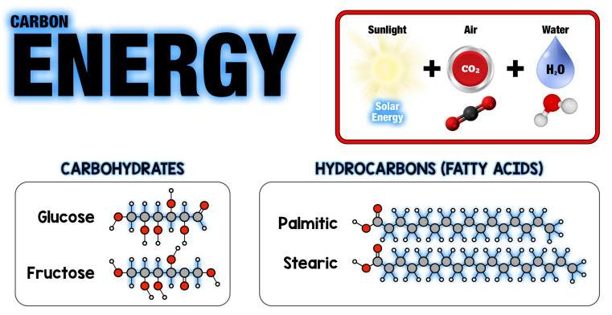
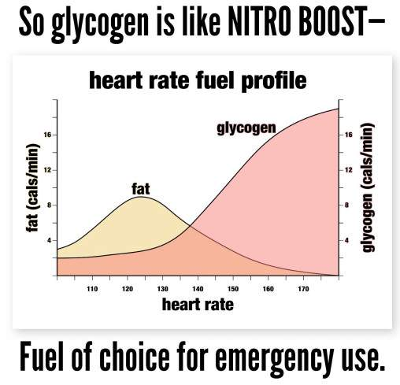

> **Digestion** = Set of processes of breaking down food into a form suitable for use by the body.  
> **Oxidation** = Carbohydrates / fats are broken down (oxidized) to produce energy.  

# Proteins

digestion: 3-6 hours

It is nothing more than a _collection_ of **amino acids**. A protein is made up of **hundreds** of smaller units called **amino acids**. You can think of a protein as a series of beads where each bead is an **amino acid**. A **mammalian** cell can contain **thousands** of proteins, each with a unique function.  

Mammals need protein in their diet to

* support growth
* to repair tissues
* maintain basic physical functions  

Proteins can play a wide range of roles in a cell or organism.  

- **Enzymes** act as catalysts in biochemical reactions, meaning they speed up reactions.
- **Hormones** are long-range chemical signals released by endocrine cells. While some hormones are based on steroids, others are proteins. These protein-based hormones are commonly called peptide hormones. For example, **insulin** is an important peptide hormone, the **hemoglobin** protein that carries oxygen in the blood is a globular protein, and collagen, found in our skin, is a fibrous protein.  
- **Antibodies**

Mammals can handle **20 standard amino acids**, which include **9 essential amino acids** that **must** be obtained from **diet** and 11 non-essential amino acids that the body can synthesize.  

Protein that has the **9 essential amino acids** can only be found in **animal products**. Of course, some like to believe that  
- Edible Hemp Seeds
- Buckwheat
- Quinoa
- Soy
- Chlorella
- Spirulina

have the **9 essential amino acids**.  

A protein is called a **complete protein** when it has all **9 essential amino acids**.  

These **9 essential amino acids** must be present **simultaneously** and in the correct relative **amounts** for **protein synthesis** to occur. If one or more are in short supply, the use of all the others in the cellular pool will be **reduced** in the same proportion.  

Although **plant sources** generally lack one or more of the **essential amino acids**, when combined with **whole grains** such as rice or nuts or seeds with legumes, all amino acids can be obtained.  

The **human body**, minus water, is **75% made up of amino acids**. All but one **neurotransmitter** (proteins) are made up of amino acids, and **95% of hormones** are **amino acids**. Amino acids are **key** to every human bodily function with every **chemical reaction** occurring.  

When an organism eats food, the protein is **broken down** (proteolysis) and **resynthesized** to produce **complete proteins**. Even in the case of animal products (complete proteins by definition) the body does **proteolysis**. When an organism consumes different (non-animal) products, the body still continues to **break down** the proteins and look for **candidate** amino acids to form **the complete protein**.  

> **Animals** are at a higher trophic level than **plants**. Because they are higher on the **food chain**, they automatically bioaccumulate **more** protein and minerals and micronutrients, and eating animals always provides **higher quality protein** and **higher nutrient density**.  
>
> `Plants create all` of the `food ENERGY`, storing **solar energy** as carbohydrates and fats. Plants create all of the `food PROTEIN`, using **nitrogen** and other **minerals** from the `soil`. **Animals** get both by eating **plants** (or other animals that have eaten plants).  
>
> Meat, eggs, and green vegetables are **good**, grains are **bad**. Fish is the **best** thing ever, and sugar and oil are the **worst** things ever.  

> **Too much protein** will produce too much **IGF-1** which activates **mTOR** and these are **protein kinases** and what it does is it **stimulates** the production of your **ribosomal** to **produce** more **protein** which is good, so when you eat protein you **build** more muscle which is fine but you also have **cell proliferation** and what that does (?) is increase the risk of cancer. Now there is absolutely no doubt that **high protein** increases the risk of cancer. I think the data is indisputable it has been **proven** in animals and also in some human studies. **Do** not consume **protein powder**. [[1](https://youtu.be/9ROk0OShVTo?t=3465)]

# Fat

digestion: 6-8 hours

- Saturated fats
- Monounsaturated fats **|**
- Polyunsaturated fats
- Trans fats **|**
- Triglycerides

Fat is **energy storage**, insulation and supports the absorption of fat-soluble vitamins, as well as providing essential fatty acids that are **vital** for various physiological functions.

Fat **exits** (converts into energy) from your body through **mitochondria**. Training **doubles** your **mitochondria**.  

  

# Carbohydrates

digestion: 1-3 hours

They are the **main source of energy**, which fuels cellular processes and supports overall metabolic functions. They are divided into three categories:

- Dietary Fiber **|**
- Sugar **|**
- Starch **|**
  - **Rapidly digestible starch (RDS)** **|** - is the amount of starch that is digested by enzymes and absorbed into the bloodstream within 20 minutes.
  - **Slowly digestible starch (SDS)** **|** - is the amount of starch that can be completely digested within 20 minutes to 120 minutes.
  - **Resistant starch (RS)** - refers to starch that cannot be digested within 120 minutes in the small intestine and therefore passes into the large intestine, where it can act as a substrate for intestinal fermentation processes. It is divided into five types:
  - **RS1** **|** - Naturally inaccessible starch that cannot be hydrolyzed due to the cell wall barrier.
  - **RS2** **|** - Raw starch, which due to its structure (crystalline form) is not digested.
  - **RS3** **|** - Retrograde starch formed when starchy foods are [cooked and then cooled](https://pipiscrew.com/apps/forum/view_topic.php?id=783) (applies to rice / red & black lentils). The long branched chains of amylopectin form double helices that cannot be hydrolyzed by digestive enzymes.
  - **RS4** **|** - Resists enzymatic hydrolysis by modifying its original molecular structure and the addition of certain chemical functional groups by chemical modification (used as a `food additive`).
  - **RS5** **|** - Combination of long and unbranched starch chains with free fatty acids, forming a helical structure that is difficult to digest and deliberate rearrangement of starch molecules - resistant maltodextrin.

> **Carbohydrates** and **fats** are macronutrients that provide **energy** to the body.  

**Carbohydrates** and **fats** are **radically different** and handled in **radically different** ways by our bodies. It is ABSOLUTELY CRITICAL to understand the basic **differences** between the two.  

**Carbohydrates** are **water-soluble**. Think of a **spoonful of sugar** in your coffee. **Fats**, on the other hand, are not completely water-soluble ( oil and water don't mix ). So your body **absorbs** and **transports** and **stores** these **two different energy sources** in **COMPLETELY different** ways** (and they have completely different **effects** on your **metabolism**).  

All foods are **broken down** into smaller units in your **digestive** system before they are even absorbed in the **small intestine**. **Proteins** are broken down into **amino acids**, the building blocks of proteins, before being absorbed. **Carbohydrates** that are not dietary fiber are broken down into simple **sugars** such as **glucose** and **fructose** before being absorbed (dietary fiber is not absorbed at all and continues its way through the digestive tract, coming out the other side). **Fats** are eaten as **triglycerides** (three fatty acids packed together) and are broken down into individual fatty acids before being absorbed.  

  

All **dietary energy** is chains of **carbon** with high-energy carbon-carbon bonds — carbohydrates and fats. We break these bonds in our **mitochondria** to release **energy**.

  

So you have two completely **separate energy storage compartments** in your own body. **Glucose** (carbohydrates), which are water soluble, are stored as glycogen (simple chains of glucose) in your **liver** and **muscles**. **Fat**, which is NOT water soluble, is stored in your **fat cells**. The fat storage space is **MUCH larger** and your body prefers to only store about **1%** of its energy as **glycogen** (carbohydrates).  

It turns out that **glucose**, from **glycogen**, is **FAST**. You can convert glucose into energy **SIX TIMES faster** than **fat**.  

So why don't we just use glycogen for energy storage? Because glycogen is **HEAVY**! Glycogen is “fully hydrated” (which is why we call them carbohydrates), which means it has a lot of **water** attached to it. And that water weighs a lot! So glycogen is about six times **heavier** than the **same amount of energy** stored as **fat**.  

**Glycogen**, which is just chains of glucose molecules, is a type of “human starch” and is identical to the starch found in **potatoes**. The fat in the lipid droplets in your **fat cells** looks a lot like sunflower oil.  

Note: the photo below shows the same amount of stored energy as olive oil compared to potatoes. At six times the size and weight, you can see why your body **doesn’t want to carry** all that energy around as **glycogen**. In fact, due to weight efficiency, your body carries 100 times more fat than glycogen.  

  

But we **SHOULD** always have **glycogen** for emergency use. In a **fasted state**, when we are sedentary or only doing light exercise, like walking, we burn mostly **fat**. But in **high intensity** exercise, we burn mostly **glucose**. `And in fact, at the MOST high intensity, like sprinting for your life, we always burn 100% pure glucose.` Because it is so useful for emergency use, your body **ALWAYS** keeps **glycogen** in your muscles, so it can run for your life in a moment of threat. This is a necessary safety net!  

**Glycogen** storage is quite **small**. You can only hold about **4 grams** of **glucose** in your **blood** circulation and maybe **100 grams** of glucose** in your **liver**. Your **muscles** can hold about **300 grams of glucose** on average, `but that glucose is only for emergency use` and goes untouched UNLESS you're doing **very high-intensity** exercise—in which case you can actually burn a ton of glucose very quickly, if you take it to the max. That's why people who do a lot of high-intensity exercise `can consume a lot of` carbs. But the average American does an average of **zero minutes of high-intensity exercise** per day, so for most of us, we should probably stay **under 100 grams of carbs**.  

`Long-duration high-intensity exercise will definitely require carbs` during the event. Even the most fat-adapted **elite** athletes can only engage in maximal intensity exercise for **2 hours** at most before they **completely** deplete their muscle and liver **glycogen** and _hit the wall_, a state of **hypoglycemia** where your body **pretty much stops** doing what you've asked it to do. Typically, anyone exercising at a very high intensity for more than an hour will **benefit** from some **carbs** during the event.  

  

  

_Glycogen storage is quite small, and without high-intensity exercise, most people only have room for about 100 grams of dietary glucose (stored as liver glycogen) per 24 hours._  

**CARBOHYDRATES** AND **FAT** OXIDIZE EACH OTHER! And it is **GLUCOSE**, not fat, that **controls** which fuel **is** oxidized** at any given time. This is an absolute requirement because glucose (glycogen) storage is so **tiny**. We have **very little room** to store **glucose** as glycogen, so the moment we **start** to **eat** more glucose **we** must** immediately **burn** more **glucose**. Conversely, the moment we **stop** eating glucose, we immediately **start** to **burn** more **fat**. Understanding this **interaction** between **carbs** and **fats** is absolutely **essential** if you want to **understand** what is required to **increase fat oxidation**.  

**High** carbohydrate **diets** can increase **carb oxidation** by **10-fold** and **decrease** **fat** oxidation** by 10-fold at the same time. If you want to get better at burning fat (as fuel), the simplest and most direct strategy is to **eat fewer carbs**. If you want your body to be better at burning fat, you only need to do one thing: eat **fewer carbs**.  

  

There are four cases (excluding obesity)  

  

  

  

  

> If you **overfeed** someone **fat**, you don't increase their risk of cancer **at all**. If you **overfeed** someone **carbohydrates**, you **dramatically** increase their risk of cancer. And **protein** is **halfway** there.  

> **Glycolysis** is a fundamental metabolic pathway that breaks down **glucose** to extract energy for **cellular processes**. It occurs in the cytoplasm of **cells**.  

# Energy Toxicity

Alzheimer’s disease. Asthma. Osteoarthritis. Rheumatoid arthritis. Cancer (especially breast, colorectal, esophageal, uterine, renal, prostate, and pancreatic cancers). Depression. Type 2 diabetes. Fatty liver. Acid reflux. Fibromyalgia. Gout. Sleep apnea. High cholesterol. High blood pressure. Osteoporosis. Stroke. Coronary artery disease and atherosclerosis. Heart failure. Erectile dysfunction. Polycystic ovarian syndrome. Acne. Low testosterone. Enlarged prostate. Gynecomastia. Baldness. Psoriasis. Lupus. Peripheral neuropathy. Glaucoma. Near-sightedness. Vertigo. Tinnitus. Inflammatory bowel disease. Sarcopenia. Tendinopathy. Carpal tunnel syndrome. Hearing loss. Macular degeneration.  

We are facing an **epidemic** of chronic disease. And believe it or not, every single one of the chronic conditions listed above is related **to one thing: chronically high insulin levels**—also known as «insulin resistance», or «hyperinsulinemia».  

**Insulin** is a hormone, once released by the **pancreas**. Here’s how it works: When foods with **carbs** reach your upper gut, they activate another key hormone, the glucose-dependent **insulinotropic polypeptide** (GIP). This **carb-driven** **burst** of GIP** spreads to your **pancreas** and fat cells. In the pancreas, it triggers a **burst** of **insulin** release. In fat cells, it sets things up for fat storage. The wave of insulin flashes around your body, triggering your cells to get ready to take up glucose. It stops the release of other hormones, like glucagon, to prevent your liver from making glucose inappropriately. It tells the hypothalamus in your brain that glucose is on its way to control your appetite. It tells your body to stop burning fat and instead burn the glucose that is coming down the hatch (glucose is dangerous if it stays high in your bloodstream), so it must be prioritized for immediate burning or conversion to body fat for storage. Insulin does all of this and more, it is truly your body's **master regulator**.  

If you **keep your insulin levels** **low**, all of these signals are extremely **effective**. Your body will remain highly sensitive to insulin messages. This is vital for **longevity** and **slimness**. There are many strategies to keep your **insulin** at **low** levels. Here are some of the most important approaches:  

- Don't consume too many carbohydrates, which are mainly made up of glucose.
- Don't consume refined carbohydrates or refined vegetable oils.
- Don't consume carbohydrates with fatty foods (a very bad combination).
- Don't consume too much fructose.
- Don't eat often, rather eat well-spaced meals (2-3 / day). **Snack** spoils **insulin signaling**.
- **Excessive carbohydrates** cause excessive **insulin**. **Refined carbohydrates** in particular lead to a burst of glucose-dependent insulinotropic polypeptide (GIP) release in the gut – **really** leading to **excessive insulin**.
- Carbohydrates and fat **together** actually increase GIP and therefore insulin.
- **Fructose** causes **insulin problems** in the liver, **promoting** **bad** cholesterol along the way. These are the main mechanisms that a low-carb, high-fat diet addresses.
- There are also emerging studies showing that **gut microbiome** problems (issues with the balance of good and bad bacteria in your gut) can also lead to **insulin dysregulation**.
- **Carbohydrate-rich** foods raise **blood sugar** levels. **Insulin** must **rise** immediately** to **manage** this **blood sugar**. **Carbohydrate-rich** foods are also **lowly satiating** at first** (they don't fill you up). The overall result is that you **feel hungry again** right after eating. The /_spring/_ is hard to ignore, it will whisper in your ear, /_You really need and deserve a snack/_.  

# Genetically Modified Products (aka GMO)

They are plants whose genetic material (root / seed) has been **altered** using **biotechnology** to introduce desirable traits such as **resistance** to pests, tolerance to herbicides or improved nutrient content. They were created by Monsanto, which was acquired in 2018 by Bayer.  

Historically, it began in 1970 and in 1990 it became permissible for everyone to plant GMO seeds.  

After years (1974) the **invaders** (pests) also became more resistant and so they began to **kill** the plants with **special herbicide** (aka Roundup) so that they could bear fruit.  

Created by Monsanto. **Roundup** has **glyphosate** as its active ingredient.  

**Glyphosate** in the weed killer Roundup is **patented** as an **antibiotic**. 😂  

It works by **disrupting** the pathway that **plants** use to make **amino acids**, called the **shikimate** pathway. Plants but not animals use the shikimate pathway. This led scientists to hypothesize that **glyphosate** would kill weeds while remaining **safe** for humans and other animals. Not so fast. Guess who else uses the **shikimate** pathway. The **good** **bacteria** in your **gut**. Glyphosate is **deadly** to them.  

Mutant roots that exist:  

- Alfalfa (Medicago sativa) --- this is what they feed animals
- Apple
- Beans (Phaseolus vulgaris)
- Black-eyed beans (Vigna unguiculata)
- Rapeseed oil
- Corn (Maize)
- Eggplant (Solanum melongena)
- Flaxseed (Linum usitatissimum L.)
- Melon
- Papaya (carica papaya)
- Pineapple
- Plum (Prunus domestica)
- Potato (Solanum tuberosum L.)
- Rice (Oryza sativa L.)
- Soybeans (Glycine max L.)
- Pumpkin + Zucchini (Cucurbita pepo)
- Sugar beet (Beta vulgaris)
- Sugar cane (Saccharum sp)
- Sweet pepper
- Tomato (Tycopersicon esculentum)
- Wheat (Triticum aestivum)
- Chicory (Cichorium intybus)
- Safflower (Carthamus tinctorius L.)
- Petunia (Petunia hybrida)
- Tobacco (Nicotiana tabacum L.)
- Cotton (Gossypium hirsutum L.)
- Poplar (Populus sp.)
- Eucalyptus (Eucalyptus sp.)
- Rose (Rosa hybrida)
- Carnation (Dianthus caryophyllus)

sources:
* <https://www.bayer.com/en/agriculture/gmo-biotechnology>
* <https://www.fda.gov/food/agricultural-biotechnology/gmo-crops-animal-food-and-beyond>
* <https://www.isaaa.org/gmapprovaldatabase/cropslist/>
* <https://www.ams.usda.gov/rules-regulations/be/bioengineered-foods-list>

# Intermittent Fasting

Fasting (12 hours -- 20:00 – 8:00 | 18 hours -- 20:00 – 14:00) involves abstaining from all food and caloric beverages for a continuous period of hours, often including overnight hours. It is considered beneficial because  

- promotes insulin sensitivity in all people
- reduces insulin resistance in people with prediabetes
- reduces inflammation
- helps reverse type 2 diabetes
- lowers blood pressure
- improves fat cell health and improves fat burning
- improves weight loss while preserving muscle better than calorie restriction
- improves mood and mental clarity
- enhances autophagy (cell regeneration and repair)
- protects against radiation damage in cancer patients
- promotes longevity

Typically, the **fed state** begins when you start eating, and for the next **three to five hours** your body digests and **absorbs** the food you just ate. **Insulin** increases significantly, to some extent **shutting down** fat burning** and also enabling excess calories to be stored as fat. After the first few hours mentioned above, your body goes into what is known as the **post-absorptive state**, during which the components of your last meal are still in **circulation**. The post-absorptive state **lasts** until **8 to 12 hours after your last meal**, which is when you enter a **fasted** state. It usually takes 12 hours after your last meal to fully enter the fasted state.  

When you are in a fasted state, your body can **burn fat** that was **unavailable** during **feeding**. Because we **don't** enter a **fasted state** until about 12 hours after our last meal, it's rare for our bodies to be in this fat-burning state in the modern eating environment. This is one reason why many people who start **intermittent fasting** will lose fat without changing what they eat, how much they eat, or how often they exercise. Fasting puts your body into a **fat-burning state** that you can rarely enter during a regular eating plan.  

Eating **carbohydrates**, especially **processed carbohydrates** without fiber, **hyperstimulates** the feeding state, **as** carbohydrates **raise both glucose** and **insulin** **higher** than other macronutrients. Generally, when you eat a **meal**, your body **spends** a few hours processing that food and **burns** what it can** of what you just **consumed**. Because it has all that **immediately available**, **easily burning energy** in the bloodstream (thanks to the food you ate), your body will choose to **use** it as **energy** instead of the fat you have stored. This is **ESPECIALLY** true if you just ate **carbs**, because they are **quickly converted to glucose** and your body **needs to burn sugar for energy** before **any other source** (you have limited glucose storage and **high glucose is toxic**, your body **burns extra glucose** **preferentially** to **get rid** of it, in the **same** way** that the body **burns** alcohol consumed for energy before other energy calories, alcohol therefore **sabotages fat loss** as well).  

Once you `go past 12 hours` from dinner the night before, `then you are truly` in a **fasted state** and begin to **rely** on stored body **fat** for fuel. If you can maintain this intermittent fasting for **20 to 24 hours**, you will achieve a very high rate of **lipolysis** (the breakdown of stored body fat into free fatty acids, **available for burning** in the cells) and fat oxidation (**burning of fat in the mitochondria**).  

Following a [low-carb diet](https://www.pipiscrew.com/threads/%CE%94%CE%B9%CE%B1%CF%84%CF%81%CE%BF%CF%86%CE%AE-%CF%87%CE%B1%CE%BC%CE%B7%CE%BB%CF%8E%CE%BD-%CF%85%CE%B4%CE%B1%CF%84%CE%B1%CE%BD%CE%B8%CF%81%CE%AC%CE%BA%CF%89%CE%BD.109145/) pairs nicely with **intermittent fasting**. It's very good to **exercise** while **fasting**, either [cardio](https://pipiscrew.github.io/timeline/#/health/exercise?id=cardiorespiratory-fitness) or [weight lifting](https://vimeo.com/showcase/8220991).  

> 18+ hour fast: Your body will handle a meal **differently** than it would when you were eating, compared to eating after a fast, **it is metabolized completely differently**, the system *accepts* it more **lightly**.  

* 2019 - [Dr. Pradip Jamnadas - Fasting For Survival Lecture](https://www.youtube.com/watch?v=RuOvn4UqznU&t=1084s)
  * autophagy starts after 18 hours of fasting, maximum is up to 3 days
  * 3 days of fasting for anti-inflammatory action (special for autoimmune) [[1](https://youtu.be/9ROk0OShVTo?t=2274)]
  * 7 days of fasting every 6 months for protection from long-term diseases
  * by fasting for 7 days the probability of developing cancer during your lifetime decreased by 70%
  * 1 time a week you can skip dinner [[1](https://youtu.be/9ROk0OShVTo?t=2667)]
  * 36 hours is a magic number [[1](https://youtu.be/9ROk0OShVTo?t=2686)]
  * overnight fasting (12h) is something else, to achieve the benefits of fasting it should be done for >= 18 hours
  * 36 hours fasting and then chemo, will only remove cancer cells [[1](https://youtu.be/9ROk0OShVTo?t=2148)]
  * when you are sick and have anorexia, it is because the body is repairing itself, do not eat you will not die but on the other hand you can die from eating
  * frequent urination due to low insulin is common [[1](https://youtu.be/9ROk0OShVTo?t=2386)]
  * if there is dizziness / headache / cramps during a fasting period, drink water with 1/8 teaspoon (0.5gr) of salt [[1](https://youtu.be/9ROk0OShVTo?t=2450)]
  * hunger comes and goes, it has to do with the increase & decrease of [ghrelin](https://el.wikipedia.org/wiki/%CE%93%CE%BA%CF%81%CE%B5%CE%BB%CE%AF%CE%BD%CE%B7) according to [circadian rhythm](https://el.wikipedia.org/wiki/%CE%9A%CE%B9%CF%81%CE%BA%CE%AC%CE%B4%CE%B9%CE%BF%CF%82_%CF%81%CF%85%CE%B8%CE%BC%CF%8C%CF%82)
  * time-restricted feeding - when you can't fast eat 1 time a day (max 2) in a 6-8 hour window
  * allowed during fasting - water / tea / coffee / coconut oil / mct oil / DIY bone broth [[1](https://youtu.be/9ROk0OShVTo?t=4076)]
  * if you have high triglycerides and low HDL and the ratio is greater than 2 you have high insulin levels [[1](https://youtu.be/9ROk0OShVTo?t=4536)]

\--

- Always cook in a pressure cooker
- Always [250gr meat](https://pipiscrew.com/apps/forum/view_topic.php?id=778) for lunch
- Always [200gr basmati rice](https://pipiscrew.com/apps/forum/view_topic.php?id=783) for dinner
- Try to keep **net carbs** (carbs minus fiber) less than 100 grams per day maximum
  * two potatoes or
  * two cups of cooked rice or
  * four apples  

sources :  

- Eat Rich, Live Long (2018) - [https://www.amazon.com/dp/1628602732](https://href.li/?https://www.amazon.com/dp/1628602732)
- The PE Diet (2019) - [https://www.thepediet.com/](https://href.li/?https://www.thepediet.com)
- Gut check (2024) - [https://www.amazon.com/dp/0062911775](https://href.li/?https://www.amazon.com/dp/0062911775)
- <https://pipiscrew.github.io/timeline/#/health/introduction_old>  

next chapter :  
* 2023 - [Dr. Pradip Jamnadas - Η επίδραση του μικροβιώματος στην υγεία](https://www.youtube.com/watch?v=VVfCLb_n8vA&list=PLN4uKfvSU2v36e8OoIfbXwVKiFejoRGTq)

---

# FOXO3 - on the road to longevity

The following, *cut* from the video [Dr. Pradip Jamnadas - Fasting For Survival Lecture](https://www.youtube.com/watch?v=RuOvn4UqznU&t=1084s).  

> **Genes** = They are segments of DNA that contain the **hereditary information** and the necessary instructions for **protein synthesis**, which in turn **determine** the characteristics and functions of an organism.
>
> **RNA** (ribonucleic acid) = Includes several types, some of them :
> * mRNA (messenger RNA) - transfers genetic information from DNA to the ribosome for protein synthesis.
> * tRNA (transfer RNA)
> * rRNA (ribosomal RNA)
>
> **Nucleic acids** = storage and transmission of genetic information
>
> **Ribosomes** = are cellular structures that facilitate protein synthesis by **translating** messenger RNA (mRNA) into **amino acid sequences**.
>
> **Telomeres** = It is a region of repeated **sequences** of DNA at the **end of a chromosome**. Telomeres protect the **ends** of chromosomes from fraying or becoming tangled. Chromosomes are located within the **nucleus** of the cell. Which are **structures** made of DNA and proteins. Each **chromosome** has **telomeres** at its **ends**, which **protect** the chromosome and play a **role** in **cell division**.

**Genes produce proteins** through a process called **gene expression**, which involves two main steps:
* transcription
  * Occurs in the **nucleus** of the **cell**. During transcription, the DNA sequence of a gene is `copied` into **messenger RNA** (mRNA).
* translation
  * After transcription, the mRNA molecule **leaves** the nucleus and `enters` the **cytoplasm**, where it is **translated** into **protein**.  

 in detail 

 

During translation, the mRNA sequence is read in groups of three **nucleotides** (the basic building blocks of nucleic acids) called codons. Each codon corresponds to a specific **amino acid**. Transfer RNA (tRNA) molecules bring the **appropriate amino acids** to the **ribosome**, where the ribosome facilitates the **binding of the tRNA to the mRNA**. The ribosome moves along the mRNA and the **amino acids** are linked together (in the order **determined** by the **sequence** of the **mRNA**), forming a polypeptide chain. Once the entire mRNA has been translated, the polypeptide chain (a linear sequence of amino acids linked by peptide bonds) folds into a specific three-dimensional shape to **become** a `functional protein`.

  

The **body** is actually very smart what **you eat** immediately starts** changing **gene expression**. Two people talking:
- have you ever thought about that?  
- I never thought about that until I did all this research and started researching all this.
- what? My ``genetic expression`` **changes** with every **meal** I eat? wtf!
- yes!
- that's very encouraging to know [[1](http://ebooks.edu.gr/ebooks/v/html/8547/2726/Biologia-T2_G-Lykeiou-ThSp-SpYg_html-empl/index2_1.html)]  

An important **vitamin** that is **involved** in **gene expression** is `vitamin D`, if you are deficient in vitamin D your **gene expression** is **disabled**, your body's **genetic material** cannot be *revealed* in a normal way (your body's ability to repair itself). And I can tell you right now that 90% of you (in this room) are **vitamin D deficient**.  

**Vitamin D** is involved in more than 300 different biochemical reactions in the body (most of which have to do with **gene expression**).   

The gene [FOXO3](https://pmc.ncbi.nlm.nih.gov/articles/PMC5403515/) is an **essential antioxidant**, it is this gene that **activates** the processes for **repair** `DNA`. DNA is **bombarded** daily by:
* radiation
* toxins
* food

and DNA **breaks down** every day which is why we **age**. Among other things, FOXO3 **makes** the `telomeres` beautiful and longer (longer **telomeres** mean `longevity`). [[1](https://href.li/?https://www.snexplores.org/article/scientists-say-telomere-definition-pronunciation)] [[2](https://href.li/?https://learn.genetics.utah.edu/content/basics/telomeres/)]  

> Meditation strengthens **telomeres**. 

The [apoptosis](https://href.li/?https://el.wikipedia.org/wiki/%CE%91%CF%80%CF%8C%CF%80%CF%84%CF%89%CF%83%CE%B7) is the cellular **programmed death** of cells, FOXO3 **controls** this clearance of old cells (getting rid of old cells) this is called `autophagy` (autophagy). You don't want old cells in your system.

To have `good FOXO3 you need to have vitamin D` in your system and you need to eat the right food (not processed foods). If you eat fruit (max one / day) it should be with a low glycemic index.

So, the `DNA` (step 1) can start to **produce proteins** this is called **gene expression** (gene expression). As a result your genetic expression changes because you are now making **new proteins** (step 2). So, consuming **vitamin D** (now you see **how your diet**) **affects** which genes will now be expressed. And these **genes produce proteins** and thus exert their **effect** on your **body** (step 3). So the `effect` on your body `actually` activates a gene (step 4) called the **FOXO3** gene and this FOXO3 gene **activates many other genes** (that's what genes do, they activate other genes). It's very exciting. The FOXO3 gene `activates all the antioxidant genes in your body` naturally, so you don't have to go out and buy vitamin C or vitamin E etc.

These genes that the FOXO3 gene activates are also activated by `turmeric`. You think turmeric has **antioxidant properties**(?), it does, but through the mechanism that **activates specific genes** (like the FOXO3 gene). It doesn't have antioxidant properties on its own.

That's why it's `super super essential to have vitamin D` and `omega3` and to have it in the right proportion with **omega6**. [[1](https://youtu.be/9ROk0OShVTo?t=3237)]

`Melatonin` prevents cancer, and it also **activates** **FOXO3**, so if you don't take melatonin and don't sleep at night, you don't get **rejuvenation**.