> **Πέψη** = Σύνολο διεργασιών διάσπασης της τροφής σε μορφή κατάλληλη ώστε να μπορέσει να αξιοποιηθεί απο τον οργανισμό.  
> **Οξείδωση** = Υδατάνθρακες / λίπη διασπώνται (οξειδώνονται) για να παράξουν ενέργεια.  
  

# Πρωτεΐνες

πέψη : 3-6 ώρες

Δεν είναι τίποτα άλλο από μια _συλλογή_ από **αμινοξέα**. Η πρωτεΐνη αποτελείται από **εκατοντάδες** μικρότερες μονάδες που ονομάζονται **αμινοξέα** (amino acids). Μπορείτε να σκεφτείτε μια πρωτεΐνη ως μια σειρά από σφαιρίδια όπου κάθε σφαιρίδιο είναι ένα **αμινοξύ**. Ένα **κύτταρο** θηλαστικού μπορεί να περιέχει **χιλιάδες πρωτεΐνες**, η καθεμία με μοναδική λειτουργία.

Τα θηλαστικά χρειάζονται πρωτεΐνη στη διατροφή τους για να

- υποστηρίξουν την ανάπτυξη
- να επισκευάσουν τους ιστούς
- διατηρήσουν τις βασικές σωματικές λειτουργίες

Οι πρωτεΐνες μπορούν να παίξουν ένα ευρύ φάσμα ρόλων σε ένα κύτταρο ή οργανισμό.

- Τα **ένζυμα** δρουν ως καταλύτες σε βιοχημικές αντιδράσεις, που σημαίνει ότι επιταχύνουν τις αντιδράσεις.
- Οι **ορμόνες** είναι χημικά σήματα μεγάλων αποστάσεων που απελευθερώνονται από τα ενδοκρινικά κύτταρα. Ενώ ορισμένες ορμόνες βασίζονται σε στεροειδή, άλλες είναι πρωτεΐνες. Αυτές οι ορμόνες που βασίζονται σε πρωτεΐνες ονομάζονται συνήθως πεπτιδικές ορμόνες. Για παράδειγμα, η **ινσουλίνη** είναι μια σημαντική πεπτιδική ορμόνη, η πρωτεΐνη **αιμοσφαιρίνης** που μεταφέρει το οξυγόνο στο αίμα είναι μια σφαιρική πρωτεΐνη, ενώ το κολλαγόνο, που βρίσκεται στο δέρμα μας, είναι μια ινώδης πρωτεΐνη.
- **Αντισώματα**

Τα θηλαστικά μπορούν να χειριστούν **20 τυπικά αμινοξέα**, τα οποία περιλαμβάνουν **9 απαραίτητα αμινοξέα** (essential amino acids) που **πρέπει** να ληφθούν από τη **διατροφή** και 11 μη απαραίτητα αμινοξέα που μπορεί να συνθέσει το σώμα.

Πρωτεΐνη που έχει τα **9 απαραίτητα αμινοξέα** μπορεί να βρεθεί μόνο σε **ζωικά προϊόντα**. Βέβαια κάποιοι θέλουν να πιστεύουν ότι

- Βρώσιμοι Σπόροι κάνναβης
- Φαγόπυρο
- Κινόα
- Σόγια
- Χλωρέλλα
- Σπιρουλίνα

έχουν τα **9 απαραίτητα αμινοξέα**.

Μια πρωτεΐνη λέγεται **ολόκληρη πρωτεΐνη** (complete protein) όταν έχει και τα **9 απαραίτητα αμινοξέα**.

Αυτά τα **9 απαραίτητα αμινοξέα** πρέπει να υπάρχουν **ταυτόχρονα** και σε σωστές σχετικές **ποσότητες** για να συμβεί η **πρωτεϊνοσύνθεση**. Εάν ένα ή περισσότερα είναι σε ανεπαρκή τροφοδοσία, η χρήση όλων των άλλων στην κυτταρική δεξαμενή θα **μειωθεί** στην ίδια αναλογία.

Αν και οι **φυτικές πηγές** γενικά στερούνται ένα ή περισσότερα από τα **απαραίτητα αμινοξέα**, όταν συνδυάζονται με **δημητριακά ολικής αλέσεως** όπως το ρύζι ή ξηρούς καρπούς ή σπόρους με όσπρια, όλα τα αμινοξέα μπορούν να ληφθούν.

Το **ανθρώπινο σώμα**, μείον το νερό, αποτελείται κατά **75% από αμινοξέα**. Όλοι οι **νευροδιαβιβαστές** (πρωτεΐνες) εκτός από έναν αποτελούνται από αμινοξέα και το **95% των ορμονών** είναι **αμινοξέα**. Τα αμινοξέα είναι το **κλειδί** για κάθε ανθρώπινη σωματική λειτουργία με κάθε **χημική αντίδραση** που συμβαίνει.

Όταν ένας οργανισμός τρώει τροφή, η πρωτεΐνη **αποσυντίθεται** (πρωτεόλυση) και **επανασυντίθεται** για να παράγει **πλήρεις πρωτεΐνες**. Ακόμα και στην περίπτωση των ζωικών προϊόντων (πλήρης πρωτεΐνη εξ ορισμού) ο οργανισμός κάνει **πρωτεόλυση**. Όταν ένας οργανισμός καταναλώνει διαφορετικά (μη ζωικά) προϊόντα, ο οργανισμός συνεχίζει και πάλι να **αποσυνθέτει** τις πρωτεΐνες και να αναζητά αμινοξέα **υποψήφιους** για να σχηματίσει **την πλήρη πρωτεΐνη**.

> Τα **ζώα** βρίσκονται σε υψηλότερο τροφικό επίπεδο από τα **φυτά**. Επειδή είναι υψηλότερα στην **τροφική αλυσίδα**, βιοσυσσωρεύουν αυτόματα **περισσότερες** πρωτεΐνες και μέταλλα και μικροθρεπτικά συστατικά και η κατανάλωση ζώων παρέχει πάντα **υψηλότερη ποιότητα πρωτεΐνης** και **υψηλότερη πυκνότητα θρεπτικών συστατικών**.
> 
> Τα `φυτά δημιουργούν όλη` τη διατροφική `ΕΝΕΡΓΕΙΑ`, αποθηκεύοντας την **ηλιακή ενέργεια** ως υδατάνθρακες και λίπη. Τα φυτά δημιουργούν όλη τη `διατροφική ΠΡΩΤΕΪΝΗ`, χρησιμοποιώντας **άζωτο** και άλλα **μέταλλα** από το `έδαφος`. Τα **ζώα** λαμβάνουν και τα δύο τρώγοντας **φυτά** (ή άλλα ζώα που έχουν φάει φυτά).
>
> Το κρέας, τα αυγά και τα πράσινα λαχανικά είναι **καλά**, τα δημητριακά είναι **κακά**. Τα ψάρια είναι ό,τι **καλύτερο** υπάρχει ποτέ, και η ζάχαρη και το λάδι είναι τα **χειρότερα** πράγματα ποτέ.  

> Η **πολλή πρωτεΐνη** θα παράγει πάρα πολύ **IGF-1** που ενεργοποιεί το **mTOR** και αυτές είναι **πρωτεϊνικές κινάσες** και αυτό που κάνει είναι ότι **διεγείρει** την παραγωγή του **ριβοσωμικού** σας για να **παράγει** περισσότερη **πρωτεΐνη** η οποία είναι καλή, οπότε όταν τρώτε πρωτεΐνη **δημιουργείτε** περισσότερους μύες που είναι εντάξει, αλλά έχετε επίσης **πολλαπλασιασμό των κυττάρων** και τι κάνει αυτό (;) αυξάνει τον κίνδυνο καρκίνου. Πλέον δεν υπάρχει απολύτως καμία αμφιβολία ότι η **υψηλή πρωτεΐνη** αυξάνει τον κίνδυνο καρκίνου. Νομίζω ότι τα δεδομένα είναι αδιαμφισβήτητα έχουν **αποδειχθεί** σε ζώα και επίσης σε ορισμένες μελέτες σε ανθρώπους. **Μην** καταναλώνετε **σκόνη πρωτεΐνης**.  [[1](https://youtu.be/9ROk0OShVTo?t=3465)] [[2](https://pipiscrew.com/apps/fasting/)]  

# Λίπη

πέψη : 6-8 ώρες

- Κορεσμένα λίπη
- Μονοακόρεστα λιπαρά **|**
- Πολυακόρεστα λίπη
- Τρανς λιπαρά **|**
- Τριγλυκερίδια

Το λίπος είναι **αποθήκευση ενέργειας**, μόνωση και υποστήριξη της απορρόφησης λιποδιαλυτών βιταμινών, καθώς και για την παροχή βασικών λιπαρών οξέων που είναι **ζωτικής σημασίας** για διάφορες φυσιολογικές λειτουργίες.

Το λίπος **εξέρχεται** (μετατρέπεται σε ενέργεια) από το σώμα σας μέσω των **μιτοχονδρίων**. Η προπόνηση **διπλασιάζει** τα **μιτοχόνδριά** σας.

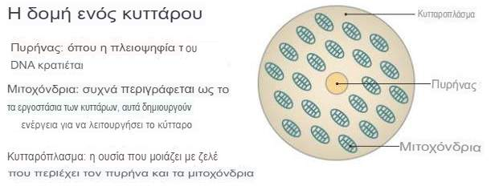  

# Υδατάνθρακες

πέψη : 1-3 ώρες  

Είναι η **κύρια πηγή ενέργειας**, η οποία τροφοδοτεί τις κυτταρικές διεργασίες και υποστηρίζει τις συνολικές μεταβολικές λειτουργίες. Χωρίζονται σε τρεις κατηγορίες :

- Εδώδιμες Ίνες **|**
- Ζάχαρη **|**
- Άμυλο **|**
  - **Ταχέως εύπεπτο άμυλο (RDS)** **|** - είναι η ποσότητα αμύλου που αφομοιώνεται από τα ένζυμα και απορροφάται στην κυκλοφορία του αίματος εντός 20 λεπτών.
  - **Αργά εύπεπτο άμυλο (SDS)** **|** - είναι η ποσότητα αμύλου που μπορεί να αφομοιωθεί πλήρως μέσα σε 20 λεπτά έως 120 λεπτά.
  - **Ανθεκτικό άμυλο (RS)** - αναφέρεται στο άμυλο που δεν μπορεί να αφομοιωθεί εντός 120 λεπτών στο λεπτό έντερο και επομένως περνά στο παχύ έντερο, όπου μπορεί να λειτουργήσει ως υπόστρωμα στις διαδικασίες ζύμωσης του εντέρου (πηγή τροφής για ωφέλιμα βακτήρια). Χωρίζεται σε πέντε τύπους:
    - **RS1** **|** - Φυσικά απρόσιτο άμυλο που δεν μπορεί να υδρολυθεί λόγω του φραγμού του κυτταρικού τοιχώματος.
    - **RS2** **|** - Ακατέργαστο άμυλο, το οποίο λόγω της δομής του (κρυσταλλική μορφή) δεν χωνεύεται.
    - **RS3** **|** - Ανάδρομο άμυλο που σχηματίζεται όταν τα αμυλούχα τρόφιμα [μαγειρεύονται και στη συνέχεια ψύχονται](https://pipiscrew.com/apps/forum/view_topic.php?id=783) (ισχύει για ρύζι / κόκκινες & μαύρες φακές). Οι μακριές διακλαδισμένες αλυσίδες της αμυλοπηκτίνης (amylopectin) σχηματίζουν διπλές έλικες που δεν μπορούν να υδρολυθούν από πεπτικά ένζυμα.
    - **RS4** **|** - Αντιστέκεται στην ενζυματική υδρόλυση τροποποιώντας την αρχική της μοριακή δομή και την προσθήκη ορισμένων χημικών λειτουργικών ομάδων με χημική τροποποίηση (χρησιμοποιείται ως `πρόσθετο τροφίμων`).
    - **RS5** **|** - Συνδυασμός μακριών και μη διακλαδισμένων αλυσίδων αμύλου με ελεύθερα λιπαρά οξέα, σχηματίζοντας μια ελικοειδή δομή που είναι δύσκολο στην πέψη και σκόπιμη αναδιάταξη των μορίων αμύλου - ανθεκτική μαλτοδεξτρίνη.

> Οι **υδατάνθρακες** και τα **λίπη** είναι μακροθρεπτικά συστατικά που παρέχουν **ενέργεια** στον οργανισμό.  

Οι **υδατάνθρακες** και τα **λίπη** είναι **ριζικά διαφορετικά** και αντιμετωπίζονται με **ριζικά διαφορετικούς** τρόπους από το σώμα μας. Είναι ΑΠΟΛΥΤΑ ΚΡΙΣΙΜΟ για να κατανοήσουμε τις βασικές **διαφορές** μεταξύ αυτών των δύο.

Οι **υδατάνθρακες** είναι **υδατοδιαλυτές**. Σκεφτείτε μια **κουταλιά ζάχαρη** στον καφέ σας. **Λίπη**, από την άλλη πλευρά, δεν είναι απολύτως υδατοδιαλυτά ( λάδι και νερό δεν γίνεται μείγμα ). Έτσι το σώμα σας **απορροφά** και **μεταφέρει** και **αποθηκεύει** αυτές τις **δύο διαφορετικές πηγές ενέργειας** με **ΤΕΛΕΙΩΣ διαφορετικούς τρόπους** (και έχουν τελείως διαφορετικές **επιπτώσεις** στον **μεταβολισμό** σας).

Όλα τα τρόφιμα **διασπώνται** σε μικρότερες μονάδες στο **πεπτικό** σας σύστημα πριν ακόμη απορροφηθούν στο **λεπτό έντερο**. Οι **πρωτεΐνες** διασπώνται σε **αμινοξέα**, τα δομικά στοιχεία των πρωτεϊνών, πριν από την απορρόφησή τους. Οι **υδατάνθρακες** που δεν είναι εδώδιμες ίνες, διασπώνται σε απλά **σάκχαρα** όπως η **γλυκόζη** και η **φρουκτόζη** πριν απορροφηθούν (οι εδώδιμες ίνες δεν απορροφώνται καθόλου και συνεχίζουν το δρόμο τους μέσω του πεπτικού σωλήνα, βγαίνοντας από την άλλη πλευρά). Τα **λίπη** τρώγονται ως **τριγλυκερίδια** (τρία λιπαρά οξέα συσκευασμένα μαζί) και διασπώνται σε μεμονωμένα λιπαρά οξέα πριν απορροφηθούν.

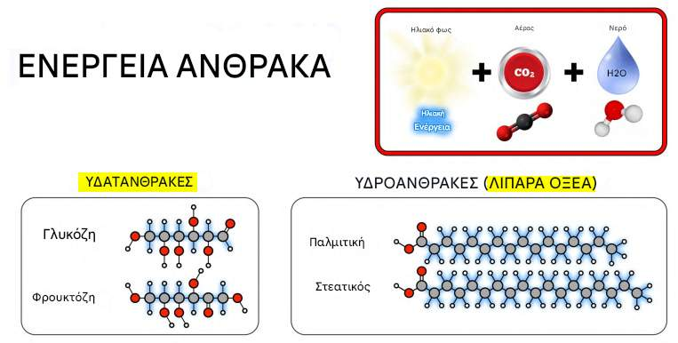  

Όλη η **διατροφική ενέργεια** είναι αλυσίδες **ανθράκων** με δεσμούς άνθρακα-άνθρακα υψηλής ενέργειας — υδατάνθρακες και λίπη. Διασπάμε αυτούς τους δεσμούς στα **μιτοχόνδριά** μας για να απελευθερώσουμε **ενέργεια**.

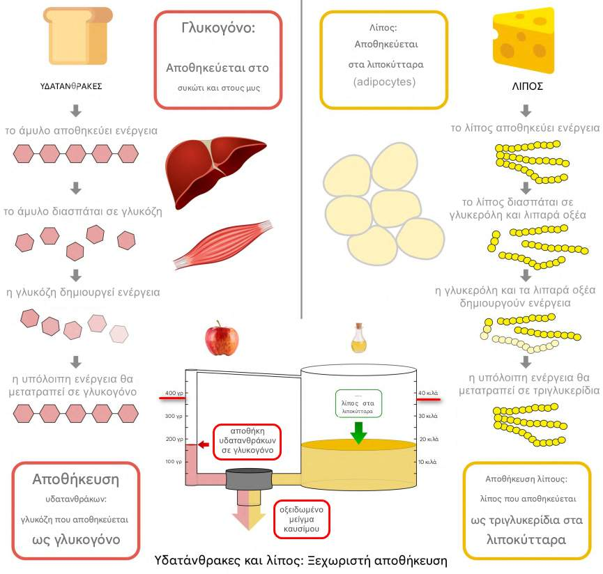 

Άρα έχετε δύο εντελώς **ξεχωριστά διαμερίσματα αποθήκευσης ενέργειας** στο σώμα σας. **Γλυκόζη** (υδατάνθρακες), που είναι υδατοδιαλυτό, αποθηκεύεται ως γλυκογόνο (απλές αλυσίδες γλυκόζης) στο **συκώτι** σας και τους **μυς** σου. **Λίπος**, που ΔΕΝ είναι υδατοδιαλυτό, αποθηκεύεται στα **λιποκύτταρά** σας. Η αποθήκη για το λίπος είναι **ΠΟΛΥ μεγαλύτερη** και το σώμα σας προτιμά να μεταφέρει μόνο το **1%** περίπου της ενέργεια ως **γλυκογόνο** (υδατάνθρακα).

Αποδεικνύεται ότι η **γλυκόζη**, από το **γλυκογόνο**, είναι **ΓΡΗΓΟΡΗ**. Μπορείτε να μετατρέψετε τη γλυκόζη σε ενέργεια **ΕΞΙ ΦΟΡΕΣ γρηγορότερα** σε σύγκριση με το **λίπος**.

Γιατί λοιπόν δεν χρησιμοποιούμε μόνο γλυκογόνο για αποθήκευση ενέργειας; Γιατί το γλυκογόνο είναι **ΒΑΡΥ**! Το γλυκογόνο είναι «πλήρως ενυδατωμένο» (γι' αυτό τους ονομάζουμε υδατάνθρακες), που σημαίνει ότι έχει πολύ **νερό** συνδεδεμένο με αυτό. Και αυτό το νερό ζυγίζει πολύ! Έτσι το γλυκογόνο είναι περίπου έξι φορές **βαρύτερο** από την **ίδια ποσότητα ενέργειας** που αποθηκεύεται με το **λίπος**.

Το **γλυκογόνο**, το οποίο είναι απλώς αλυσίδες μόρια γλυκόζης, είναι ένα είδος «ανθρώπινου αμύλου» και είναι πανομοιότυπο με το άμυλο που υπάρχει στις **πατάτες**. Το λίπος στα σταγονίδια λιπιδίων στα **λιποκύτταρά** σας μοιάζουν πολύ με ηλιέλαιο.

Σημειώση : την παρακάτω φωτογραφία για την ίδια ποσότητα αποθηκευμένης ενέργειας ως ελαιόλαδο σε σχέση με τις πατάτες. Σε εξαπλάσιο μέγεθος και βάρος, μπορείτε να δείτε γιατί το σώμα σας **δεν θέλει να τα κουβαλάει** όλη την ενέργεια ως **γλυκογόνο**. Στην πραγματικότητα, λόγω της αποτελεσματικότητας του βάρους, το σώμα σας κουβαλά 100 φορές περισσότερο λίπος από το γλυκογόνο.

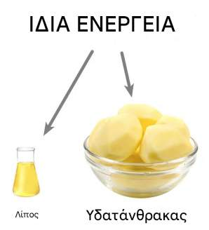  

Αλλά **ΠΡΕΠΕΙ πάντα** να έχουμε **γλυκογόνο** για χρήση έκτακτης ανάγκης. Σε μια **νηστική κατάσταση**, όταν κάνουμε καθιστική ζωή ή μόνο κάνουμε ελαφριά άσκηση, όπως το περπάτημα καίμε κυρίως **λίπος**. Αλλά στις **υψηλές εντάσεις** άσκησης, καίμε κυρίως **γλυκόζη**. `Και μάλιστα, στην ΠΟΛΥ υψηλότερη ένταση, όπως το σπριντ για την ζωή σας, πάντα καίμε 100% αγνή γλυκόζη`. Επειδή είναι τόσο χρήσιμη για χρήση έκτακτης ανάγκης, το σώμα σας **ΠΑΝΤΑ κρατάει** το **γλυκογόνο** στους μύες σας, έτσι μπορεί να τρέξει για τη ζωή σας σε μια στιγμή απειλής. Αυτή είναι μια απαραίτητη ασφάλεια!

Η αποθήκευση **γλυκογόνου** είναι αρκετά **μικρή**. Μπορείτε να κρατήσετε μόνο περίπου **4 γραμμάρια** **γλυκόζης** στην κυκλοφορία του **αίματός** σας και ίσως **100 γραμμάρια γλυκόζης** στο **συκώτι** σας. Οι **μύες** σας μπορούν να χωρέσουν περίπου **300 γραμμάρια γλυκόζης** κατά μέσο όρο, `αλλά αυτή η γλυκόζη είναι μόνο για χρήση έκτακτης ανάγκης` και παραμένει ανέγγιχτη ΕΚΤΟΣ ΑΝ κάνετε ασκήσεις **πολύ υψηλής έντασης**—στην περίπτωση αυτή μπορείτε πραγματικά να κάψετε έναν τόνο γλυκόζης πολύ γρήγορα, εάν λάβετε ένταση μέχρι το μέγιστο. Αυτός είναι ο λόγος που οι άνθρωποι που κάνουν πολλές ασκήσεις υψηλής έντασης `μπορούν να καταναλώνουν πολλούς` υδατάνθρακες. Αλλά ο μέσος Αμερικανός κάνει κατά μέσο όρο **μηδέν λεπτά άσκησης** υψηλής έντασης την ημέρα, οπότε για τους περισσότερους από εμάς, μάλλον θα πρέπει να παραμείνουμε **κάτω από 100 γραμμάρια υδατάνθρακα**.

Η `άσκηση υψηλής έντασης μεγάλης διάρκειας θα απαιτήσει οπωσδήποτε υδατάνθρακες` κατά τη διάρκεια της εκδήλωσης. Ακόμη και οι πιο προσαρμοσμένοι στο λίπος **ελίτ αθλητές** μπορούν να συμμετέχουν σε άσκηση μέγιστης έντασης **μόνο για 2 ώρες** το πολύ πριν **τελειώσουν** εντελώς το **γλυκογόνο** των μυών και του ήπατος και _χτυπήσουν στον τοίχο_, μια κατάσταση **υπογλυκαιμίας** όπου το σώμα σας **σχεδόν σταματά** να κάνει αυτό που έχετε ζητήσει να κάνει. Συνήθως, όποιος ασκεί πολύ υψηλή ένταση για περισσότερο από μία ώρα, θα **επωφεληθεί** από κάποιους **υδατάνθρακες** κατά τη διάρκεια της εκδήλωσης.

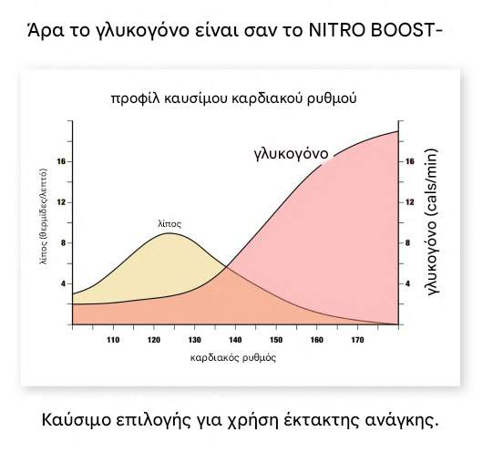  

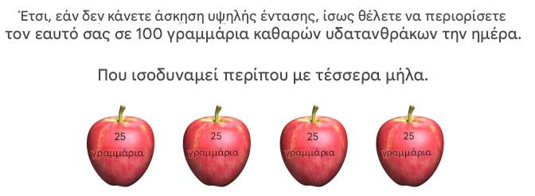  

_Η αποθήκευση γλυκογόνου είναι αρκετά μικρή και, χωρίς άσκηση υψηλής έντασης, οι περισσότεροι άνθρωποι έχουν μόνο χώρο για περίπου 100 γραμμάρια διαιτητικής γλυκόζης (αποθηκευμένη ως γλυκογόνο του ήπατος) ανά 24 ώρες._

ΟΙ **ΥΔΑΤΑΝΘΡΑΚΕΣ** ΚΑΙ ΤΑ **ΛΙΠΗ** ΟΞΕΙΔΟΝΤΑΙ ΑΜΟΙΒΑΙΑ! Και είναι η **ΓΛΥΚΟΖΗ**, όχι το λίπος, που **ελέγχει** ποιο καύσιμο **οξειδώνεται** ανά πάσα στιγμή. Αυτή είναι μια απόλυτη απαίτηση επειδή η αποθήκευση γλυκόζης (γλυκογόνο) είναι τόσο **μικροσκοπική**. Έχουμε **πολύ λίγο χώρο** για αποθήκευση **γλυκόζης** ως γλυκογόνο, οπότε τη στιγμή που αρχίζουμε να **τρώμε** περισσότερη γλυκόζη **πρέπει** αμέσως να **κάψουμε** περισσότερη **γλυκόζη**. Αντίθετα, μόλις **σταματήσουμε** να τρώμε γλυκόζη, αρχίζουμε αμέσως να **καίμε** περισσότερο **λίπος**. Η κατανόηση αυτής της **αλληλεπίδρασης** μεταξύ **υδατανθράκων** και **λιπών** είναι απολύτως **απαραίτητη** εάν θέλετε να **κατανοήσετε** τι απαιτείται για την **αύξηση της οξείδωσης του λίπους**.

Οι δίαιτες **πλούσιες** σε **υδατάνθρακες** μπορούν να αυξήσουν την **οξείδωση** των υδατανθράκων **10 φορές** και να **μειώσουν** την οξείδωση των **λιπών** 10 φορές ταυτόχρονα. Αν θέλετε να γίνετε καλύτεροι στην καύση λίπους (ως καύσιμο), η πιο απλή και άμεση στρατηγική είναι να **τρώτε λιγότερους υδατάνθρακες**. Αν θέλετε το σώμα σας να είναι καλύτερο στην καύση λίπους, πρέπει να κάνετε μόνο ένα πράγμα: να τρώτε **λιγότερους υδατάνθρακες**.

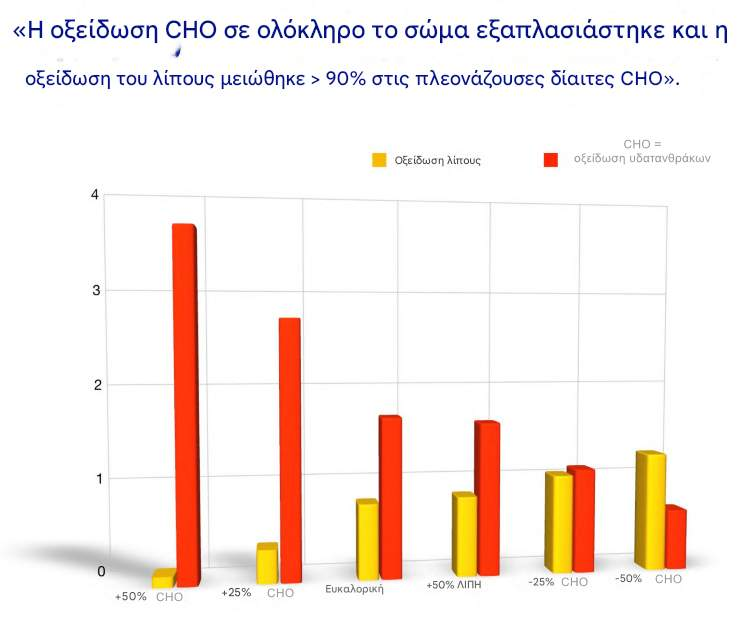  

Υπάρχουν τέσσερις περιπτώσεις (εξαιρώντας την παχυσαρκία)

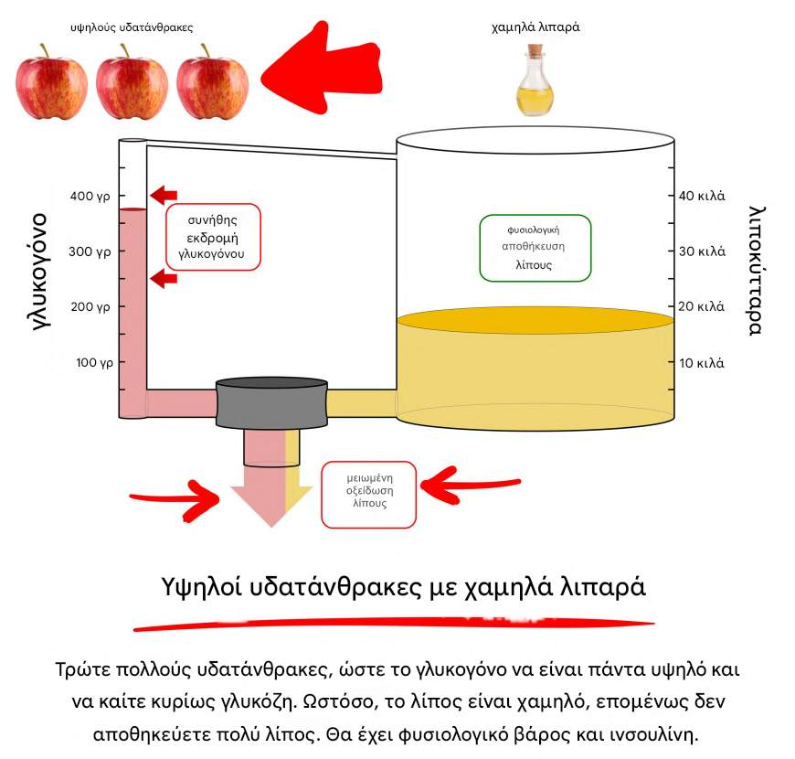  

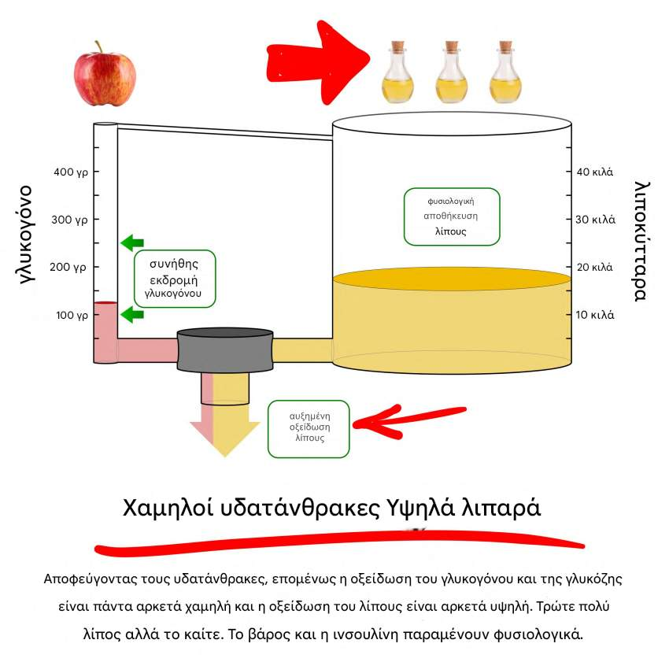  

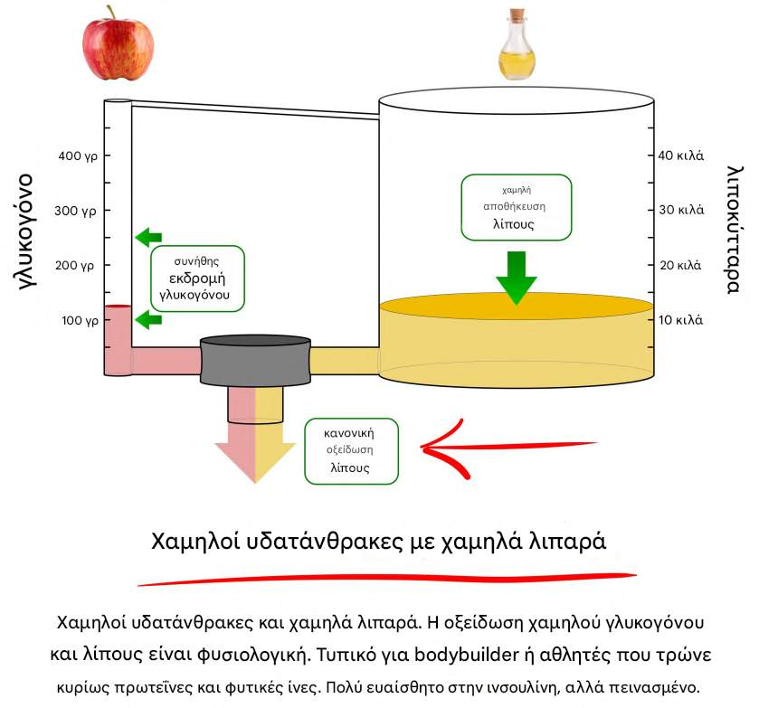  

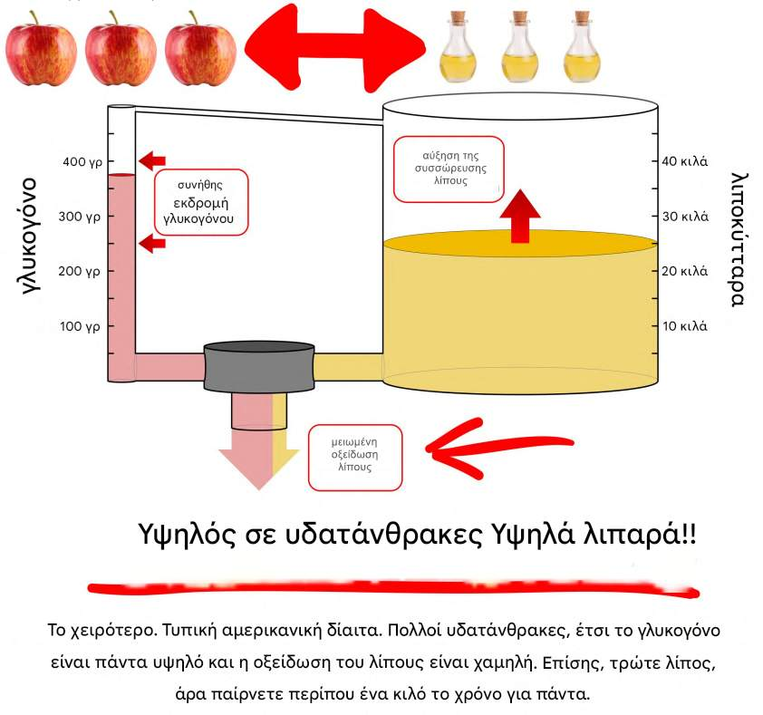  

> Εάν ταΐσετε **υπερβολικά** κάποιον με **λίπος**, δεν αυξάνετε **καθόλου** τον κίνδυνο καρκίνου. Άμα ταΐσετε **υπερβολικά** κάποιον με **υδατάνθρακες** αυξάνετε **δραματικά** τον κίνδυνο καρκίνου. Και η **πρωτεΐνη** βρίσκεται στα **μισά** του δρόμου.  

> Η **γλυκόλυση** είναι μια θεμελιώδης μεταβολική οδός που διασπά τη **γλυκόζη** για την εξαγωγή ενέργειας για **κυτταρικές διεργασίες**. Συμβαίνει στο κυτταρόπλασμα των **κυττάρων**.  

# Τοξική Ενέργεια

Νόσος Αλτσχάιμερ. Ασθμα. Οστεοαρθρίτιδα. Ρευματοειδής αρθρίτιδα. Καρκίνος (ιδιαίτερα του μαστού, του παχέος εντέρου, οισοφαγική, μήτρα, νεφρική, προστάτης, και καρκίνους του παγκρέατος). Κατάθλιψη. Διαβήτης τύπου 2. Λιπαρό συκώτι. Παλινδρόμηση οξέος. Ινομυαλγία. Αρθρίτιδα. Υπνική άπνοια. Υψηλή χοληστερίνη. Υψηλή αρτηριακή πίεση. Οστεοπόρωση. Κτύπημα. Στεφανιαία αρτηρία ασθένεια και αθηροσκλήρωση. Καρδιά αποτυχία. Στυτική δυσλειτουργία. Πολυκυστική ωοθηκικό σύνδρομο. Ακμή. Χαμηλή τεστοστερόνη. Διόγκωση προστάτη. Γυναικομαστία. Φαλάκρα. Ψωρίαση. Λύκος. Περιφερική νευροπάθεια. Γλαυκώμα. Μυωπία. Ιλιγγος. Εμβοές. Φλεγμονώδης νόσος του εντέρου. Σαρκοπενία. Τενοντοπάθεια. Καρπικός σύνδρομο σήραγγας. Απώλεια ακοής. Εκφύλιση της ωχράς κηλίδας.

Βρισκόμαστε αντιμέτωποι με μια **επιδημία** χρόνιας ασθένειας. Και το πιστεύετε ή όχι, κάθε μία από τις χρόνιες παθήσεις που αναφέρθηκαν παραπάνω σχετίζονται **με ένα πράγμα: χρόνια υψηλά επίπεδα ινσουλίνης**—επίσης γνωστή ως «αντίσταση στην ινσουλίνη», ή «υπερινσουλιναιμία».

Η **ινσουλίνη** είναι μια ορμόνη, μόλις απελευθερωθεί από το **πάγκρεας**. Δείτε πώς λειτουργεί: Όταν οι τροφές με **υδατάνθρακες** φτάνουν στο άνω μέρος του εντέρου σας, ενεργοποιούν μια άλλη βασική ορμόνη, το εξαρτώμενο από τη γλυκόζη **ινσουλινοτροπικό πολυπεπτίδιο** (GIP). Αυτή η **έκρηξη GIP** με **γνώμονα** τους **υδατάνθρακες** απλώνεται στο πάγκρεας και στα λιποκύτταρά σας. Στο πάγκρεας, πυροδοτεί μια **έκρηξη** απελευθέρωσης **ινσουλίνης**. Στα λιπώδη κύτταρα, προετοιμάζει τα πράγματα για τη λειτουργία **αποθήκευσης λίπους**. Το κύμα **ινσουλίνης** αναβοσβήνει γύρω από το σώμα σας, ενεργοποιώντας τα κύτταρα σας να ετοιμαστούν να **απορροφήσουν** τη **γλυκόζη**. **Σταματά** την **απελευθέρωση** άλλων **ορμονών**, όπως η γλυκαγόνη, προκειμένου να αποτραπεί η ακατάλληλη παραγωγή γλυκόζης στο συκώτι σας. Λέει στον **υποθάλαμο** στον εγκέφαλό σας ότι η γλυκόζη **είναι καθ' οδόν** για να ελέγξει την **όρεξή** σας. Λέει στο σώμα σας να **σταματήσει** να **καίει λίπος** και κατά προτίμηση να **κάψει** τη **γλυκόζη** που κατεβαίνει από την _καταπακτή_ (`η γλυκόζη είναι επικίνδυνη εάν παραμένει σε υψηλά επίπεδα` στην κυκλοφορία του αίματος), επομένως πρέπει να **δοθεί προτεραιότητα** στην **άμεση καύση** ή να μετατραπεί σε σωματικό λίπος για αποθήκευση. Η ινσουλίνη τα κάνει όλα αυτά και πολλά άλλα, είναι πραγματικά ο **κύριος ρυθμιστής** του σώματός σας.

Εάν **διατηρείτε τα επίπεδα ινσουλίνης** σας **χαμηλά**, όλα αυτά τα σήματα είναι εξαιρετικά **αποτελεσματικά**. Το σώμα σας θα παραμείνει εξαιρετικά ευαίσθητο στα μηνύματα ινσουλίνης. Αυτό είναι ζωτικής σημασίας για **μακροζωία** και **λεπτότητα**. Υπάρχουν πολλές στρατηγικές για να διατηρήσετε την **ινσουλίνη** σας σε **χαμηλά** επίπεδα. Εδώ είναι μερικές από τις πιο σημαντικές προσεγγίσεις:

- Μην καταναλώνετε πάρα πολύ υδατάνθρακες, οι οποίοι αποτελούνται κυρίως από γλυκόζη.
- Μην καταναλώνετε επεξεργασμένους υδατάνθρακες ή επεξεργασμένα φυτικά έλαια.
- Μην καταναλώνετε υδατάνθρακες μαζί με λιπαρά τρόφιμα (πολύ κακός συνδυασμός).
- Μην καταναλώνετε πολύ φρουκτόζη.
- Μην τρώτε συχνά, μάλλον τρώτε γεύματα σε καλή απόσταση (2-3 / ημέρα). Το **σνακ** χαλάει τη **σηματοδότηση** της ινσουλίνης.
- Οι **υπερβολικοί υδατάνθρακες** προκαλούν υπερβολική **ινσουλίνη**. Ειδικά οι **επεξεργασμένοι υδατάνθρακες** οδηγούν σε εκρηκτική απελευθέρωση ινσουλινοτροπικού πολυπεπτιδίου (GIP) που εξαρτάται από τη γλυκόζη στο έντερο – οδηγώντας **πραγματικά** σε **υπερβολική ινσουλίνη**.
- Οι υδατάνθρακες και το λίπος **μαζί** αυξάνουν πραγματικά το GIP και κατά συνέπεια την ινσουλίνη.
- Η **φρουκτόζη** προκαλεί **προβλήματα** ινσουλίνης στο συκώτι, **προάγοντας** την **κακή** χοληστερόλη στην πορεία. Αυτοί είναι οι κύριοι μηχανισμοί που αντιμετωπίζει μια δίαιτα χαμηλή σε υδατάνθρακες και υψηλή περιεκτικότητα σε λιπαρά.
- Υπάρχουν επίσης αναδυόμενες μελέτες που δείχνουν ότι τα προβλήματα **μικροβιώματος του εντέρου** (ζητήματα με την ισορροπία καλών και κακών βακτηρίων στο έντερο σας) μπορούν επίσης να οδηγήσουν σε **απορρύθμιση της ινσουλίνης**.
- Οι τροφές **πλούσιες σε υδατάνθρακες** αυξάνουν τα επίπεδα **σακχάρου** στο αίμα. Η **ινσουλίνη** πρέπει να **αυξηθεί αμέσως** για τη **διαχείριση** αυτού του **σακχάρου** στο **αίμα**. Οι τροφές **πλούσιες σε υδατάνθρακες** είναι επίσης **ελάχιστα χορταστικές στην αρχή** (δεν σας χορταίνουν). Το συνολικό αποτέλεσμα είναι ότι **αισθάνεστε ξανά πεινασμένοι** αμέσως μετά το γεύμα. Την /_άνοιξη/_ είναι δύσκολο να την αγνοήσεις θα σου ψιθυρίσει στο αυτί, /_Χρειάζεσαι πραγματικά και αξίζεις ένα σνακ/_.

# Μεταλλαγμένα Προΐόντα (aka GMO)

Είναι φυτά των οποίων το γενετικό υλικό (ρίζα / σπόρος) έχει **μεταβληθεί** με τη χρήση **βιοτεχνολογίας** για την εισαγωγή επιθυμητών χαρακτηριστικών όπως **αντοχή** στα παράσιτα, ανοχή στα ζιζανιοκτόνα ή βελτιωμένο θρεπτικό περιεχόμενο. Δημιουργήθηκαν από την Monsanto, η οποία εξαγοράστηκε το 2018 απο την Bayer.

Ιστορικά άρχισε το 1970 και το 1990 έγινε επιτρεπτό σε όλους να φυτέψουν GMO σπόρο.

Μετά από χρόνια (1974) οι **εισβολείς** (παράσιτα) έγιναν και αυτοί πιο ανθεκτικοί και έτσι άρχισαν να **ξεκάζουν** με **ειδικό ζιζανιοκτόνο** (aka Roundup) τα φυτά για να μπορέσουν να έχουν καρποφορία.

Δημιουργήθηκε από την Monsanto. Το **Roundup** έχει σαν δραστικό συστατικό το **glyphosate** ([γλυφοσάτη](https://echa.europa.eu/el/hot-topics/glyphosate)).  

Το **Glyphosate** στο ζιζανιοκτόνο Roundup, κατοχυρώθηκε με **δίπλωμα ευρεσιτεχνίας** ως **αντιβιοτικό**. 😂  

Λειτουργεί **διαταράσσοντας** το μονοπάτι που χρησιμοποιούν τα **φυτά** για την παραγωγή **αμινοξέων**, που ονομάζεται μονοπάτι **σικιμικού**. Τα φυτά αλλά όχι τα ζώα χρησιμοποιούν την οδό σικιμάτη. Αυτό οδήγησε τους επιστήμονες να υποθέσουν ότι η **γλυφοσάτη** θα σκότωνε τα ζιζάνια ενώ θα παρέμενε **ασφαλής** για τους ανθρώπους και άλλα ζώα. Όχι τόσο γρήγορα. Μαντέψτε ποιος άλλος χρησιμοποιεί το μονοπάτι **σικιμάτη**. Τα **καλά** **βακτήρια** του **εντέρου**. Το glyphosate είναι **θανατηφόρο για αυτά**.  
* (2021) - Έρευνα - [King College London](https://usrtk.org/pesticides/glyphosate-alterations-in-gut-microbiome/) [[1](https://doi.org/10.1289/EHP6990)]
  * [συνέντευξη επιστημόνων](https://www.youtube.com/watch?v=p6bHyzlZIlE)  

Μεταλλαγμένες ρίζες που υπάρχουν :

- Alfalfa (Medicago sativa) --- με αυτό ταΐζουν τα ζώα
- Μήλο (Golden Delicious / Granny Smith / Fuji)
- (beans) Φασόλια (Phaseolus vulgaris)
- Μαύρομάτικα φασόλια (Vigna unguiculata)
- Κραμβέλαιο
- Καλαμπόκι (Αραβόσιτος)
- Μελιτζάνα (Solanum melongena)
- Λιναρόσπορος (Linum usitatissimum L.)
- Πεπόνι
- Παπάγια (carica papaya)
- Ανανάς
- Δαμάσκηνο (Prunus domestica)
- Πατάτα (Solanum tuberosum L.)
- Ρύζι (Oryza sativa L.)
- Σόγια (Glycine max L.)
- Κολοκύθα + Κολοκυθάκια (Cucurbita pepo)
- Ζαχαρότευτλα (Beta vulgaris)
- Ζαχαροκάλαμο (Saccharum sp)
- Γλυκό πιπέρι
- Ντομάτα (Tycopersicon esculentum)
- Σιτάρι (Triticum aestivum)
- Chicory (Cichorium intybus)
- Safflower (Carthamus tinctorius L.)
- Petunia (Petunia hybrida)
- Καπνός (Nicotiana tabacum L.)
- Βαμβάκι (Gossypium hirsutum L.)
- Λεύκα (Populus sp.)
- Ευκάλυπτος (Eucalyptus sp.)
- Τριαντάφυλλο (Rosa hybrida)
- Γαρύφαλλο (Dianthus caryophyllus)  

> **11/2023** - Η Επιτροπή εγκρίνει ανανέωση για 10 χρόνια - Η γλυφοσάτη έχει εγκριθεί επί του παρόντος ως δραστική ουσία στην Ευρωπαϊκή Ένωση έως **12/2033**. [[1](https://food.ec.europa.eu/plants/pesticides/approval-active-substances-safeners-and-synergists/renewal-approval/glyphosate_en)] [[2](https://www.pipiscrew.com/threads/150812/)]  

πηγές :
* <https://www.bayer.com/en/agriculture/gmo-biotechnology>
* <https://www.fda.gov/food/agricultural-biotechnology/gmo-crops-animal-food-and-beyond>
* <https://www.isaaa.org/gmapprovaldatabase/cropslist/>
* <https://www.ams.usda.gov/rules-regulations/be/bioengineered-foods-list>

# Διαλείπουσα Νηστεία (aka intermittent fasting)

Η νηστεία (12 ώρες -- 20:00 – 8:00 | 18 ώρες -- 20:00 – 14:00) περιλαμβάνει την αποχή από όλα τα τρόφιμα και θερμιδικά ποτά για μια συνεχή περίοδο ωρών, συχνά συμπεριλαμβανομένων των ολονύχτιων ωρών. Θεωρείται ευεργετική γιατί

- προάγει την ευαισθησία στην ινσουλίνη σε όλους τους ανθρώπους
- μειώνει την αντίσταση στην ινσουλίνη σε άτομα με προδιαβήτη
- μειώνει τη φλεγμονή
- βοηθά στην αναστροφή του διαβήτη τύπου 2
- μειώνει την αρτηριακή πίεση
- βελτιώνει την υγεία των λιποκυττάρων και βελτιώνει την καύση λίπους
- βελτιώνει την απώλεια βάρους ενώ διατηρεί τους μυς καλύτερα από τον περιορισμό των θερμίδων
- βελτιώνει τη διάθεση και την πνευματική διαύγεια
- ενισχύει την αυτοφαγία (κυτταρική αναγέννηση και επιδιόρθωση)
- προστατεύει από βλάβες από την ακτινοβολία σε καρκινοπαθείς
- προάγει τη μακροζωία

Συνήθως, η **κατάσταση σίτισης** ξεκινά όταν αρχίζετε να τρώτε και για τις επόμενες **τρεις έως πέντε ώρες** το σώμα σας αφομοιώνει και **απορροφά** το φαγητό που μόλις φάγατε. Η **ινσουλίνη** αυξάνεται σημαντικά, σε κάποιο βαθμό **διακόπτοντας** την **καύση λίπους** και επίσης ενεργοποιώντας τις υπερβολικές θερμίδες που θα αποθηκευτούν ως λίπος. Μετά τις πρώτες λίγες ώρες που αναφέρθηκαν παραπάνω, το σώμα σας περνά σε αυτό που είναι γνωστό ως **μετα-απορροφητική κατάσταση**, κατά την οποία τα συστατικά του τελευταίου γεύματος βρίσκονται ακόμα στην **κυκλοφορία**. Η μετα-απορροφητική κατάσταση **διαρκεί** μέχρι **8 έως 12 ώρες μετά το τελευταίο σας γεύμα**, δηλαδή όταν εισέρχεστε σε κατάσταση **νηστείας**. Συνήθως χρειάζονται 12 ώρες μετά το τελευταίο γεύμα σας για να μπείτε πλήρως στην κατάσταση νηστείας.

Όταν είστε σε κατάσταση νηστείας, το σώμα σας μπορεί να **κάψει λίπος** που ήταν **απρόσιτο** κατά τη διάρκεια της **σίτισης**. Επειδή **δεν** μπαίνουμε εντελώς σε **κατάσταση νηστείας** πριν από περίπου 12 ώρες μετά το τελευταίο μας γεύμα, είναι σπάνιο το σώμα μας να βρίσκεται σε αυτή την κατάσταση καύσης λίπους στο σύγχρονο διατροφικό περιβάλλον. Αυτός είναι ένας από τους λόγους για τους οποίους πολλοί άνθρωποι που ξεκινούν **διαλείπουσα νηστεία** θα χάσουν λίπος χωρίς να αλλάξουν τι τρώνε, πόσο τρώνε ή πόσο συχνά ασκούνται. Η νηστεία βάζει το σώμα σας σε **κατάσταση καύσης λίπους** στην οποία σπάνια μπορείτε να εισέλθετε κατά τη διάρκεια ενός κανονικού προγράμματος διατροφής.

Η κατανάλωση **υδατανθράκων**, ειδικά **επεξεργασμένων υδατανθράκων** χωρίς φυτικές ίνες, **υπερδιεγείρει** την κατάσταση σίτισης, **καθώς** οι υδατάνθρακες **αυξάνουν τόσο τη γλυκόζη** όσο και την **ινσουλίνη** **υψηλότερα** από άλλα μακροθρεπτικά συστατικά. Γενικά, όταν τρώτε ένα **γεύμα**, το σώμα σας **αφιερώνει** μερικές ώρες επεξεργάζοντας αυτό το φαγητό και **καίει ό,τι μπορεί** από αυτό που μόλις **καταναλώσατε**. Επειδή έχει όλα αυτά **άμεσα διαθέσιμα**, που **καίει εύκολα ενέργεια** στην κυκλοφορία του αίματος (χάρη στο φαγητό που φάγατε), το σώμα σας θα επιλέξει να το **χρησιμοποιήσει** ως **ενέργεια** αντί για το λίπος που έχετε αποθηκεύσει. Αυτό ισχύει **ΙΔΙΑΙΤΕΡΑ** εάν καταναλώσατε απλώς **υδατάνθρακες**, επειδή αυτοί μετατρέπονται **γρήγορα σε γλυκόζη** και το σώμα σας **πρέπει να καίει τη ζάχαρη ως ενέργεια** πριν από **οποιαδήποτε άλλη πηγή** (έχετε περιορισμένη αποθήκευση γλυκόζης και **η υψηλή γλυκόζη είναι τοξική**, το σώμα σας **καίει επιπλέον γλυκόζη** **κατά προτίμηση** για να **απαλλαγεί** από αυτή, με τον **ίδιο τρόπο** που το σώμα **καίει το αλκοόλ** που καταναλώνεται για ενέργεια πριν από άλλες ενεργειακές θερμίδες, το αλκοόλ επομένως **σαμποτάρει επίσης απώλεια λίπους**).

Μόλις `περάσετε τις 12 ώρες` από το δείπνο το προηγούμενο βράδυ, `τότε είστε πραγματικά` σε **κατάσταση νηστείας** και αρχίζετε να **βασίζεστε** στο αποθηκευμένο σωματικό **λίπος** για καύσιμο. Εάν μπορείτε να διατηρήσετε αυτή τη διαλείπουσα νηστεία για **20 έως 24 ώρες**, θα επιτύχετε πολύ υψηλό ρυθμό **λιπόλυσης** (διάσπαση του αποθηκευμένου σωματικού λίπους σε ελεύθερα λιπαρά οξέα, **διαθέσιμα για καύση** στα κύτταρα) και οξείδωση λίπους (**καύση λίπους στα μιτοχόνδρια**) .

Ακολουθώντας μια [διατροφή χαμηλών υδατανθράκων](https://www.pipiscrew.com/threads/%CE%94%CE%B9%CE%B1%CF%84%CF%81%CE%BF%CF%86%CE%AE-%CF%87%CE%B1%CE%BC%CE%B7%CE%BB%CF%8E%CE%BD-%CF%85%CE%B4%CE%B1%CF%84%CE%B1%CE%BD%CE%B8%CF%81%CE%AC%CE%BA%CF%89%CE%BD.109145/) συνδυάζεται όμορφα με τη **διαλείπουσα νηστεία**. Είναι πολύ καλό να **ασκείσαι** ενώ **νηστεύεις**, είτε [cardio](https://pipiscrew.github.io/timeline/#/health/exercise?id=cardiorespiratory-fitness) είτε σηκώνοντας [βάρη](https://vimeo.com/showcase/8220991).  

> 18ωρη+ νηστεία : Το σώμα σας θα αντιμετωπίσει ένα γεύμα **διαφορετικά** από ό,τι όταν θα ήσασταν φαγομένος, σε σχέση με το να τρώτε μετά από μια νηστεία, **μεταβολίζεται τελείως διαφορετικά**, το σύστημα το *δέχεται* πιο **ελαφριά**.  

* 2019 - [Dr. Pradip Jamnadas - Νηστεία για επιβίωση](https://www.youtube.com/watch?v=9ROk0OShVTo&t=1084s)
  * αυτοφαγία αρχίζει μετά από τις 18 ώρες νηστείας, το μέγιστο είναι μέχρι 3 μέρες
  * 3 μέρες νηστεία για αντιφλεγμονώδη δράση (special για αυτοάνοσα) [[1](https://youtu.be/9ROk0OShVTo?t=2274)]
  * 7 ήμερη νηστεία κάθε 6 μήνες για προστασία από μακροπρόθεσμες ασθένειες  
  * κάνοντας 7 ημέρες νηστεία η πιθανότητα εμφάνισης καρκίνου κατά την διάρκεια της ζωής σας μειώθηκε κατά 70%  
  * 1 φορά την εβδομάδα μπορείτε να παραλείψετε το βραδινό [[1](https://youtu.be/9ROk0OShVTo?t=2667)]
  * 36 ώρες είναι μαγικός αριθμός [[1](https://youtu.be/9ROk0OShVTo?t=2686)]
  * η ολονύκτια νηστεία (12h) είναι κάτι άλλο, για να επιτευχθούν τα οφέλη της νηστείας θα πρέπει να γίνει για >= 18 ώρες
  * 36 ώρες νηστεία και μετά chemo, θα απομακρύνει μόνο τα καρκινικά κυττάρα [[1](https://youtu.be/9ROk0OShVTo?t=2148)]  
  * όταν είσαι άρρωστος και έχεις ανορέξια, είναι επειδή ο οργανισμός επιδιορθώνεται, μην τρως δεν θα πεθάνεις αλλά από την άλλη μπορεί να πεθάνεις από το φαγητό  
  * συχνή επιθυμία ούρησης λόγω χαμηλής ινσουλίνης είναι συνηθισμένο [[1](https://youtu.be/9ROk0OShVTo?t=2386)]  
  * άμα υπάρχει ζάλη / πονοκέφαλος / κράμπες σε περίοδο νηστείας, πιείτε νερό με 1/8 κουταλάκι του γλυκού (0.5gr) αλάτι  [[1](https://youtu.be/9ROk0OShVTo?t=2450)]  
  * μετά από 2,5 εκατομμύρια χρόνια (100.000 γενιές) γεννήθηκε ο homo sapien μετά ήρθε η αγροτική επανάσταση (600 γενιές) τώρα είμαστε στη βιομηχανική επανάσταση μόνο για 10 γενιές [[1](https://youtu.be/9ROk0OShVTo?t=3935)]  
  * η πείνα έρχεται και φεύγει, έχει να κάνει με την αύξηση & μείωση της [γκρελίνης](https://el.wikipedia.org/wiki/%CE%93%CE%BA%CF%81%CE%B5%CE%BB%CE%AF%CE%BD%CE%B7) σύμφωνα με τον [κιρκάδιο ρυθμό](https://el.wikipedia.org/wiki/%CE%9A%CE%B9%CF%81%CE%BA%CE%AC%CE%B4%CE%B9%CE%BF%CF%82_%CF%81%CF%85%CE%B8%CE%BC%CF%8C%CF%82)
  * σίτιση σε περιορισμένο χρόνο - όταν δεν μπορείτε να κάνετε νηστεία τρώτε 1 φορά την ημέρα (το πολύ 2) σε ένα παράθυρο 6-8 ωρών  
  * επιτρεπόμενα κατά την νηστεία - νερό / τσάι / καφές / λάδι καρύδας / λάδι mct / DIY ζωμός οστών [[1](https://youtu.be/9ROk0OShVTo?t=4076)]  
  * άμα έχετε υψηλά τριγλυκερίδια και χαμηλή HDL και η αναλογία είναι μεγαλύτερη από 2 υπάρχουν υψηλά επίπεδα ινσουλίνης [[1](https://youtu.be/9ROk0OShVTo?t=4536)]  

\--

- Πάντα μαγειρεύουμε σε χύτρα ταχύτητας
- Πάντα [250gr κρέας](https://pipiscrew.com/apps/forum/view_topic.php?id=778) στο μεσημεριανό
- Πάντα [200gr ρύζι basmati](https://pipiscrew.com/apps/forum/view_topic.php?id=783) το απόγευμα
  - Προσπαθήστε να διατηρήσετε **καθαρούς υδατάνθρακες** (υδατάνθρακες μείον τις φυτικές ίνες) λιγότερο από 100 γραμμάρια την ημέρα μέγιστο
    * δύο πατάτες ή
    * δύο φλιτζάνια μαγειρεμένο ρύζι ή
    * τέσσερα μήλα  
* Πάντα σταματάμε να τρώμε 18:00 ( `16ωρη` - 18:00 - 10:00 | `18ωρη` - 16:00 - 10:00 ). Έχει **τεράστια διαφορά** στον μεταβολισμό, `7:00 με 13:30` γίνονται **κυτταρικές διεργασίες** (επηρεάζονται από τους [κιρκάδιους ρυθμούς](https://el.wikipedia.org/wiki/%CE%9A%CE%B9%CF%81%CE%BA%CE%AC%CE%B4%CE%B9%CE%BF%CF%82_%CF%81%CF%85%CE%B8%CE%BC%CF%8C%CF%82)), πρέπει να τρώμε πρωινό.
  * 10:00 - 500ml Kefir
  * 11:00 - 2 αυγά
  * 15:30 - καλό γεύμα   

πηγές :  

- Eat Rich, Live Long (2018) - [https://www.amazon.com/dp/1628602732](https://href.li/?https://www.amazon.com/dp/1628602732)
- The PE Diet (2019) - [https://www.thepediet.com/](https://href.li/?https://www.thepediet.com)
- Gut check (2024) - [https://www.amazon.com/dp/0062911775](https://href.li/?https://www.amazon.com/dp/0062911775)
- <https://pipiscrew.github.io/timeline/#/health/introduction_old>  

επόμενο κεφάλαιο :  
* 2023 - [Dr. Pradip Jamnadas - Η επίδραση του μικροβιώματος στην υγεία](https://www.youtube.com/watch?v=S1n7P5l2xK8)
* 2022 - [Χαρώνης Αναστάσιος - Ευ Ζην Holobiont](https://www.ianos.gr/books/epistimes/iatriki/diatrofi-diaitologia/ef-zin-holobiont-0537228) [[1](https://pipiscrew.github.io/timeline/assets/ey_zhn.jpg)]  

---

# FOXO3 - στον δρόμο προς τη μακροζωία

Τα ακόλουθα, *κόπηκαν* από το video [Dr. Pradip Jamnadas - Νηστεία για επιβίωση](https://www.youtube.com/watch?v=9ROk0OShVTo&t=1084s).

> **Γονίδια** (genes) = Είναι τμήματα του DNA που περιέχουν τις **κληρονομικές πληροφορίες** και τις απαραίτητες οδηγίες για τη **σύνθεση πρωτεϊνών**, οι οποίες με τη σειρά τους **καθορίζουν** τα χαρακτηριστικά και τις λειτουργίες ενός οργανισμού.
>
> **RNA** (ριβονουκλεϊκό οξύ) = Περιλαμβάνει διάφορους τύπους, κάποιοι από αυτούς :
> * mRNA (αγγελιοφόρος RNA) - μεταφέρει γενετικές πληροφορίες από το DNA στο ριβόσωμα για τη σύνθεση πρωτεϊνών.
> * tRNA (RNA μεταφοράς)
> * rRNA (ριβοσωμικό RNA)
>
> **Νουκλεϊκά οξέα** = αποθήκευση και μετάδοση γενετικών πληροφοριών
>
> **Ριβοσώματα** = είναι κυτταρικές δομές που διευκολύνουν τη σύνθεση πρωτεϊνών **μεταφράζοντας** το αγγελιοφόρο RNA (mRNA) σε **αλληλουχίες αμινοξέων**.  
> 
> **Τελομερή** = Είναι μια περιοχή επαναλαμβανόμενων **αλληλουχιών** DNA στο **τέλος ενός χρωμοσώματος**. Τα τελομερή προστατεύουν τα **άκρα** των χρωμοσωμάτων από το να ξεφτίσουν ή να μπλέξουν. Τα χρωμοσώματα βρίσκονται μέσα στον **πυρήνα** (nucleus) του κυττάρου. Τα οποία είναι **δομές** φτιαγμένες από DNA και πρωτεΐνες. Κάθε **χρωμόσωμα** έχει **τελομερή** στα **άκρα** του, τα οποία **προστατεύουν** το χρωμόσωμα και παίζουν **ρόλο** στην **κυτταρική διαίρεση**.

Τα **γονίδια παράγουν πρωτεΐνες** μέσω μιας διαδικασίας που ονομάζεται **γονιδιακή έκφραση** (gene expression), η οποία περιλαμβάνει δύο κύρια στάδια:
* μεταγραφή (transcription)
  * Γίνεται στον **πυρήνα** (nucleus) του **κυττάρου**. Κατά τη μεταγραφή, η αλληλουχία DNA ενός γονιδίου `αντιγράφεται` σε **αγγελιοφόρο RNA** (mRNA).
* μετάφραση (translation)
  * Μετά τη μεταγραφή, το μόριο mRNA **εξέρχεται** από τον πυρήνα (nucleus) και `εισέρχεται` στο **κυτταρόπλασμα** (cytoplasm), όπου **μεταφράζεται** σε **πρωτεΐνη**.  

 αναλυτικά 

 

Κατά τη μετάφραση, η αλληλουχία mRNA διαβάζεται σε ομάδες τριών **νουκλεοτιδίων** (είναι τα βασικά δομικά στοιχεία των νουκλεϊκών οξέων) που ονομάζονται κωδικόνια. Κάθε κωδικόνιο αντιστοιχεί σε ένα συγκεκριμένο **αμινοξύ**. Τα μόρια μεταφοράς RNA (tRNA) φέρνουν τα **κατάλληλα αμινοξέα** στο **ριβόσωμα**, όπου το ριβόσωμα διευκολύνει τη **σύνδεση του tRNA στο mRNA**. Το ριβόσωμα κινείται κατά μήκος του mRNA και τα **αμινοξέα συνδέονται** μεταξύ τους (με τη σειρά που **καθορίζεται** από την **αλληλουχία** του **mRNA**), σχηματίζοντας μια πολυπεπτιδική αλυσίδα. Μόλις μεταφραστεί ολόκληρο το mRNA, η πολυπεπτιδική αλυσίδα (γραμμική αλληλουχία αμινοξέων που συνδέονται με πεπτιδικούς δεσμούς) διπλώνεται σε ένα συγκεκριμένο τρισδιάστατο σχήμα για να **γίνει** μια `λειτουργική πρωτεΐνη`.

  

Το **σώμα** είναι πραγματικά πολύ έξυπνο αυτό που **τρώτε αρχίζει αμέσως** να αλλάζει τη **γονιδιακή έκφραση** (gene expression). Δύο άνθρωποι που μιλάνε :  
- το σκέφτηκες ποτέ αυτό;
- δεν το σκέφτηκα ποτέ αυτό μέχρι που έκανα όλη αυτή την έρευνα και άρχισα να τα ερευνώ όλα αυτά.
- τι; Η `γενετική μου έκφραση` **αλλάζει** με κάθε **γεύμα** που τρώω ? wtf!
- ναι!
- είναι πολύ ενθαρρυντικό να γνωρίζεις [[1](http://ebooks.edu.gr/ebooks/v/html/8547/2726/Biologia-T2_G-Lykeiou-ThSp-SpYg_html-empl/index2_1.html)]  

Σημαντική **βιταμίνη** που **εμπλέκεται** στη **γονιδιακή έκφραση** είναι η `βιταμίνη D`, εάν έχετε έλλειψη βιταμίνης D η **γονιδιακή σας έκφραση** είναι **ανάπηρη**, το **γενετικό υλικό** του σώματός σας δεν μπορεί να *αποκαλυφθεί* με φυσιολογικό τρόπο (ικανότητα επιδιόρθωσης του σώματός σας). Και μπορώ να σας πω αυτή τη στιγμή ότι το 90% από εσάς (που βρίσκεστε σε αυτή την αίθουσα) έχει **έλλειψη βιταμίνης D**.  

Η **βιταμίνη D** εμπλέκεται σε περισσότερες από 300 διαφορετικές βιοχημικές αντιδράσεις στο σώμα (οι περισσότερες έχουν να κάνουν με την **γονιδιακή έκφραση**).  

Το γονίδιο [FOXO3](https://pmc.ncbi.nlm.nih.gov/articles/PMC5403515/) είναι **απαραίτητο αντιοξειδωτικό**, είναι αυτό το γονίδιο που **ενεργοποιεί** τις διαδικασίες για την **επισκευή** `DNA`. Το DNA **βομβαρδίζεται** καθημερινά από :  
* ακτινοβολία
* τοξίνες 
* τρόφιμα   

και το DNA **καταρρέει** κάθε μέρα γι' αυτό **γερνάμε**. Εκτός των άλλων, το FOXO3 **κάνει** τα `τελομερή` όμορφα και μακρύτερα ( μακρύτερα **τελομερή** σημαίνει `μακροζωία` ). [[1](https://href.li/?https://www.snexplores.org/article/scientists-say-telomere-definition-pronunciation)] [[2](https://href.li/?https://learn.genetics.utah.edu/content/basics/telomeres/)]  

> Ο διαλογισμός (meditation) δυναμώνει τα **τελομερή**.  

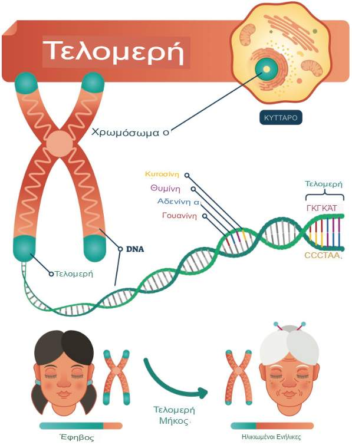

Η [απόπτωση](https://href.li/?https://el.wikipedia.org/wiki/%CE%91%CF%80%CF%8C%CF%80%CF%84%CF%89%CF%83%CE%B7) είναι ο κυτταρικός **προγραμματισμένος θάνατος** των κυττάρων, το FOXO3 **ελέγχει** αυτή την κάθαρση των γερασμένων κυττάρων (να απαλλαγούμε από παλιά κύτταρα) αυτό λέγεται `αυτοφαγία` (autophagy). Δεν θέλετε παλιά κύτταρα να υπάρχουν στο σύστημά σας.  

Για να έχετε `καλό FOXO3 πρέπει να έχετε βιταμίνη D` στο σύστημά σας και πρέπει να τρώτε τη σωστή τροφή (όχι επεξεργασμένα τρόφιμα). Άμα τρώτε φρούτα (max ένα / μέρα) να είναι με χαμηλό γλυκαιμικό δείκτη.  

Έτσι, το `DNA` (βήμα 1) μπορεί να αρχίσει να **παράγει πρωτεΐνες** αυτό που ονομάζεται **γονιδιακή έκφραση** (gene expression). Σαν αποτέλεσμα η γενετική σας έκφραση αλλάζει επειδή τώρα φτιάχνετε **νέες πρωτεΐνες** (βήμα 2). Έτσι, καταναλώνοντας **βιταμίνη D** (τώρα βλέπετε **πώς η διατροφή** σας) **επηρεάζει** ποια γονίδια θα εκφραστούν τώρα. Και αυτά τα **γονίδια παράγουν πρωτεΐνες** και έτσι ασκούν το **αποτέλεσμα** στο **σώμα** σας (βήμα 3). Έτσι, η `επίδραση` στο σώμα σας ενεργοποιεί `πραγματικά` ένα γονίδιο (βήμα 4) που ονομάζεται γονίδιο **FOXO3** και αυτό το γονίδιο FOXO3 **ενεργοποιεί πολλά άλλα γονίδια** (αυτό κάνουν τα γονίδια, ενεργοποιούν άλλα γονίδια). Είναι πολύ συναρπαστικό. Το γονίδιο FOXO3 `ενεργοποιεί όλα τα αντιοξειδωτικά γονίδια στο σώμα σας` φυσικά (naturally), επομένως δεν χρειάζεται να πάτε να αγοράσετε βιταμίνη C ή βιταμίνη Ε κτλ.  

Αυτά τα γονίδια που ενεργοποιεί το γονίδιο FOXO3 το κάνει επίσης ο `κουρκουμάς`. Νομίζετε ότι ο κουρκουμάς έχει **αντιοξειδωτικές ιδιότητες**(?), έχει, αλλά μέσω του μηχανισμού που **ενεργοποιεί τα συγκεκριμένα γονίδια** (όπως το γονίδιο FOXO3). Από μόνος του δεν έχει αντιοξειδωτικές ιδιότητες.  

Γι' αυτό είναι `super super βασικό να έχετε βιταμίνη D` και τα `omega3` και να είναι σε σωστή αναλογία με τα **omega6**. [[1](https://youtu.be/9ROk0OShVTo?t=3237)]  

Η `μελατονίνη` προλαμβάνει τον καρκίνο, και **ενεργοποιεί** επίσης το **FOXO3**, οπότε αν δεν λαμβάνετε μελατονίνη και δεν κοιμάστε τη νύχτα, δεν λαμβάνετε **αναζωογόνηση**.  

---

# Οξειδωτικό στρες (oxidative stress)

> **οξειδωτικό στρες** = είναι μια ανισορροπία των ελεύθερων ριζών και των αντιοξειδωτικών στο σώμα σας που οδηγεί σε κυτταρική βλάβη.  

Τα ακόλουθα, *κόπηκαν* από το video [King College London - συνέντευξη επιστημόνων](https://www.youtube.com/watch?v=p6bHyzlZIlE).
  
Είναι ουσιαστικά βλάβη ή στρες που προκαλείται από την υπερβολική παραγωγή `αντιδραστικού οξυγόνου`. Στο σώμα μας **παράγουμε** συνεχώς αυτά που είναι γνωστά ως **αντιδραστικά είδη οξυγόνου** αυτά είναι μόρια τύπου οξυγόνου που, όπως υποδηλώνει το όνομα, είναι εξαιρετικά **αντιδραστικά**, επομένως θα αντιδράσουν και θα **βλάψουν** σχεδόν οποιοδήποτε είδος δομής (πρωτεΐνες και το DNA).  

Κανονικά έχουμε **μηχανισμούς εξουδετέρωσης** αυτού, τα **αντιοξειδωτικά**, βοηθούν να αντιμετωπίσουμε αυτά τα **φυσικά παραγόμενα αντιδραστικά μόρια οξυγόνου**. Τα ζώα που τράφηκαν με `roundup` προκάλεσε μια **υπερβολική παραγωγή αυτού του αντιδραστικού οξυγόνου**. Με άλλα λόγια, το έντερο `βρισκόταν υπό οξειδωτικό στρες`, υπήρχε μια προσβολή εκεί. Όταν εξετάσαμε το `αίμα` των ίδιων ζώων, είδαμε πολύ σαφείς δείκτες **οξειδωτικού στρες και στο αίμα**, δηλαδή οξειδωτικό στρες στο εσωτερικό του σώματος των ζώων έτσι βλάπτει τις δομές των :  

* κυττάρων
* οργάνων
* και το DNA  

---

# Μεταβολική ενδοτοξαιμία (metabolic endotoxemia)

> **μεταβολική ενδοτοξαιμία** = αναφέρεται στην κατάσταση κατά την οποία βακτηριακή ενδοτοξίνη, και συγκεκριμένα λιποπολυσακχαρίτες, από το έντερο εισέρχονται στην κυκλοφορία του αίματος και φτάνουν στον εγκέφαλο, οδηγώντας σε συστηματική φλεγμονή.  

Τα ακόλουθα, *κόπηκαν* από το video [Dr. Pradip Jamnadas - Η επίδραση του μικροβιώματος στην υγεία](https://www.youtube.com/watch?v=S1n7P5l2xK8).  

Είναι οι `λιποπολυσακχαρίτες` (γνωστοί και ως `LPS` ή αλλιώς **ενδοτοξίνες**) που βρίσκονται στο **κυτταρικό τοίχωμα** των **βακτηρίων**, παράγονται από τα βακτήρια (του εντέρου), πέφτουν στην κυκλοφορία του αίματος (λόγω διαρρέοντος εντέρου).  

`sdLDL` = Η sdLDL οξειδώνεται εύκολα. Εισέρχεται στο **ενδοθήλιο** των αιμοφόρων αγγείων και `προκαλεί αθηροσκλήρωση`.  

Οι [λιποπολυσακχαρίτες](https://athenslab.gr/exetaseis-prolipsis/detoxscan-elegxos-oxeidotikou-stres/lipopolusakxaritis-lps-orou-1181) συνδέονται με την LDL και την μετατρέπουν σε `sdLDL` (εδώ είναι πιθανό ο αριθμός της **LDL** σας να είναι εντάξει, αλλά η **sdLDL** όχι).  

`sdLDL` σχετίζεται με **λιπώδες ήπαρ**, το οποίο σχετίζεται με **εντερικά προβλήματα**.  

Το `στρες` αυξάνει την `ποσότητα λιποπολυσακχαριτών` στην **κυκλοφορία του αίματός** (περιγραφή παραπάνω^) ακόμα και όταν δεν έχετε προβλήματα στο έντερο, για μια στιγμή/ώρες μπορεί να προκαλέσει διαρροή στο έντερο (leaky gut). Ο εγκέφαλος επικοινωνεί μέσω του `πνευμονογαστρικού νεύρου` με το έντερο και δίνει εντολή να απελευθερωθεί η ορμόνη `κορτιζόλη`, η οποία με την σειρά της απελευθερώνει `πεπτίδια` από τα `μαστοκύτταρα` και στη συνέχεια καταστρέφεται το `εντερικό βλεννογόνο` (φλεγμονή και διαπερατότητα).  

> Η κατανάλωση πρόχειρου φαγητού βοηθά τους λιποπολυσακχαρίτες να διεισδύσουν στο έντερο.  

Το **70% του ανοσοποιητικού** συστήματος βρίσκεται στο **έντερο**, όπου υπάρχουν `Τ και Β κύτταρα`. Οι `LPS`, όταν περνούν στην κυκλοφορία του αίματος, **διεγείρουν** αυτά τα **κύτταρα** με αποτέλεσμα να παράγουν `φλεγμονώδεις κυτοκίνες` (φλεγμονή), οι οποίες προκαλούν επίσης `ανοσοποιητικά προβλήματα`.  

Τα μόρια `φλεγμονωδών κυτοκινών` ταξιδεύουν στον **εγκέφαλο**, περνώντας από τον `αιματοεγκεφαλικό φραγμό` (BBB) και προκαλούν `φλεγμονή` στον εγκέφαλο (νοητική ομίχλη / κατάθλιψη). Η κατάθλιψη σχετίζεται με την `αθηροσκλήρωση`.  

Οι `LSP` πηγαίνουν στο **ήπαρ** και προκαλούν `λιπώδες ήπαρ` [[2](https://www.theguardian.com/society/2025/jun/05/millions-in-west-do-not-know-they-have-aggressive-fatty-liver-disease-study-says)] και οι μύες γίνονται **ανθεκτικοί στην ινσουλίνη**. Εμφανίζεται `μεταβολικό σύνδρομο`  
* αυξάνεται το **σάκχαρο** στο αίμα
* αυξάνονται τα **τριγλυκερίδια**
* μειώνεται η **HDL**  

Όλοι αυτοί οι **δείκτες** είναι της `αθηροσκλήρωσης`. Το `μεταβολικό σύνδρομο` προκαλεί `φλεγμονώδες λίπος`, οι `LPS` μπαίνουν μέσα στους `υγιείς λιπώδεις ιστούς`, ενεργοποιούν ξανά το `ανοσοποιητικό σύστημα`, γι' αυτό βρίσκουμε `φλεγμονώδη κύτταρα` στο **λίπος** (άτομα με παχυσαρκία: σχεδόν το 50% του λίπους είναι φλεγμονώδη μόρια).  

reference - (2024) [Metabolic Endotoxemia - From the Gut to Neurodegeneration](https://doi.org/10.3390/ijms25137006)  

(JUL/2025) [imidazole propionate molecule produced by gut bacteria causes atherosclerosis](https://english.elpais.com/health/2025-07-17/revolution-in-medicine-a-molecule-produced-by-gut-bacteria-causes-atherosclerosis-responsible-for-millions-of-deaths.html)  

> **sdLDL** αποτελεί **καλύτερο προγνωστικό** παράγοντα καρδιαγγειακού κινδύνου (CV) **από** την LDL-C (aka LDL), <u>ακόμη και σε ασθενείς με χαμηλή χοληστερίνη</u> (LDL-C < 100mg/dL).
Ομοίως, η [δοκιμή JUPITER](https://en.wikipedia.org/wiki/JUPITER_trial) συνέδεσε την __sdLDL__ με καρδιαγγειακούς θανάτους... <u>ακόμη και σε ασθενείς με πολύ χαμηλή</u> LDL-C. &nbsp; [πηγή](https://wholeheartfamilymed.com/advanced-testing/blood-work/lipids/sdldl)  

_GPT :_  
**LDL-C (Χοληστερόλη Λιποπρωτεϊνών Χαμηλής Πυκνότητας) :** Αναφέρεται στην συνολική περιεκτικότητα χοληστερόλης σε όλα τα σωματίδια LDL στην κυκλοφορία του αίματος. Είναι ένα συνηθισμένο μέτρο που χρησιμοποιείται σε λιπιδικά πάνελ για την αξιολόγηση του καρδιαγγειακού κινδύνου. Περιλαμβάνει όλα τα μεγέθη σωματιδίων LDL, <u>τόσο μεγάλα όσο και μικρά</u>, και συνήθως μετριέται σε χιλιοστόγραμμα ανά δεκαλίτρο (mg/dL).  

**sdLDL (Μικρή Πυκνή LDL) :** Αναφέρεται σε μια **υποκατηγορία σωματιδίων LDL** που είναι μικρότερα και πυκνότερα από τα τυπικά σωματίδια LDL. Αυτά τα σωματίδια συχνά θεωρούνται πιο `αθηρογόνα` (πιθανότερο να προάγουν τον σχηματισμό λιπαρών πλακών στις αρτηρίες) από τα μεγαλύτερα, λιγότερο πυκνά σωματίδια LDL. Τα αυξημένα επίπεδα `sdLDL` σχετίζονται με υψηλότερο κίνδυνο καρδιαγγειακών επεισοδίων, ακόμη και όταν τα συνολικά **επίπεδα LDL-C** είναι **εντός** των φυσιολογικών **ορίων**.  

---

2024 - [Dr. Pradip Jamnadas - Why Gut Health Affects Everything + FAQ](https://www.youtube.com/watch?v=Npy0qwgh5RM) - to be translated to Greek.  
* gi tract + epithelial cells analysis + LPS + WBC + Liver [video pin](https://youtu.be/Npy0qwgh5RM?t=600)
* arteriosclerosis analysis
* plants with bacteria analysis [video pin](https://youtu.be/Npy0qwgh5RM?t=3328)
* ultrasound of liver
* CT Scan with plaque analysis
* sibo supplements
  * omega3 pills 2gr (1gr per pill)
  * candibactin A+B for 14 days
  * curcumin 300mg twice a day
  * oils - one drop each, elevate 1 drop / week till reach 3 drops
    * oil of oregano
    * oil of cinnamon
    * oil of cloves
  * inulin-fos

2024 - [Dr. Pradip Jamnadas - Vagus Nerve Hacks: Powerful Techniques to Enhance Health and Well-Being + FAQ](https://www.youtube.com/watch?v=irn3cFHmK-Y) - to be translated to Greek.  
* breath and all the other technics explained.
* want to hack your psyche change your mind about everything live in the moment release the past be forgiving forgive and forget and get a pet you're going to live long.
* in this define the oil drop amount (wrote on above, on previous video)
