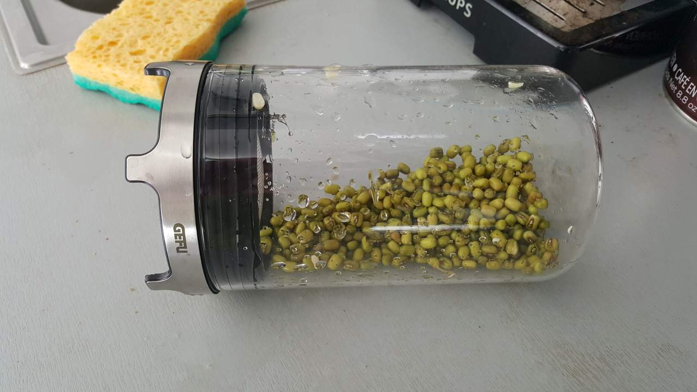
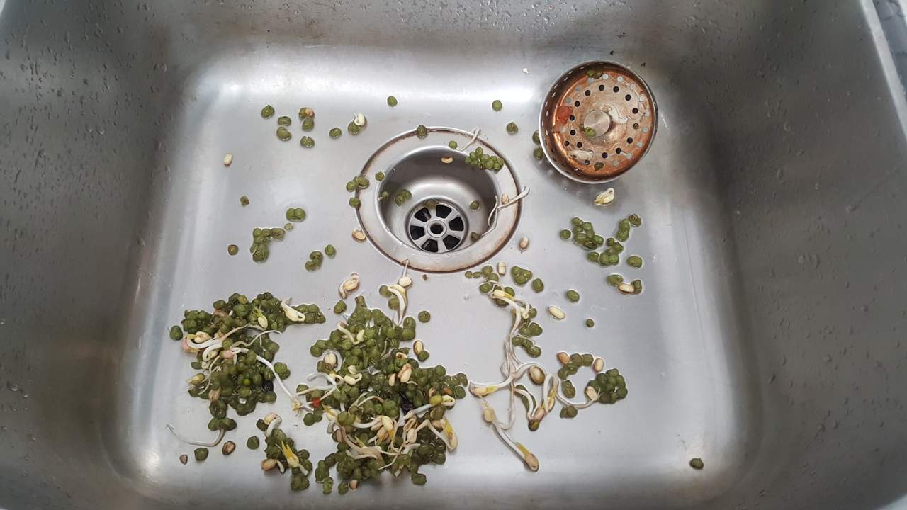

# Nutrients 
Nutrients in plants are **not always easily** digested. This is because plants may contain **antinutrients**. These are plant compounds that **reduce** the absorption of nutrients from the digestive system. In some cases, they can be eliminated almost completely.  

Beans and other legumes are often soaked in water **overnight** to improve their nutritional value, most of the antinutrients in these foods are found in the **skin**. Since many antinutrients are water-soluble, they simply **dissolve** when foods are soaked.  

**Sprouting** is a period in the life cycle of plants when they start **emerging** from the seed. This natural process is also known as **germination**.

This process **increases** the availability of **nutrients** in seeds, grains and legumes. During **sprouting**, changes take place within the seed that lead to the **degradation** of antinutrients such as phytate and protease inhibitors.  

[source](https://www.healthline.com/nutrition/how-to-reduce-antinutrients)  

# Nutritional improvement of cereals by sprouting
* The desirable nutritional changes that occur during sprouting are mainly due to the **breakdown** of complex compounds into a more **simple** form, transformation into essential constituents and breakdown of nutritionally **undesirable** constituents. This is a reason why sprouts are also called **pre-digested** foods.
* The metabolic activity of resting seeds increases as soon as they are hydrated during soaking. Complex **biochemical changes** occur during hydration and **subsequent** sprouting. The reserve chemical constituents, such as protein, starch and lipids, are broken down by enzymes into simple compounds that are used to make **new** compounds.
* Sprouting grains causes increased activities of hydrolytic enzymes, **improvements** in the contents of total proteins, fat, certain essential amino acids, total sugars, B-group vitamins, and a decrease in dry matter, starch and anti-nutrients. The increased contents of protein, fat, fibre and total ash are only apparent and attributable to the disappearance of starch. However, improvements in **amino acid** composition, B-group vitamins, sugars, protein and starch digestibilities, and **decrease** in phytates and protease inhibitors are the metabolic effects of the sprouting process.  

[source](https://doi.org/10.1080/10408398909527508) [[2](https://en.wikipedia.org/wiki/Sprouting)] ([mirror](https://www.dropbox.com/s/hs9xqjmk7xxfpjd/Nutritional%20improvement%20of%20cereals%20by%20sprouting.pdf?dl=1))


# Small-Seeded Legumes as a Novel Food Source
The protein and phytochemical contents increased and total carbohydrates decreased from seeds to microgreens. Our findings proved for the first time that seeds, **sprouted** seeds, and especially microgreens of small-seeded legumes are **promising new sources** of ingredients for fortification of staple foods with **bioactive** compounds, minerals and nutrients.

[source](https://doi.org/10.3390/molecules24010133)

# In Vivo vs In Vitro
In **vivo** refers to when research or work is done with or within an entire, living organism. Examples can include studies in animal models or human clinical trials. In **vitro** is used to describe work that's performed outside of a living organism.  


# Antinutrients and digestibility (in vitro) of soaked, dehulled and germinated cowpeas (black-eyed pea)

Phytic acid, polyphenols, protein and starch digestibility (in vitro) in two varieties, namely CS-46 and CS-88, of soaked, dehulled and germinated cowpeas were determined. Soaking for 12 hours, dehulling of soaked seeds and germination for different time periods (24, 36 and 48 h) contributed significantly in reducing the phytic acid and polyphenol content of cowpeas. Removal of seed coat (dehulling) of soaked cowpeas reduced the polyphenols by 70-71%. Soaking (12 h) brought about an improvement in protein and starch digestibility which further increased after dehulling. Progressive increase in digestibility (protein and starch) was noticed, with an increase in germination period. Dehulling of soaked seeds was most effective in reducing the polyphenolic content, and germination in enhancing protein and starch digestibility.  [source](https://pubmed.ncbi.nlm.nih.gov/10904935/) ([mirror](https://www.dropbox.com/s/k2nyjc8h8ddvrzk/Antinutrients%20and%20Digestibility.pdf?dl=1))  


# Plant-based diets are associated with reduced risk of lifestyle-induced chronic diseases  

| Anti-nutrient  | Food Sources                                                                                                          | Suggested Clinical Implications                                                                  |
| -------------- | --------------------------------------------------------------------------------------------------------------------- | ------------------------------------------------------------------------------------------------ |
| Lectins        | Legumes, cereal grains, seeds, nuts, fruits, vegetables                                                               | Altered gut function; inflammation                                                               |
| Oxalates       | Spinach, Swiss chard, sorrel, beet greens, beet root, rhubarb, nuts, legumes, cereal grains, sweet potatoes, potatoes | May inhibit calcium absorption; May increase calcium kidney stone formation                      |
| Phytate (IP6)  | Legumes, cereal grains, pseudocereals (amaranth, quinoa, millet), nuts, seeds                                         | May inhibit absorption of iron, zinc and calcium; Acts as an antioxidant; Antineoplastic effects |
| Goitrogens     | Brassica vegetables (kale, Brussels sprouts, cabbage, turnip greens, Chinese cabbage, broccoli), millet, cassava      | Hypothyroidism and/or goiter; Inhibit iodine uptake                                              |
| Phytoestrogens | Soy and soy products, flaxseeds, nuts (negligible amounts), fruits and vegetables (negligible amounts)                | Endocrine disruption; Increased risk of estrogen-sensitive cancers                               |
| Tannins        | Tea, cocoa, grapes, berries, apples, stone fruits, nuts, beans, whole grains                                          | Inhibit iron absorption; Negatively impact iron stores                                           |  

[source](https://www.ncbi.nlm.nih.gov/pmc/articles/PMC7600777/)  

---

* [Sprout People - All seed types, instructions](https://sproutpeople.org/growing-sprouts/sprouting-instructions/) 
* [Country Life - Sprouts explained](https://countrylifefoods.com/blogs/country-life-feed/what-are-the-best-seeds-for-sprouting-these-are-11-will-rock-your-sprouting-game)
* [Broccolini, Broccoli Rabe, and Chinese Broccoli](https://www.eater.com/2019/9/14/20865436/whats-the-difference-between-broccolini-broccoli-rabe-chinese-broccoli)
* [AlfaAlfa explained](https://www.verywellhealth.com/health-benefits-of-alfalfa-4584280)  

---

The steps :  
* soaking a handful of dry peas in water for 12-24 hours.
* remove the water, add them on bowl, covered with the lid.
* for 4-10 days, one or τwo or three times a day, rinse.
  * always rinse the seeds with clean water at least 3 to 4 times / day, to avoid the risk of contamination
* store to fridge for max a week (better consume it in 3 days aka till the next harvest), don't eat those are brown.
* if some are unsprouted, is because the producer mixed new with old seeds.
* eat 1 or 2 cups / day.  

Instead of bowl can be a [jar](https://www.thespruce.com/how-to-grow-sprouts-in-a-jar-2540007) [[2](https://www.youtube.com/watch?v=TXZG7iDGxe8)] [[3](https://www.youtube.com/watch?v=qynti1u9ywE)] or a tray or [Gefu](https://www.youtube.com/watch?v=kFgd2AOlm1Y) [[2](https://www.gefu.com/en/product-world/design/688/sprouting-jar-bivita)] [[3](https://www.gefu.com/media/pdf/2a/f3/81/18910-bda-sprossenglas.pdf)].  

[FullyRawKristina - How to](https://www.youtube.com/watch?v=qynti1u9ywE)  
[Pea Sprouts to boost your DAO](https://www.low-histamine.com/nutrition/natural-sources-of-dao/)  

---

* [Sonnentor - Seeds for germination](https://www.sonnentor.com/cs-cz/eshop/sladke-a-krupave/seminka-k-naklicovani)
* [Nakliceno (aka  SEOlight) - Organic sprouting seeds](https://www.nakliceno.cz/seminka-na-kliceni/)
* [Nakliceno (aka  SEOlight) - Sprouting bowls and jars](https://www.nakliceno.cz/misky-a-sklenice-na-kliceni/)
* [MallCZ - Germinating seeds](https://www.mall.cz/hledej?src=sug&s=semena%20na%20kl%C3%AD%C4%8Den%C3%AD)

```
BIO Semínka na klíčení
Organic sprouting seeds

Sklo se sítkem
Glass with strainer
```

---

Growing **mung bean** sprouts in a **dark** place **ensures** that the beans stay a nice vibrant **yellow** color and do not turn **pink** or **green**. If exposed to a little bit of light when watering, the sprouts may develop a slightly **pinkish** tinge, which is **harmless**. If exposed to even more light, the beans will begin to turn **green** and acquire a bitter taste. So, store the sprouts in a dark place for as much as possible.  

Repeat this watering process for a maximum of **five** days or just before the sprouts begin to grow **leaves**. As the bean sprouts start to produce more leaves, they will **lose** more of their **nutrition**.  

[source](https://www.assortedeats.com/growing-mung-bean-sprouts/) ([mirror](https://www.dropbox.com/s/ulbxcrxqbzd7h7y/Growing%20Mung%20Bean%20Sprouts.pdf?dl=1)) 


# The procedure 

Using 50gr mung beans, soaked overnight then Day1 8am added it to GEFU

## Day 1 - 8am
  

## Day 2 - 8am
  

## Day 3 - 8am
  

## Day 4 - 8am (harvest day)
  

### 8:05am - extracted from GEFU
  

### unpilling process - add water to bowl and separate the good boys
  

### waste
  
  

## this quantity is for 3 days (till next harvest come) eating twice a day (a palm)
  