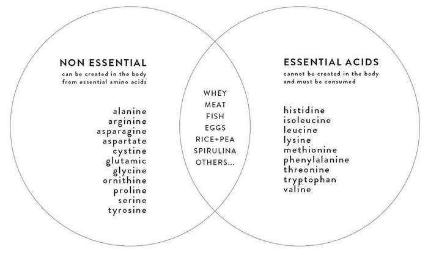

# Creatine monohydrate

Is formed of three amino acids :  
* arginine
* glycine
* methionine

It is an amino acid derivative, naturally produced in the human body from the amino acids **glycine** and **arginine**, with an additional requirement for **methionine** to catalyze the transformation of guanidinoacetate to creatine. [src](https://en.wikipedia.org/wiki/Creatine)  

**Dose** : 3.5gr / day, one month on, one month off..  

4gr creatine in 1kg any type of meat...  

brands - [Biotech](https://shop.biotechusa.com/products/100-micronized-creatine-monohydrate-500-g) / [Nutrend](https://www.nutrend-supplements.com/creatine-monohydrate-d12501.htm)

&nbsp;
&nbsp;

# BCAA

Is formed of three amino acids :  
* leucine
* isoleucine
* valine

**Dose** : 10gr / day.  

| Food            | Serving Size          | BCAAs      |
|-----------------|-----------------------|------------|
| Beef, round     | 100 grams             | 6.8 grams  |
| Chicken breast  | 100 grams             | 5.88 grams |
| Canned tuna     | 100 grams             | 5.2 grams  |
| Salmon          | 100 grams             | 4.9 grams  |
| Eggs            | 2 eggs                | 3.28 grams |
| Parmesan cheese | 1/2 cup (50   grams)  | 4.5 grams  |
| 1% milk         | 1 cup (235   ml)      | 2.2 grams  |
| Greek yogurt    | 1/2 cup   (140 grams) | 2 grams    |  

[more](https://www.healthline.com/nutrition/benefits-of-bcaa)  

brands - [Biotech](https://shop.biotechusa.com/products/bcaa-zero-amino-acids-360-g?variant=29472154746950) / [Nutrend](https://www.nutrend-supplements.com/bcaa-2-1-1-powder-d15808.htm) / [Nutrabolt.Xtend](https://cellucor.com/collections/xtend?shopify_products%5BrefinementList%5D%5Bnamed_tags.category%5D%5B0%5D=Aminos%20%26%20BCAAs)

&nbsp;
&nbsp;

# EAA

Is formed by **all nine essential** amino acids :  

| Amino Acid               | Primary   functions                                                            |
|--------------------------|--------------------------------------------------------------------------------|
| Histidine                | Nerve protection, immune function                                              |
| Isoleucine (**BCAA**)    | Muscle metabolism, immune function, energy from fats and carbohydrates         |
| Leucine (**BCAA**)       | Muscle repair, blood sugar control, energy from fats, protein synthesis        |
| Lysine                   | Protein and collagen production, calcium absorption, immune function           |
| Methionine               | Growth and metabolism of energy from food                                      |
| Phenylalanine            | Enzyme and neurotransmitter function                                           |
| Threonine                | Structural tissue, immune function, fat metabolism                             |
| Tryptophan               | Used to make serotonin and melatonin, which regulate appetite, mood, and sleep |
| Valine (**BCAA**)        | Stimulates muscle growth and energy from carbohydrates                         |

**Dose** : 8-10.7gr / day.  

[more](https://us.myprotein.com/thezone/supplements/everything-you-should-know-about-eaas-are-they-superior-to-bcaas/)  

brands - [Biotech](https://shop.biotechusa.com/products/eaa-zero-350-g?variant=29472173031494) / [Nutrend](https://www.nutrend-supplements.com/eaa-mega-strong-powder-d15757.htm)

&nbsp;
&nbsp;

---  

* Whey Protein - essential and not essential amino acids
* EAA - all essential amino acids
* BCAA - 3 most wamted essential amino acids

Proteins are the foundation **of amino acids**. In order to render amino acids form protein molecules proteins must be digested via the **gastrointestinal tract**, GI. This involves stomach hydrochloric acid secretion on large protein molecules, then pancreatic secretion of the protease breaking down longer amino chains, and finally the breakdown into smaller fragments in the small intestine to form free amino's and some small peptides with the enzyme peptidease. Most amino acids are then subject to transportation to the liver and some metabolism in the viscera (splanchec) area and the stomach mucosal area.   

Free **BCAA’s** are a little different in that they are directly **transported to the bloodstream through the liver**, while some exchange in the intestinal viscera and go directly to the bloodstream also. Most all amino acids can be degradated, broken down, in the liver effectively, with the **exception** of BCAA’s. The liver oxidizes the BCAA’s from their converted form called oxo-Keto acids. This means that basic BCAA’s are not metabolized by the liver directly. Ultimately large percentages of the BCAA’S are oxidized by the muscle tissue and some by fat (adipose) tissue The largest percentage of oxidation occurs in muscle tissue (Organ Specific Muscle) [src](https://www.huhs.edu/literature/BCAA.pdf)  

The three BCAAs are leucine, isoleucine, and valine. They’re considered the most **anabolic** of the nine EAAs and have therefore been marketed as a sports supplement. It is however possible that only leucine is especially anabolic, and that leucine taken alone is actually more anabolic than leucine taken with isoleucine and valine, due to competition for both absorption in the gut and entry into muscle tissue. [src](https://examine.com/supplements/branched-chain-amino-acids/)  

Several studies showed that **aromatic amino acids** (aka those have an aromatic ring in the side-chain) such as tryptophan, tyrosine, and phenylalanine might be useful in **treating** depression by **producing neurotransmitters**.  

Branched-chain amino acids (BCAAs) **compete** with **aromatic amino acids** to transfer from **blood-brain barrier**. Therefore, the **higher** BCAAs concentrations in the blood, the **lower** aromatic amino acids will be **observed** in the brain. Therefore, it is possible that reductions in brain concentrations of aromatic amino acids will subsequently reduce the synthesis and the **release of neurotransmitters** associated with aromatic amino acids.  [src](https://nutritionj.biomedcentral.com/articles/10.1186/s12937-021-00670-z)  [2](https://www.nutraingredients.com/Article/2021/03/04/BCAAs-may-reduce-risk-of-anxiety-and-depression-says-study)  

> Source of Whey Protein / EAA / BCAA are dairy products (mostly cheese).  

---

| RDA for Adults           | RDA - mg * body kg / day  | RDA for 70kg body | nutrend per 10gr | biotech per 9gr | lamberts per pill |
| ------------------------ | ------------------------- | ----------------- | ---------------- | --------------- | ----------------- |
| histidine                | 14 mg/kg/d                |                   |                  |                 |                   |
| isoleucine (**BCAA**)    | 19 mg/kg/d                | 1330mg            | 1500mg           | 1500mg          | 125mg * 6 = 750mg |
| leucine (**BCAA**)       | 42 mg/kg/d                | 2940mg            | 3000mg           | 3000mg          | 250mg * 6 = 1500mg|
| lysine                   | 38 mg/kg/d                |                   |                  |                 |                   |
| methionine + cysteine    | 19 mg/kg/d                |                   |                  |                 |                   |
| phenylalanine + tyrosine | 33 mg/kg/d                |                   |                  |                 |                   |
| threonine                | 20 mg/kg/d                |                   |                  |                 |                   |
| tryptophan               | 5 mg/kg/d                 |                   |                  |                 |                   |
| valine (**BCAA**)        | 4 mg/kg/d                 | 280mg             | 1500mg           | 1500mg          | 125mg * 6 = 750mg |
| glutamine                | -                         |                   | 3200mg           | 700mg           | -                 |  

[src - page 708](http://www.nap.edu/catalog/10490.html) - [mirror](https://www.dropbox.com/s/dlyhwto0l612rl8/NAP%20-%20Dietary%20Reference%20Intakes.pdf?dl=1)  

> When a portion of the neurons in the brain are damaged leading to a decrease in the release of neurotransmitter [src](https://www.dropbox.com/s/kp3rpelncqok33m/Effects%20of%20nutrients%20on%20brain%20function-maher2000.pdf?dl=1)  

> (2021) We determined that gestational exposure to **e-cig** aerosols results in **significant alterations** to the **amino acid profile** in the maternal and fetal compartments, including the fetal lungs. The data shows a targeted disruption to the nitric oxide pathway, **branched-chain amino acid metabolism**, fetal **protein synthesis**, and urea cycle. [src](https://www.sciencedirect.com/science/article/pii/S2589936821000311)  

* (2015) [E-Cigarette Affects the Metabolome of Primary Normal Human Bronchial Epithelial Cells](https://journals.plos.org/plosone/article?id=10.1371/journal.pone.0142053%20)
* (2007) [FAO/WHO/UNU Expert Consultation - Protein and Amino Acid Requirements in Human Nutrition](http://apps.who.int/iris/bitstream/handle/10665/43411/WHO_TRS_935_eng.pdf)  
* [CZ - Institute of modern nutrition](https://www.institutmodernivyzivy.cz/)  
* [Greek - Αμινοξέα Διακλαδισμένης Αλύσου - τι προσφέρουν στον αθλούμενο](https://wp.me/p43koD-3Fo)  
* [Greek - Διαγνωστική Αθηνών - Αμινοξέα Αίματος](https://athenslab.gr/exetaseis-prolipsis/aminoxea-aimatos-657)  

---  

# 2022 - [New Research: Are BCAAs bad for you?](https://advancedmolecularlabs.com/blogs/news/new-research-are-bcaas-bad-for-you)
[mirror](https://archive.ph/RQrch)  

MAR 2022 - [BCAAs are strongly linked and correlated with poor metabolic health including metabolic syndrome and cardiac arrhythmias](https://www.onlinecjc.ca/article/S0828-282X(22)00197-0/fulltext)

MAR 2022 - [Higher blood levels of BCAAs are linked and associated to pancreatic cancer in humans](https://www.cambridge.org/core/journals/british-journal-of-nutrition/article/dietary-intake-of-branchedchain-amino-acids-and-pancreatic-cancer-risk-in-a-casecontrol-study-from-italy/4E75F15A51D19ADD2BDDBDCF2DC6E70A) 

JAN 2022 - [Limiting BCAAS in the diet may delay aging and promote healthy longevity](https://www.nature.com/articles/s41580-021-00411-4)

AUG 2021 - [Insulin resistance and diabetes](https://onlinelibrary.wiley.com/doi/10.1002/dmrr.3490)

APR 2021 - [The adverse metabolic effects of branched-chain amino acids are mediated by isoleucine and valine](https://www.cell.com/cell-metabolism/fulltext/S1550-4131(21)00166-2)

DEC 2021 - [Diabetes Remission Is Modulated by Branched Chain Amino Acids](https://onlinelibrary.wiley.com/doi/10.1002/mnfr.202100652)

AUG 2018 - [High circulating BCAAs were negatively associated with free fatty acid concentrations](https://academic.oup.com/clinchem/article/64/8/1203/5608751)

JUN 2018 - [BCAA valine is strongly linked and correlated to insulin resistance and diabetes](https://www.hindawi.com/journals/jdr/2018/4207067/)

MAY 2018 - [Diabetes researchers find switch for fatty liver disease](https://www.sciencedaily.com/releases/2018/05/180517113847.htm)

JUL 2016 -  [Increased abdominal visceral fat including inflammation, cardiovascular disease and type 2 diabetes](https://www.sciencedirect.com/science/article/abs/pii/S093947531530301X)
