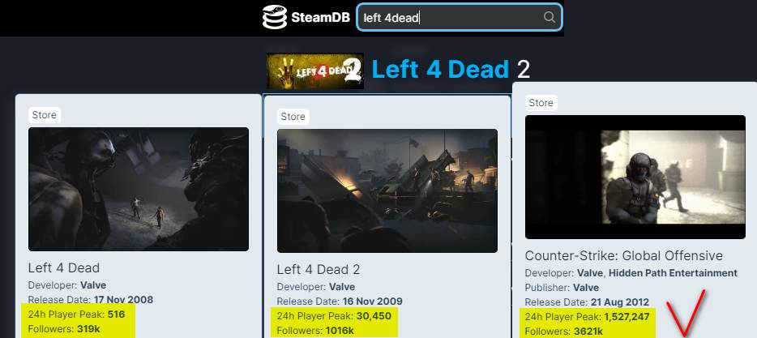
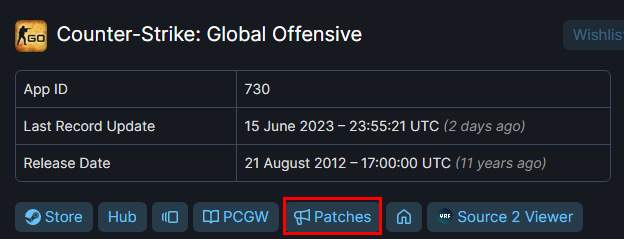
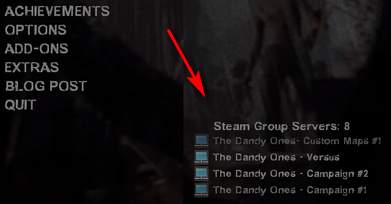
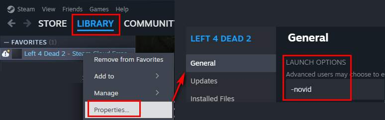

For [STEAM](https://is.gd/7bPxIZ) games, at [steamdb](https://steamdb.info/) you can find useful information at glance..  

when you are in the game page, you can see the last update date and by click **patches** link, you see the complete history.  

Once the game published the developers afterwards releasing **DLC** (DownLoadable Content) packages.  It refers to additional content or **expansions** that can be downloaded and **added** to a base game. DLC provides players with new features, levels, characters, missions, maps, items, or other enhancements that extend the gameplay experience beyond what was initially included in the base game.  

To play **online** you must have till the **latest** DLC package released. You can play online either by paying the game either download it as trialware by [here](https://thepiratebay.org/search.php?q=user:liluser) or [here](https://cs.rin.ru/) or [here](https://se7en.ws/?lang=en) the last one has `game launcher` (on any available update asking you to download).

The trialware versions are not always enabled for online gamming. There are two technics, the first one enables [LAN](https://gitlab.com/Mr_Goldberg/goldberg_emulator) game and the second the [online](https://hl2go.com/downloads/dedicated-servers/srcds/revemu-latest-version-linux-windows/) game.  

## adding money to your wallet through gift card  
* Top right - Account details > Add funds to your wallet > `Redeem a steam wallet code`
* or Top left - Steam > Settings > Account > Add funds

[illustrated](https://www.mygiftcardsupply.com/how-to-redeem-your-steam-gift-card/)

## is not downloading content?  
* Top left - Steam > Settings > Downloads > set another `download region`
  * you can try also `clear cache`

[illustrated](https://youtu.be/RSSQhcE3si4?t=142)

## enable to download content from homebrew servers (optional)

* launch the game from STEAM
* on the main menu > Options > Multiplayer > Custom Server Content = Allow all

## at statup - open to library tab
* Top left - Steam > Settings > Interface > Start Up Location = Library

## left 4 dead 2 - homebrew servers 

official [discussions](https://steamcommunity.com/app/550/discussions/)

* launch the game from STEAM 
* on the main menu > Options > Keyboard/Mouse > `Enable Developer Console` 
* return back to main menu by pressing ESC
* hit tilde `~`
* a new dialog will open
* type `openserverbrowser` and hit enter > go to **CUSTOM** tab > sort by players column
* finally press right click on chosen > `connect to server` &nbsp; [[source](https://gamefaqs.gamespot.com/boards/960510-left-4-dead-2/52324192)]

### enable lobby connect list
once the user `joins` a group (example [The Dandy Ones](https://steamcommunity.com/groups/TheDandyOnes)) then, this list appears on main menu (aka lobby)  

some [community](https://steamcommunity.com/search/groups/#text=L4D2+group+servers) groups.  

### remove materials
* [Remove nwanted Steam Group Servers](http://steamcommunity.com/my/followedgames/)
* [Unsubscribe from workshops](https://www.youtube.com/watch?v=c3jtRUiuJzU&t=26s) (the custom maps used in game) - when enter on STEAM app > mouseover `Community` tab > click `Workshop` > scroll down 1 page says on right `Your Workshop Files` click `Your Files` > On the new page click `Subscribed Items`.  The folder used is `C:\SteamLibrary\steamapps\common\Left 4 Dead 2\left4dead2\addons` if no any workshop, this folder must be empty.  
* [Unsubscribe from servers] goto [steamcommunity](https://steamcommunity.com/), mouserover to username, select `groups`  

### server things
* [old - server side - steam gtoup settings](https://pricklytech.wordpress.com/2008/12/17/left-4-dead-steam-group-server-settings/)
* [old - command - sv_allow_lobby_connect_only](https://commands.gg/l4d2/sv-allow-lobby-connect-only)
* [create a server](https://steamcommunity.com/sharedfiles/filedetails/?id=276173458)
* [find & join a sever](https://steamcommunity.com/sharedfiles/filedetails/?id=573020642)

#### updates may broke. server compatibility
* [update - release notes](https://left4dead.fandom.com/wiki/Updates_(Left_4_Dead_2)#August_22,_2023_(2.2.2.8))
> [Dandy Ones group chat] - cheshire❤cat™:
> Hey guys, the servers just don't match the game version right now and it will be all fixed soon :) the servers just need updated also!  

### skip intro video

enter `-novid` in launch parameters  

### hotkeys

* `y` or `u` - in game, opens the chat window.
* `q` or `12345` - to quick switch item.
* `c` - while holding it and talk transmits, to other players what you saying.
   * altenrative option is to go Top left - Steam > Settings > Broadcast > Record my microphone thats is always on, no need to pressing `c`.

### misc

* [hand weapons](https://imgur.com/a/8FBIe1K) & [all weapons](https://left4dead.fandom.com/wiki/Weapons)
* [10 tricks for survivors](https://www.youtube.com/watch?v=AEWIe3YRq7Y)
* [Cheat Codes](https://www.liveabout.com/left-4-dead-2-cheats-pc-3401984) - `sv_cheats 1`
* [VRF / Valve Resource Format](https://github.com/SteamDatabase/ValveResourceFormat)
  * CLI Decompiler - File data viewer, decompiler and a playground for testing new formats and features.
  * GUI Viewer - A vpk archive viewer and extractor. Also supports viewing resources such as sounds, textures, models, maps, and much more.
  * Library - Provides public API to parse resource files and some helpers.
* install custom map - User, either double click the .vpk file and auto installed either copy the .vpk file to `C:\SteamLibrary\steamapps\common\Left 4 Dead 2\left4dead2\addons`. The [.vpk](https://www.gamemaps.com/details/26998) is something like archive and is also an extractor called [GCFScape](https://developer.valvesoftware.com/wiki/GCFScape). 