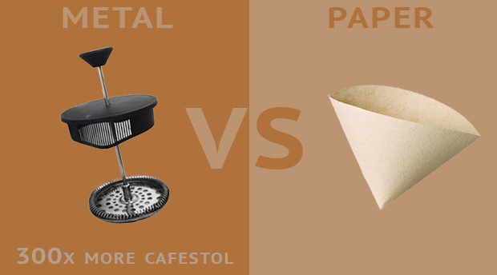
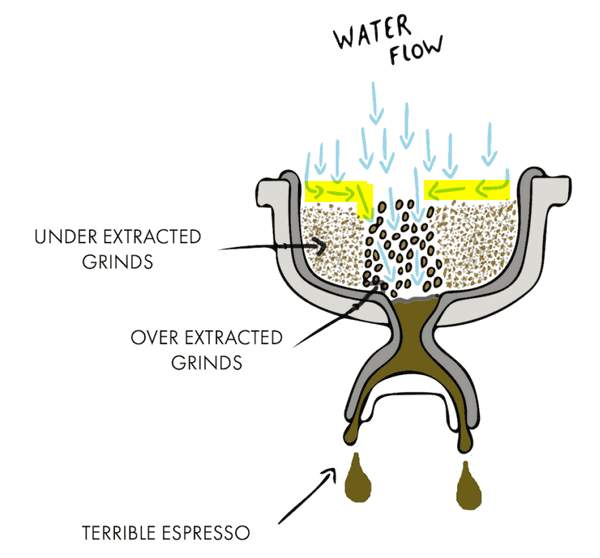

## accessories  
* casserole with lid (diameter [18cm](https://www.skroutz.gr/s/16098709/Lamart-Rock-%CE%92%CE%B1%CE%B8%CE%B9%CE%AC-%CE%9A%CE%B1%CF%84%CF%83%CE%B1%CF%81%CF%8C%CE%BB%CE%B1-%CE%B1%CF%80%CF%8C-%CE%91%CE%BB%CE%BF%CF%85%CE%BC%CE%AF%CE%BD%CE%B9%CE%BF-2-1lt-18cm-LT1137.html), volume 1.8l)
* wok (diameter 28cm)
* pan (diameter 20cm)
* bowl
* strainer
* measurment bowl
* 3 * (large water glasses / coffee cups)
* 3 * (spoons / forks / knifes)
* wooden big spoon
* wooden cutting tray (33x22cm) / plastic tray (35x26cm)
* fridge (84.2 × 47.5 × 44.6cm)
* ice cube tray
* trash bags (35l)
* 5 x kitchen sponges
* 2 soap dispenser for hand soap (bathroom / kitchen)  
* use jar or frosch brands for dish soap
* 1l water glass bottle OR Brita Jug
* aluminium foil
* bed frame (90x200cm) w/ pillow (42x65x15cm)
* table (120x75cm)
* table chair
* room chair
* paper scissor
* rectangle small white sticky papers

&nbsp;
## kitchen staff  
* salt & pepper
* oregano
* tandoori masala
* garam masala
* curry
* ghee
* peppers (serrano / jalapeno / habanero)
* always have 3 yogurts as backup
* always have 1kg basmati rice (w/ spinach)
* always have 1kg barilla linguine or spaghetti no5
* always have green tea (Japanese Sencha)
* always have cherries jam (actual 10 / day)  

&nbsp;
## frying pan

**Stainless steel** is `non-reactive` and easy to clean, while **cast iron** and **ceramic** can **add** iron and other minerals to food during cooking. However, it is important to note that **non-stick pans**, which are made from materials such as **Teflon**, may release **harmful** chemicals when heated to high temperatures.  

**Titanium** is `non-reactive`, meaning they won't affect the taste or quality of food, truly non-stick and they are also resistant to scratches and dings. Is typically **very safe**, especially when compared to other non-stick cookware sets that contain [Teflon](https://www.webmd.com/food-recipes/is-teflon-coating-safe), PTFE and other kinds of fluoropolymers.

* **Stainless steel** and **aluminum** frying pans can heat up to around 260-290°C when used on a gas stove.  
* **Cast iron** around 370-425°C on a gas stove.  
* Electric stove, usually get lower temperature than gas stove. 
* **Granite stone** (aka crushed stone or mineral-enriched) frying pans marketed as being healthier but contain trace amounts of heavy metals, which are harmful.  

> ανοξείδωτο ατσάλι με αντικολλητική επίστρωση τιτανίου  

&nbsp;
## coffee

* [2007 - How Coffee Raises Cholesterol](https://www.sciencedaily.com/releases/2007/06/070614162223.htm) - **cafestol**, elevates cholesterol by hijacking a receptor in an intestinal pathway critical to its regulation
* [2012 - Harvard - What is it about coffee?](https://www.health.harvard.edu/healthbeat/what-is-it-about-coffee)
* [James Hoffmann - Coffee Brewing Ratios Explained](https://www.youtube.com/watch?v=ipB6P1uzNYM) - 15gr / 250ml water
* Coffee pot
  * [Is French Press Bad For You?](https://voltagecoffee.com/is-french-press-coffee-bad-for-you/) - coffee key compounds are **cafestol** and **kahweol** found in normal and decaf ([study](https://www.sciencedirect.com/science/article/pii/S0963996912002360))
  * [Starbucks - Pour Over](https://athome.starbucks.com/how-to-brew-coffee-at-home-pour-over/) - 25gr / 177ml water (?)
  * [Chemex](https://www.hopculture.com/best-coffee-maker-chemex-vs-french-press-debate/) ([ref](https://www.kava.cz/vyhledavani/?string=chemex))
  * [Able stainless steel filter](https://ablebrewing.com/products/able-kone-coffee-filter) - no paper filter needed ([ref](https://www.kava.cz/nature-friendly/able-kone-ocelovy-filtr-pro-chemex/))
  * [AeroPress](https://aeropress.com/) ([ref](https://www.kava.cz/aeropress/aeropress/))  

&nbsp;
* **Metal filters** produce a more robust and visually **darker** cup of coffee, which **contains** more oils and sometimes small amounts of sediment.
* **Paper filters** produce a **brighter**, sweeter cup of coffee with little or **no** sediment or oils, helping cut out the bad cholesterol found in coffee. 
* [How to Lower the Cafestol in Your Coffee](https://dhrupurohit.com/try-this-cafestol/)  

to be honest, forget about french press or bialetti moka, buy yourself an espresso machine.  

### clean an espresso machine
- Add to water tank 125ml white vinegar + 375ml water, attach the filter holder (empty)
- Turn on the machine and wait the led to light
- Let trickle 125ml, turn off the machine
- Wait 5 / 10 minutes
- Redo the operator 2 times.
- Clean the water tank, add 400ml pure water
- Turn on the machine and wait the led to light
- Let trickle 125ml, wait 1min, trickle 125ml, wait 1min, trickle 125ml
- Close the machine, clean the water tank.  
- Diluted vinegar will [not damage](https://coffee.stackexchange.com/a/4205) the boiler or hoses in your espresso machine.
- Official descaler ingredients : Water / Citrid acid, monohydrate / Lactic acid / Etidronic acid  

### clean the filter basket
* [video - burn the coffee](https://www.youtube.com/watch?v=q_YrpnsrscU) ([2](https://www.youtube.com/watch?v=E6oG_RYDqMo))
* [video - use needle](https://youtu.be/vuRmnOiE03Q?t=83) - possible soak with baking soda and warm water before
* [articles](https://www.google.com/search?q=espresso+filter+handle+clean)  

## krups suggestion
**​Arabica** coffee offers the best taste and is naturally low in caffeine. Experiment with different types, mixtures, and degrees of roasting to find what works best for you. In general, the darker the roasting, the more pronounced the taste of coffee. Delicate roasting gives a rich aroma, and the result is a delicate coffee with a full flavor-for true connoisseurs! Quality coffee should only be roasted gently so that its true richness, softness and completeness stand out. **Avoid** too **dark** roasted grains, they are more **oily** and can **clog** the device. Check that there are no small stones between the grains that could damage the device at the same time. Never use instant or ground coffee.  

* [How to Brew the Perfect Cup of Coffee, According to Science](https://theconversation.com/how-to-make-the-perfect-cup-of-coffee-with-a-little-help-from-science-129398)  

  

> In order to brew a **good** espresso, it is important to make sure that the **handle** (also known as the portafilter) **is full**. This means that the handle should be filled with the right amount of ground coffee, and the coffee should be evenly distributed and tamped down before brewing.  

### coffee not good ?
* use [burr grinder](https://www.homegrounds.co/coffee-grind-chart/) (not blade grinder) [sample](https://coffeetechniciansguild.org/blog/2018/8/14/selecting-a-burr-type-for-an-espresso-grinder)
* [5 Things To Try](https://www.javapresse.com/blogs/espresso/espresso-troubleshooting-5-things-to-try)
  * Is it bitter and dull (over extracted)?
  * Is it acidic and sour (under extracted)?
* [why it never tastes as good](https://www.threellamascoffee.com/blogs/news/home-espresso-coffee-why-it-never-tastes-as-good-as-an-espresso-from-your-cafe)
  * The extraction should finish at approx 25 - 30 seconds for a double shot basket.
    * Coffee running TOO FAST (less than 20 seconds) = make the grind finer
      * if your shot pulls too fast it tastes under extracted.
    * Coffee running TOO SLOW (more than 35 seconds) = make the grind coarser  
      *  if your shot pulls too slowly it tastes over extracted.  

###  blade grinder bug  
The small-sized coffee ground particles – called “fines” – will **over extract** some of the chemical compounds that cause **bitterness**, while the larger sized particles may remain **under extracted**.  [source](https://foodal.com/drinks-2/coffee/grinders/why-you-shouldnt-use-a-blade-grinder-for-your-coffee/)  [[instead buy burr grinder](https://www.amazon.co.uk/dp/B09W9N1ZWV/)]  

Extraction always happens like this:  

1. The first things to be extracted are bright, sour, flavorful acids
2. Next come the aromatic oils, sugars, and most flavors
3. Lastly come the lower notes and bitter tannins  

Perfectly extracted espresso is flavorful, aromatic, and has a pleasant balance of bright acids and deeper bitter notes. It should taste like a symphony of flavors in harmony. This happens by extracting just the right amount of solids, oils, acids, and other things from the grounds.  

### Illy.Guatemala
https://www.illy.com/en-us/eshop/coffee/whole-bean-coffee/arabica-selection-whole-bean-coffee-guatemala/6990ST  

## Nappuccino
Have a cup of coffee just before you doze off post lunch. Caffeine, a stimulant, takes about **twenty minutes** to enter your **bloodstream**, so if you have a cup of coffee, set your alarm for twenty minutes and then take a nap. You'll wake up refreshed and ready to go.

This technique is called nappuccino. This is why several companies have nap rooms or nap pods where employees can take a quick nap. It helps overcome the slump in their days. [source](https://bip.so/@TIL_/Nappucino-iZTgy)

&nbsp;
## first day lunch
* 2 eggs with broccoli
* yogurt with 1 slice cherries jam