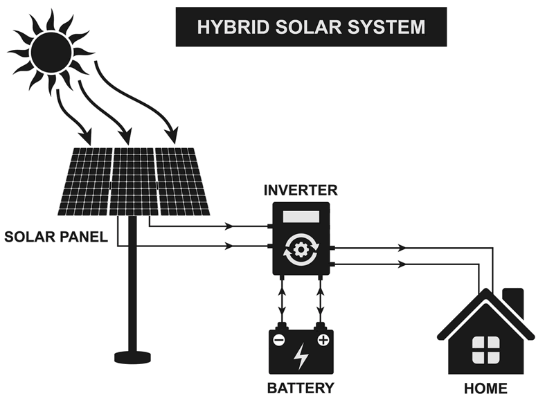

# Panel
Υπάρχουν 2 ειδών `panel` : 
* πολυκρυσταλλικό 
* μονοκρυσταλλικό (πιο αποδοτικό 18-21% σε σχέση με το πολυκρυσταλλικό)

Όταν λένε ότι το panel βγάζει 580w, σημαίνει **την ώρα** σε **ηλιόλουστη** μέρα.

Το `Half-cell` είναι ένας σχεδιασμός εσωτερικού κελιού όπου τα κελιά κόβονται στη μέση για να μειωθεί η ηλεκτρική αντίσταση και να βελτιωθεί η ανοχή στη σκίαση, ενώ η τεχνολογία `Bifacial` επιτρέπει στα πάνελ να συλλαμβάνουν το ηλιακό φως τόσο από την μπροστινή όσο και από την πίσω πλευρά, ενισχύοντας την ενεργειακή απόδοση μέσω του ανακλώμενου φωτός. [source](https://sovasolar.com/key-differences-between-half-cut-modules-bi-facial-modules/)

* [Jinko Solar Biaficial](https://www.jinkosolar.com/en/site/bifacial) 580w
* [Solar Panels For Beginners](https://href.li/?https://www.youtube.com/watch?v=xhh6DL9pVgk)

# Inverter
* καθαρού ημίτονου (pure sine wave inverter) - Μετατρέπει το `συνεχές ρεύμα` (DC) από τους ηλιακούς συλλέκτες ή τις μπαταρίες σε `εναλλασσόμενο ρεύμα` (AC) για να μπορεί να χρησιμοποιηθεί. Παρέχουν ομαλή και σταθερή έξοδο ρεύματος, ιδανικοί για ευαίσθητες συσκευές, όπως υπολογιστές και ιατρικές συσκευές.
    * (solar charge controller) MPPT (Maximum Power Point Tracking) παίζει κρίσιμο ρόλο στην ενίσχυση της αποδοτικότητας των συστημάτων ηλιακής ενέργειας βελτιστοποιώντας την ενέργεια που συλλέγεται από τα ηλιακά πάνελ. Διατηρεί υψηλή απόδοση σε ποικίλες ηλιακές ακτίνες.

brands :
* (CN) [Voltronic.Axpert](https://voltronicpower.com/en-US/Product/PV-Inverter/Off-Grid-Inverter) 5000W 10000VA 48V 230V
    * 5000W (Watt): Αυτό υποδεικνύει τη **συνεχή ισχύ εξόδου** του μετατροπέα.
    * 10000VA (Βολτ-Αμπέρ): Αυτό αντιπροσωπεύει τη μέγιστη ισχύ που μπορεί να **χειριστεί** ο μετατροπέας (ενέργεια που παράγεται από ηλιακούς συλλέκτες).
    * Μπορεί να χειριστεί έως και 5000W συνεχούς φορτίου και 10000VA φορτίου αιχμής σε **είσοδο** 48V DC και **έξοδο** 230V AC.
* (EU) [Victron](https://www.victronenergy.com/inverters)
* (TW) [Cotek](https://www.cotek.com.tw/)

# Batteries
Οι μπαταρίες αποθηκεύουν σε `συνεχές ρεύμα` (DC).

* (lead carbon - μολύβδου άνθρακα) 4 x 320Ah 12v = `1280Ah 48v` (*3000 κύκλοι φόρτισης* = 8 χρόνια)
* ή
* (lithium - λιθίου) 4 x 280Ah 12v = `1220Ah 48v` (*5000 κύκλοι φόρτισης* = 13 χρόνια)

*(Ah = αμπερώρια)*  

faq :  
* `50% DOD` σημαίνει ότι η μπαταρία μπορεί να **αποφορτιστεί** μέχρι το 50% της χωρητικότητάς της, χωρίς να υπάρξει **μείωση της απόδοσής της**.
* Όσα περισσότερα `τεμάχια` σε μπαταρίες τόσο το καλύτερο.

Μπορούμε να υπολογίσουμε πόσες kWh μπορούν να αποθηκευτούν στην μπαταρία :
* (48V×1280Ah) / 1000 = `61.44kWh`
* με **50% DOD** (48V×640Ah) / 1000 = `30.72kWh`
​

brands :  
* (GR) [NorthBatt](https://www.northbatt.com/) - not sure for the quality.

---

# Solar Lamps
* [Jortan,JF-BS400W](https://href.li/?https://www.jortan-uae.com/store/bs-400w-pc-metalic-solar-flood-light) [2](https://href.li/?https://globaloffers.net/product/professional-solar-led-flood-light-jortan-100w-ip66/)
* [Jortan,SKYY-300W](https://href.li/?https://www.jortan-uae.com/store/skyy-200-w-solar-flood-light) [2](https://href.li/?https://globaloffers.net/product/professional-solar-led-flood-light-jortan-300w-ip66/)
* [4000W LED Solar Light](https://www.aliexpress.com/item/1005009455620621.html)

# Solar Cameras
* [Baseus,S1 Lite Solar w/ wifi](https://href.li/?https://eu.baseus.com/products/security-s1-lite-outdoor-camera-2k)    
* [tp-link,Tapo C410 KIT V2 Solar w/ wifi](https://href.li/?https://www.tp-link.com/en/home-networking/cloud-camera/tapo-c410-kit/)    
* [tp-link,Tapo C615G KIT Solar w/ 4G](https://href.li/?https://www.tp-link.com/en/home-networking/cloud-camera/tapo-c615g-kit/)    
* [Ezviz,EB3 Solar w/ 4G or wifi](https://href.li/?https://www.ezviz.com/product/eb3/41418)

## SIM for solar camera
* [Cosmote.Mobile internet με κάρτα](https://www.cosmote.gr/static/cosmote/el/programmata-kinitis-paketa-mobile-internet)  
    * 20e εφάπαξ
    * 85e για ένα χρόνο με 400gb

## other kinds of mobile internet
* [UniFi 5G](https://blog.ui.com/article/introducing-unifi-5g)
    * [Unifi Travel Router](https://blog.ui.com/article/travel-in-style-unifi-style-unifi-travel-router)
* [Cosmote.4G Wi-Fi Router](https://www.cosmote.gr/static/cosmote/el/programmata-kinitis-paketa-mobile-internet)
* [Starlink](https://starlink.com/) [[2](https://www.kotsovolos.gr/pages/starlink)]

## Gas Oven
searh for `φούρνοι αερίου` or else `Gas Stoves & Ovens`

## Free standing fireplace
[Fragos](https://www.frangos.com.gr/en/fireplaces/eleytheris-topothetisis)