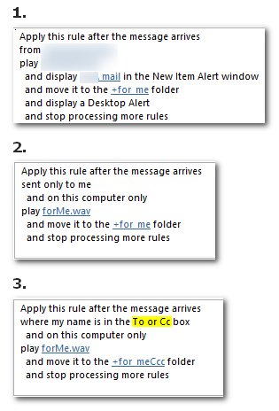
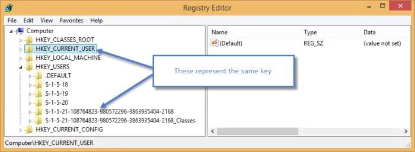

### shortcuts  

* **logoff** shortcut `%SystemRoot%\System32\logoff.exe` when on RDP
* **lock** workstation shortcut `%SystemRoot%\System32\rundll32.exe user32.dll,LockWorkStation`

* **Outlook rules** - never miss an email!  


* If you have two accounts (guest & admin), you can alter guest registry (HKEY_CURRENT_USER) by **HKEY_USERS** key! &nbsp; ([source](https://www.pdq.com/blog/modify-the-registry-of-another-user/))   

&nbsp;


&nbsp;
&nbsp;
### applications  

  * grepWin
  * Nirsoft.HashMyFiles
  * Nirsoft.SearchMyFiles
  * PipisCrew.Text_Comparer
  * PipisCrew.dontlock
  * WinMerge
  * Riot Image optimizer
  * PipisCrew.Source Code Organizer
  * PipisCrew.Pastextra
  * Iris Mini
  * mRemoteNG v1.72
  * Fastone Capture
  * PipisCrew.ClipMon
  * Windows 7 Calculator on Win10
  * FTP WinSCP
  * notepad++
    * [JSON Viewer](https://github.com/kapilratnani/JSON-Viewer)
    * [Compare](https://github.com/pnedev/compare-plugin)
    * [XML Tools](https://github.com/morbac/xmltools) or the old [v2.4.9](https://sourceforge.net/projects/npp-plugins/)  

&nbsp;
### batch files  

&nbsp;
```js
// Kill process
@echo off

taskkill /F /IM lync.exe  
```

&nbsp;
```js
// Kill process with countdown  
@echo off

SET /A tick = (60*60)

timeout /t %tick% /nobreak

taskkill /F /IM colors.exe
```

&nbsp;
```js
// Who is gonna close all the windows !?  
@echo off

::https://www.robvanderwoude.com/ntcolor.php
COLOR fc

setlocal
:PROMPT
SET /P AREYOUSURE=Are you sure (Y/[N])?
IF /I "%AREYOUSURE%" NEQ "Y" GOTO END

shutdown /t 0 /s /f

:END
endlocal
```