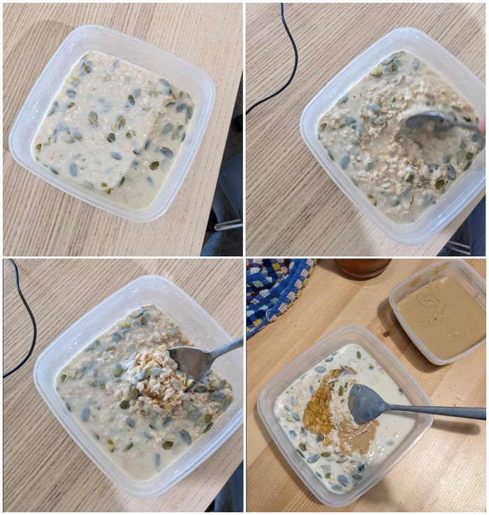

# Eat Right 4 Your Type (2020)

* ISBN : ‎ 0425183122  
* Author : Dr. Peter J. D'Adamo | Catherine Whitney  

[Amazon](https://href.li/?https://www.amazon.com/dp/0399584161/)  

---

## Πλάνο της Ομάδας Αίματος A

* Ο πρώτος **φυτοφάγος**
* Θερίζει ό,τι σπέρνει
* Ευαίσθητο πεπτικό σύστημα
* **Ανεκτικό** ανοσοποιητικό σύστημα
* Προσαρμόζεται καλά στις σταθερές διατροφικές και περιβαλλοντικές συνθήκες
* Ανταποκρίνεται καλύτερα στο στρες με ηρεμιστική δραστηριότητα
* Χρειάζεται **αγροτική διατροφή** για να παραμείνει λεπτός και παραγωγικός

## ΤΟ ΔΙΑΙΤΟΛΟΓΙΟ ΤΗΣ ΟΜΑΔΑΣ A
Τα άτομα της ομάδας Α `χρειάζονται φυτοφαγική δίαιτα`, κάτι που αποτελεί κληρονομιά των πιο ήρεμων και λιγότερο πολεμοχαρών αγροτών προγόνων τους. Αν είστε ένας μέσος τύπος της ομάδας Α μπορεί να σας φανεί πολύ μεγάλο το άλμα για να περάσετε από την τυπική διατροφή με κρέας και πατάτες σε ένα διαιτολόγιο με **πρωτεΐνες σόγιας, σιτηρά και χορταρικά**. Παρόμοια, μπορεί να δυσκολευτείτε να κόψετε τις υπερεπεξεργασμένες τροφές, αφού η πολιτισμένη διατροφή μας αποτελείται όλο και περισσότερο από τοξίνες σε πολύχρωμες συσκευασίες. Είναι όμως ιδιαίτερα σημαντικό για την ευαίσθητη ομάδα Α να τρώει όσο το δυνατόν πιο `φυσικές τροφές: φρέσκες, αγνές και οργανικές`.  

Πρέπει να τονίσω το πόσο κρίσιμη μπορεί να είναι αυτή η διατροφική αλλαγή για το `ευαίσθητο ανοσοποιητικό σύστημα` της ομάδας Α. H ομάδα Α έχει `βιολογική προδιάθεση` προς τις καρδιοπάθειες, τον καρκίνο και το διαβήτη. Με άλλα λόγια, αυτοί είναι οι παράγοντες κινδύνου που αντιμετωπίζετε. Αυτό όμως δεν είναι απαραίτητο να είναι και το πεπρωμένο σας. Αν ακολουθήσετε αυτή τη διατροφή, μπορείτε να υπερφορτίσετε το ανοσοποιητικό σας σύστημα και έτσι να **βραχυκυκλώσετε** την εμφάνιση τέτοιων σοβαρών παθήσεων. Μια θετική πλευρά της γενετικής σας κληρονομιάς είναι η ικανότητά σας να χρησιμοποιείτε τα καλύτερα στοιχεία που έχει να προσφέρει η φύση. Η δική σας πρόκληση είναι να *ξαναμάθετε αυτά που γνωρίζει ήδη το αίμα σας*.

## ΔΙΑΤΡΟΦΗ
Από πολλές απόψεις, **η ομάδα Α είναι το άκρο αντίθετο της ομάδας Ο** σε ό,τι αφορά στο `μεταβολισμό`. Ενώ οι `ζωικές` τροφές **επιταχύνουν το μεταβολικό ρυθμό της ομάδας Ο** και τον κάνουν πιο αποδοτικό, ασκούν εντελώς **διαφορετική επίδραση στην ομάδα Α**. Ίσως να έχετε προσέξει ήδη πως όταν τρώτε κόκκινο κρέας νιώθετε νωθρότητα και λιγότερη ενέργεια απ’ ό,τι όταν τρώτε φυτικές πρωτεΐνες. Μερικά άτομα της ομάδας Α εμφανίζουν κατακράτηση υγρών, καθώς το πεπτικό τους σύστημα **επεξεργάζεται αργά τις δύσκολες αυτές τροφές**. Η **ομάδα Ο καίει το κρέας ως καύσιμο**. Η ομάδα Α όμως το αποθηκεύει ως λίπος. Το **αίτιο** αυτής της διαφοράς είναι τα **στομαχικά οξέα**. Ενώ η ομάδα Ο έχει μεγάλη ποσότητα στομαχικών οξέων και έτσι χωνεύει εύκολα το κρέας, η ομάδα Α έχει χαμηλό επίπεδο στομαχικών οξέων (μια προσαρμογή των προγόνων τους που ζούσαν με αγροτική διατροφή).  

Η ομάδα Α **δυσκολεύεται** επίσης να χωνέψει τα `γαλακτοκομικά προϊόντα` τα οποία της προκαλούν αντιδράσεις ινσουλίνης (ένας άλλος παράγοντας που συντελεί στην επιβράδυνση του μεταβολισμού). Επιπλέον, τα γαλακτοκομικά έχουν μεγάλη περιεκτικότητα σε **κορεσμένα λίπη** (εκείνα που θέτουν σε κίνδυνο την καρδιά και προκαλούν παχυσαρκία και διαβήτη).  

Το `σιτάρι` παίζει ανάμεικτο ρόλο στη δίαιτα της ομάδας Α. Τα άτομα αυτής της ομάδας μπορούν να τρώνε σιτάρι, πρέπει να προσέχουν όμως να μην τρώνε πάρα πολύ, γιατί τότε ο μυϊκός ιστός τους θα περάσει σε υπερβολικά όξινη κατάσταση. Αντίθετα από την ομάδα Ο που λειτουργεί καλά με ελαφρά όξινους ιστούς, η **ομάδα Α δεν μπορεί να χρησιμοποιήσει την ενέργεια τόσο γρήγορα** και έτσι καταστέλλεται ο μεταβολισμός των θερμίδων. Αυτή η συγκεκριμένη αντίδραση είναι ένα καλό παράδειγμα που δείχνει ότι οι διαφορετικές τροφές αντιδρούν με διαφορετικούς τρόπους, ανάλογα με την ομάδα αίματος.  

Το `σιτάρι` είναι **αλκαλικό για την ομάδα Ο** και **όξινο για την ομάδα Α**. Τα άτομα της ομάδας Α, εκτός από το ότι πρέπει να τρώνε μια μεγάλη ποικιλία από υγιεινές τροφές με χαμηλά λιπαρά, εξισορροπητικά λαχανικά και σιτηρά, πρέπει επίσης να δίνουν έμφαση σε ορισμένες τροφές που είναι ευεργετικές.  

## Μη συμβατά τρόφιμα  
| είδος                      | αποτέλεσμα                                                                                                 |
| -------------------------- | ---------------------------------------------------------------------------------------------------------- |
| κρέας                      | χωνεύεται δύσκολα, αποθηκεύεται ως λίπος                                                                   |
| γαλακτοκομικά              | προκαλούν αντίδραση ινσουλίνης, αυξάνουν την έκκριση βλέννας                                               |
| φασόλια κίντνεϊ (kidney)   | προκαλούν αντίδραση ινσουλίνης, χαμηλός μεταβολικός ρυθμός                                                 |
| φασόλια λίμα (lima)        | προκαλούν αντίδραση ινσουλίνης, χαμηλός μεταβολικός ρυθμός                                                 |
| σιτάρι (μεγάλες ποσότητες) | χαμηλός μεταβολικός ρυθμός επιφέρει οξύτητα στους μυϊκούς ιστούς, παρεμποδίζει την κατανάλωση των θερμίδων |

## Συμβατά τρόφιμα
| είδος         | αποτέλεσμα                                                                                                       |
| ------------- | ---------------------------------------------------------------------------------------------------------------- |
| φυτικά έλαια  | βοηθούν στην αποτελεσματική πέψη, αποτρέπουν την κατακράτηση υγρών                                               |
| τροφές σόγιας | βοηθούν στην αποτελεσματική πέψη, μεταβολίζονται γρήγορα, βελτιώνουν τη λειτουργία του ανοσοποιητικού συστήματος |
| λαχανικά      | βοηθούν στον αποτελεσματικό μεταβολισμό                                                                          |
| ανανάς        | αυξάνει την κινητικότητα του εντέρου, αυξάνει την κατανάλωση θερμίδων                                            |

## ΚΡΕΑΤΑ

Για να έχει τη μεγαλύτερη δυνατή ωφέλεια, η ομάδα Α πρέπει να` αποκλείσει όλα τα κρεατικά` από τη διατροφή της. Δεν υπάρχουν εξαιρετικά ωφέλιμα κρέατα γι’ αυτή την ομάδα. Με αυτό τον τρόπο θα αρχίσετε να μειώνετε τους παράγοντες κινδύνου που μπορεί να σας οδηγήσουν στις καρδιοπάθειες και στον καρκίνο.  

Προφανώς, όμως, μάλλον θα χρειαστεί χρόνος για μια ολοκληρωτική μετάβαση σε χορτοφαγική δίαιτα. Αρχίστε, **υποκαθιστώντας** `το κρέας με ψάρι` αρκετές φορές τη βδομάδα. Όταν τρώτε κρέας, επιλέγετε τα πιο άπαχα κομμάτια. Τα **πουλερικά είναι προτιμότερα** από το κόκκινο κρέας. Καλό είναι να ψήνετε το κρέας στο φούρνο ή στο γκριλ.  

Αποφεύγετε εντελώς τα προϊόντα επεξεργασμένου κρέατος όπως το ζαμπόν, τα λουκάνικα Φρανκφούρτης και τα **κρύα κρέατα** (cold cuts). Περιέχουν **νιτρικά άλατα** που μπορεί να προκαλέσουν καρκίνο του στομάχου σε άτομα με χαμηλά επίπεδα στομαχικών οξέων, κάτι που χαρακτηρίζει την ομάδα Α.

### ΟΥΔΕΤΕΡΑ
* Γαλοπούλα
* Κοτόπουλο

### ΑΠΟΦΕΥΓΕΤΕ
* Πρόβειο κρέας
* Χοιρινό
* Συκώτι
* Φασιανό
* Ορτύκι
* Πάπια
* Πέρδικα
* Χήνα

## ΘΑΛΑΣΣΙΝΑ

Η ομάδα Α μπορεί να τρώει θαλασσινά σε μέτριες ποσότητες, τρεις ή τέσσερις φορές τη βδομάδα, πρέπει όμως να αποφεύγει τα **λευκά ψάρια**, όπως η γλώσσα και ο πλευρονήκτης, γιατί περιέχουν μια λεκτίνη που μπορεί να **ερεθίσει το πεπτικό** τους σύστημα.

Αν είστε γυναίκα με ομάδα αίματος Α και έχετε οικογενειακό ιστορικό καρκίνου του μαστού, καλό θα είναι να συμπεριλάβετε **σαλιγκάρια** στη διατροφή σας. Το φαγώσιμο σαλιγκάρι **Helix pomatia** περιέχει μια ισχυρή λεκτίνη που έλκεται και **συγκολλά τα μεταλλαγμένα κύτταρα** της ομάδας Α για τις δύο συνηθέστερες μορφές καρκίνου του μαστού. Αυτή είναι μια θετική μορφή συγκόλλησης, αφού αυτή η λεκτίνη εξουδετερώνει τα **άρρωστα κύτταρα**. Τα θαλασσινά πρέπει να είναι ψητά ή βραστά για να αποκτήσουν την πλήρη θρεπτική τους αξία.  

### ΕΞΑΙΡΕΤΙΚΑ ΩΦΕΛΙΜΑ
* Βακαλάος
* Ιριδίζουσα πέστροφα
* Κόκκινος παγρόσωμος
* Κυπρίνος
* Πέρκα ασημένια
* Πέρκα κίτρινη
* Πέστροφα θαλάσσια
* Ρίνα (αγγελόψαρο)
* Σαρδέλες
* Σκουμπρί
* Σολομός
* Σφυρίδα

### ΟΥΔΕΤΕΡΑ
* Αθερίνα
* Καρχαρίας
* Λαβράκι
* Λούτσος
* Ξιφίας
* Οξύρρυγχος
* Παγρόσωμος
* Πέρκα λευκή
* Πέρκα του ωκεανού
* Σελάχι
* Τόνος
* Φαγγρί

### ΑΠΟΦΕΥΓΕΤΕ
* Αντσούγια
* Αστακό
* Αχιβάδες
* Βατραχοπόδαρα
* Γαλίτης
* Γαρίδες
* Γλώσσα
* Κοχύλια
* Μουρούνα
* Μύδια
* Πλευρονήκτης
* Πωματόμος
* Ρέγκα - φρέσκια, παστή
* Στρείδια
* Ιππόγλωσσο
* Καβούρι
* Καλαμάρια
* Καπνιστό βακαλάο
* Καπνιστό σολομό
* Καραβίδα
* Φρίσσα (είδος σαρδέλας)
* Χαβιάρι
* Χέλι
* Χταπόδι
* Χτένια

## ΓΑΛΑΚΤΟΜΙΚΑ
Η ομάδα Α μπορεί να **ανεχθεί μικρές ποσότητες γαλακτοκομικών προϊόντων** που έχουν υποστεί ζύμωση, αλλά πρέπει να **αποφεύγει** οτιδήποτε είναι φτιαγμένο από **πλήρες γάλα** και επίσης πρέπει να **περιορίσει την κατανάλωση αβγών**, τρώγοντας αβγά λίγες φορές και μόνο οργανικής παραγωγής.  

Η ομάδα Α πρέπει να **προτιμά το γιαούρτι**, το **κεφίρ** και τα καλλιεργημένα γαλακτοκομικά προϊόντα. Το `κατσικίσιο γάλα` είναι ένα καλό υποκατάστατο για το πλήρες γάλα. Το `γάλα σόγιας` και το `τυρί σόγιας` είναι εξαιρετικά υποκατάστατα και κάνουν πολύ καλό στην ομάδα Α.  

Τα άτομα της ομάδας Α `δεν μπορούν να χωνέψουν τα περισσότερα από τα γαλακτοκομικά προϊόντα`, για τον απλό λόγο ότι το **αίμα τους δημιουργεί αντισώματα** κατά του κύριου σακχάρου του πλήρους γάλατος, της `D-γαλακτοσαμίνης`.  

> Τα [αντισώματα](http://panacea.med.uoa.gr/topic.aspx?id=133), επίσης γνωστά ως ανοσοσφαιρίνες (IgG / IgA / IgM / IgD / IgE ), είναι εξειδικευμένες πρωτεΐνες που παράγονται από το ανοσοποιητικό σύστημα για την αναγνώριση και την **εξουδετέρωση** ξένων αντικειμένων όπως βακτήρια, ιούς και τοξίνες. Βρίσκονται κυρίως στο πλάσμα, το υγρό συστατικό του αίματος, το οποίο αποτελεί περίπου το 55% του συνολικού όγκου του αίματος.  

Τα άτομα της ομάδας Α που **υποφέρουν από αλλεργίες** ή έχουν αναπνευστικά προβλήματα πρέπει να ξέρουν ότι τα **γαλακτοκομικά προϊόντα** αυξάνουν σημαντικά την **εκκρινόμενη βλέννα**. Η ομάδα Α συνήθως έχει ήδη περισσότερες βλέννες από τις άλλες ομάδες αίματος, ίσως επειδή **χρειάζεται την προστασία που προσφέρει στο ανοσοποιητικό της σύστημα**, το οποίο κάποιες φορές είναι υπερβολικά **φιλικό προς τους εισβολείς**. Η πολλή βλέννα όμως μπορεί να αποβεί επιβλαβής, αφού υπάρχουν διάφορα **βακτηρίδια που ζουν από αυτή**. Η μεγάλη ποσότητα βλέννας οδηγεί **αναπόφευκτα σε αλλεργικές αντιδράσεις**, λοιμώξεις και αναπνευστικά προβλήματα. Αυτός είναι ένας άλλος καλός λόγος για να **περιορίσετε τα γαλακτοκομικά**.  

### ΕΞΑΙΡΕΤΙΚΑ ΩΦΕΛΙΜΑ
* Γάλα σόγιας
* Τυρί σόγιας

### ΟΥΔΕΤΕΡΑ
* Γάλα κατσικίσιο
* Γιαούρτι - παγωμένο, σκέτο, με φρούτα
* Κεφίρ
* Τυρί κατσικίσιο
* Τυρί Μοτσαρέλα (Mozzarella) - με λίγα λιπαρά
* Τυρί Ρικότα (Ricotta) - με λίγα λιπαρά
* Τυρί φέτα

### ΑΠΟΦΕΥΓΕΤΕ
* Βούτυρο
* Βουτυρόγαλα
* Τυρί Ένταμ (Edam)
* Τυρί Καμαμπέρ (Camembert)
* Γάλα - 2% λιπαρά αποβουτυρωμένο, πλήρες
* Γραβιέρα
* Παγωτό
* Παρμεζάνα
* Ροκφόρ
* Σερμπέτι
* Τυρί Γιάρλσπουργκ (Jarlsburg)
* Τυρί Γκούντα (Gouda)
* Τυρί Έμενταλ (Emmenthal)
* Τυρί Κότατζ (Cottage)
* Τυρί κρέμα
* Τυρί Μίνστερ (Munster)
* Τυρί Μοντερέι Τζακ (Monterey Jack)
* Τυρί Μπρι (Brie)
* Τυρί Νεφατέλ (Neufchatel)
* Τυρί Προβολόνε (Provolone)
* Τυρί Τσένταρ (Cheddar)
* Τυρόγαλα

## ΛΙΠΗ
Η ομάδα Α χρειάζεται `πολύ λίγα λίπη για να λειτουργήσει καλά`, αλλά **μια κουταλιά** της σούπας **ελαιόλαδο** στις σαλάτες ή στα λαχανικά, καθημερινά, θα βοηθήσει την πέψη και την απέκκριση. Το ελαιόλαδο, ως `μονοακόρεστο` έλαιο, έχει επίσης θετική επίδραση στην καρδιά και μπορεί επιπλέον να μειώσει τη χοληστερίνη.  

Οι `λεκτίνες` των ελαίων, όπως του `καλαμποκέλαιου` και του `καρθαμελαιου`, προκαλούν προβλήματα στο πεπτικό σύστημα της ομάδας Α, καθώς ασκούν ακριβώς την **αντίθετη** επίδραση από τα ωφέλιμα έλαια.  

Υπάρχουν μόνο **δύο έλαια** που είναι εξαιρετικά ωφέλιμα, και μπορώ να πω άτι το **ελαιόλαδο** είναι πολύ πιο εύγευστο και πιο κατάλληλο για μαγειρική χρήση απ’ ό,τι το **λινέλαιο**.

### ΕΞΑΙΡΕΤΙΚΑ ΩΦΕΛΙΜΑ
* Ελαιόλαδο
* Λινέλαιο

### ΟΥΔΕΤΕΡΑ
* Έλαιο κανόλα
* Μουρουνέλαιο

### ΑΠΟΦΕΥΓΕΤΕ
* Βαμβακέλαιο
* Καλαμποκέλαιο
* Καρθαμέλαιο
* Σουσαμέλαιο
* Φιστικέλαιο

## ΞΗΡΟΙ ΚΑΡΠΟΙ ΚΑΙ ΣΠΟΡΟΙ
Οι κολοκυθόσποροι, οι ηλιόσποροι, τα αμύγδαλα και τα καρύδια κάνουν καλό στην ομάδα Α. Αφού η ομάδα αυτή τρώει **πολύ λίγη ζωική πρωτεΐνη**, οι **ξηροί καρποί και οι σπόροι καλύπτουν ένα σημαντικό μέρος** των αναγκών της σε `πρωτεΐνη`. Τα άτομα της ομάδας Α πρέπει να τρώνε `φιστίκια` συχνά, γιατί περιέχουν μια λεκτίνη που καταπολεμά τον καρκίνο. Επίσης, καλό είναι να τρώνε το **φλοιό των φιστικιών** (όχι τα τσόφλια).  

### ΕΞΑΙΡΕΤΙΚΑ ΩΦΕΛΙΜΑ
* Κολοκυθόσποροι
* Φιστίκια
* Φιστικοβούτυρο 

### ΟΥΔΕΤΕΡΑ
* Αμύγδαλα
* Αμυγδαλοβούτυρο
* Ηλιόσποροι
* Καρύδια
* Καρύδια Ίκορι (Hickory)
* Καρύδια Μακαντάμια (Macadamia)
* Κάστανα
* Κουκουνάρι
* Μαργαρίνη από ηλίανθο
* Σουσάμι
* Ταχίνι (πολτός από σουσάμι)
* Φουντούκια

### ΑΠΟΦΕΥΓΕΤΕ
* Καρύδια Μπραζίλ (Brazil)
* Φιστίκια Αιγίνης
* Φιστίκια Κάσιους (Cashew)

## ΟΣΠΡΙΑ

Η ομάδα Α τα `πηγαίνει πολύ καλά με τις φυτικές πρωτεΐνες `που υπάρχουν στα **φασόλια** και τα όσπρια. Σε συνδυασμό με τη `σόγια` και όλα της τα προϊόντα, πολλά όσπρια αποτελούν μια θρεπτική πηγή πρωτεΐνης. Προσέξτε όμως, **δεν κάνουν όλα τα όσπρια καλό** στην ομάδα Α. Μερικά, όπως τα **φασόλια κίντνεϊ** και νέιβι και τα **ρεβίθια**, περιέχουν μια λεκτίνη που μπορεί να προκαλέσει **μείωση στην παραγωγή ινσουλίνης**, κάτι που αποτελεί **παράγοντα** στην εμφάνιση της παχυσαρκίας και του διαβήτη.  

Προσοχή :  
> Η **σόγια**, περιέχει ενώσεις γνωστές ως φυτοοιστρογόνα, ιδιαίτερα ισοφλαβόνες, οι οποίες μπορούν να μιμηθούν τα **οιστρογόνα** στο σώμα. Έχει υπάρξει κάποια συζήτηση σχετικά με το εάν αυτές οι ενώσεις θα μπορούσαν να έχουν καρκινογόνες επιδράσεις, ιδιαίτερα όσον αφορά τον **καρκίνο του μαστού**.

### ΕΞΑΙΡΕΤΙΚΑ ΩΦΕΛΙΜΑ
* Κόκκινα φασόλια σόγιας
* Μαύρα φασόλια
* Φακές - καφέ, πράσινες, κόκκινες
* Φασολάκια φρέσκα
* Φασόλια Αντζούκι (Adzuki)
* Φασόλια Πίντο (Pinto)

### ΟΥΔΕΤΕΡΑ
* Κουκιά
* Λευκά φασόλια
* Μπιζέλια - φρέσκα
* Φάβα
* Φασόλια Γικάμα (Jicama)
* Φασόλια Κανελίνι (Canneilini)

### ΑΠΟΦΕΥΓΕΤΕ
* Κόκκινα φασόλια
* Ρεβίθια
* Φασόλια Κίντνεϊ (Kidney)
* Φασόλια Λίμα (Lima)
* Φασόλια Νέιβι (Navy)

## ΔΗΜΗΤΡΙΑΚΑ
Η ομάδα Α γενικά τα πηγαίνει καλά με τα δημητριακά και τα σιτηρά, και μπορεί να τρώει αυτές τις τροφές μία ή περισσότερες φορές τη μέρα. Συμπεριλάβετε στη διατροφή σας κεχρί, σιτάρι σόγιας, καλαμποκάλευρο και πλήρη βρώμη.  

Τα άτομα της ομάδας Α με **έντονο πρόβλημα βλέννας**, που οφείλεται σε άσθμα ή συχνές λοιμώξεις, πρέπει να `περιορίσουν την κατανάλωση σιταριού`, γιατί προκαλεί **παραγωγή βλέννας**. Πειραματιστείτε για να δείτε πόσο σιτάρι μπορείτε να τρώτε.  

Τα άτομα της ομάδας Α που τρώνε σιτάρι πρέπει να φροντίσουν να εξισορροπούν την κατανάλωση σιταριού, που **δημιουργεί όξινη κατάσταση στον οργανισμό**, με αλκαλικές τροφές (βλέπε φρούτα). Εδώ δεν μιλάμε για τα στομαχικά οξέα, αλλά για την ισορροπία οξέων-αλκαλίων στους μυϊκούς ιστούς. Η ομάδα Α λειτουργεί καλύτερα όταν **οι ιστοί βρίσκονται σε ελαφρά αλκαλική** κατάσταση (σε πλήρη αντίθεση με την ομάδα Ο. Ενώ ο πυρήνας του κόκκου του σιταριού είναι αλκαλικός για την ομάδα Ο, γίνεται όξινος για την ομάδα Α).  

### ΕΞΑΙΡΕΤΙΚΑ ΩΦΕΛΙΜΑ
* Αμάρανθος
* Φαγόπυρο

### ΟΥΔΕΤΕΡΑ
* Αλεύρι βρώμης
* Δημητριακά από κεχρί
* Δημητριακά ρυζιού
* Καλαμποκάλευρο
* Καμούτ
* Κορνφλέικς
* Κρέμα ρυζάλευρου
* Κριθάρι
* Πίτουρο βρώμης
* Πίτουρο ρυζιού
* Σπελτ

### ΑΠΟΦΕΥΓΕΤΕ
* Αλεύρι γκρανόλα (granola)
* Αλεύρι φαρίνα
* Κρέμα σιταριού
* Πίτουρο σιταριού
* Σιτάρι υπό μορφή φιδέ
* Φύτρο σιταριού

## ΨΩΜΙΑ ΚΑΙ ΑΡΤΟΣΚΕΥΑΣΜΑΤΑ
Οι κατευθυντήριες γραμμές της ομάδας Α για τα ψωμιά, τα κριτσίνια και τα μάφιν είναι παρόμοιες με εκείνες για τα δημητριακά και τα σιτηρά. Οι τροφές αυτές είναι γενικά `ωφέλιμες`, αλλά για όποιον έχει πολλές βλέννες ή είναι παχύσαρκος, καλό είναι να μην τρώει πλήρες σιτάρι. Το `αλεύρι σόγιας` και το `ρυζάλευρο` είναι καλά υποκατάστατα. Σημειώστε ότι στο ψωμί των Εσσαίων από φυτρωμένο σιτάρι (υπάρχει στα καταστήματα υγιεινών τροφών), η λεκτίνη γλουτένη έχει καταστραφεί από τη διαδικασία της βλάστησης. Προσέξτε όμως, μερικά ψωμιά φυτρωμένου σιταριού που υπάρχουν στο εμπόριο συχνά περιέχουν μικρές ποσότητες από φυτρωμένο σιτάρι και ουσιαστικά είναι ψωμιά ολικής αλέσεως. Διαβάζετε με προσοχή την ετικέτα με τα συστατικά.  

### ΕΞΑΙΡΕΤΙΚΑ ΩΦΕΛΙΜΑ
* Ρυζογκοφρέτες
* Ψωμί από αλεύρι σόγιας
* Ψωμί από φυτρωμένο σιτάρι
* Ψωμί Εσσαίων και Ψωμί Ιεζεκιήλ

### ΟΥΔΕΤΕΡΑ
* Κεχρί
* Κριτσίνια σικάλεως
* Μάφιν καλαμποκιού
* Μάφιν με πίτουρα βρώμης
* Φρυγανιές σίκαλης
* Ψωμί από αναποφλοίωτο ρύζι
* Ψωμί σίκαλης 100%
* Ψωμί σπελτ
* Ψωμί χωρίς γλουτένη

### ΑΠΟΦΕΥΓΕΤΕ
* Αγγλικά μάφιν
* Μάφιν από πίτουρα σιταριού
* Πολύσπορο ψωμί
* Ψωμί από σκληρό σιτάρι
* Ψωμί Βαυαρίας
* Ψωμί ολικής αλέσεως

## ΣΙΤΗΡΑ ΚΑΙ ΖΥΜΑΡΙΚΑ
Η ομάδα Α έχει ένα θαυμάσιο φάσμα επιλογών από σιτηρά και ζυμαρικά. Αυτές οι τροφές είναι εξαιρετικές `πηγές φυτικής πρωτεΐνης` και μπορούν να δώσουν πολλά θρεπτικά συστατικά που ο οργανισμός δεν παίρνει πια από ζωικές πρωτεΐνες. Μπορείτε να έχετε πλήρη θρεπτικά οφέλη από προϊόντα ολικής αλέσεως. Φτιάχνετε τα δικά σας κέικ και ζυμαρικά και βράζετε μόνοι σας το ρύζι, προτιμώντας τα οργανικά συστατικά.  

### ΕΞΑΙΡΕΤΙΚΑ ΩΦΕΛΙΜΑ
* Αλεύρι βρώμης
* Αλεύρι ρυζιού
* Αλεύρι σίκαλης
* Ζυμαρικά από αγκινάρα
* Λαζάνια φαγόπυρου
* Φαγόπυρο

### ΟΥΔΕΤΕΡΑ
* Άγριο ρύζι
* Αλεύρι από σκληρό σιτάρι
* Αλεύρι από φυτρωμένο σιτάρι
* Αλεύρι γλουτένης
* Αλεύρι κριθαριού
* Αλεύρι σπελτ
* Κινόα (Quinoa) - αλεύρι ή κόκκοι
* Κουσκούς
* Λαζάνια από αλεύρι σπελτ
* Ρύζι - μπασμάτι, αναποφλοίωτο, αποφλοιωμένο

### ΑΠΟΦΕΥΓΕΤΕ
* Απλό αλεύρι - λευκό
* Αλεύρι ολικής αλέσεως
* Ζυμαρικά από σιμιγδάλι
* Ζυμαρικά από σπανάκι

## ΛΑΧΑΝΙΚΑ, ΒΛΑΣΤΑΡΙΑ, ΠΡΟΙΟΝΤΑ ΣΟΓΙΑΣ
Τα λαχανικά είναι ζωτικά για το διαιτολόγιο της ομάδας Α. Παρέχουν μεταλλικά άλατα, ένζυμα και αντιοξειδωτικά. Τρώτε τα λαχανικά ωμά ή βρασμένα στον ατμό για να διατηρούν όλα τους τα συστατικά. Τα περισσότερα λαχανικά είναι αποδεκτά για την ομάδα Α, υπάρχουν όμως και μερικά σημεία που χρειάζονται προσοχή: οι `πιπεριές` δημιουργούν ενοχλήσεις στο ντελικάτο στομάχι της ομάδας Α, όπως και οι μύκητες στις `ελιές` που έχουν υποστεί ζύμωση. Η ομάδα Α είναι επίσης πολύ ευαίσθητη στις λεκτίνες που υπάρχουν στις `πατάτες`, στις `γλυκοπατάτες`, στα `γιαμ` και στο `λάχανο`. **Αποφεύγετε** τις `ντομάτες`, γιατί οι λεκτίνες τους ασκούν **ισχυρή βλαπτική επίδραση** στο πεπτικό σύστημα της ομάδας Α. Αυτό σημαίνει ότι οι **λεκτίνες του προκαλούν συγκόλληση**, βλάπτουν πολύ τις ομάδες Α και Β. Όμως, η ομάδα Ο δεν παράγει αντισώματα για τις ντομάτες και τα άτομα αυτής της ομάδας μπορούν να τις φάνε. Το ίδιο ισχύει για την ομάδα ΑΒ.  

Τα `μπρόκολα` συνιστώνται ιδιαίτερα για τις αντιοξειδωτικές τους ιδιότητες. Τα αντιοξειδωτικά ενισχύουν το ανοσοποιητικό σύστημα και αποτρέπουν τον πολλαπλασιασμό των μη φυσιολογικών κυττάρων. Άλλα λαχανικά που κάνουν πολύ καλό στην ομάδα Α είναι τα καρότα, τα παραπούλια, το κατσαρό λάχανο, η κολοκύθα και το σπανάκι.  

Τρώτε άφθονο `σκόρδο`. Είναι ένα φυσικό αντιβιοτικό, ενισχυτικό του ανοσοποιητικού συστήματος, το οποίο κάνει καλό στο αίμα Όλες οι ομάδες αίματος ωφελούνται από το σκόρδο, αλλά περισσότερο ίσως η ομάδα Α, γιατί το ανοσοποιητικό της σύστημα είναι ευάλωτο σε έναν αριθμό παθήσεων τις οποίες καταπραΰνει το σκόρδο.  

Τα `κίτρινα κρεμμύδια` είναι επίσης πολύ καλά ενισχυτικό του ανοσοποιητικού συστήματος. Περιέχουν μια ουσία που ονομάζεται **κερσετίνη** και είναι αντιοξειδωτική.  

Το `τόφου`, φυσικά, είναι ένα βασικό στοιχείο της διατροφής της ομάδας Α. Το τόφου είναι μια διατροφικά πλήρης τροφή που χορταίνει και είναι σχετικά φτηνή. Ωστόσο, πολλοί Δυτικοί έχουν μια αυτόματη απέχθεια για το τόφου, επειδή δεν δείχνει πολύ ορεκτικό. Δοκιμάστε να αγοράσετε τόφου που πουλιέται παγωμένο, και ιδιαίτερα από καταστήματα υγιεινών τροφών, όπου συνήθως είναι πιο φρέσκο απ’ ότι στα σουπερμάρκετ. Το τόφου είναι **άγευστο** και **παίρνει τη γεύση των λαχανικών και των μπαχαρικών με τα οποία μαγειρεύεται**. Ο καλύτερος τρόπος για να το φτιάξετε είναι σε κινέζικο τηγάνι γουόκ, **ανακατεύοντας συνεχώς, με λαχανικά** και μυρωδικά όπως σκόρδο, τζίντζερ και σάλτσα σόγιας.  

Τα φρέσκα χορταρικά που είναι αποδεκτά μπορούν να χρησιμοποιηθούν σε μεγάλες ποσότητες.  

### ΕΞΑΙΡΕΤΙΚΑ ΩΦΕΛΙΜΑ
* Αγκινάρες
* Αγριοράδικο (πικραλίδα)
* Βλαστάρια αλφάλφα
* Γλυκοκολοκύθα
* Γογγύλι
* Γουλί
* Εσκαρόλ
* Καρότα
* Κατσαρό λάχανο (λαχανίδα)
* Κιχώριο
* Κολοκάσι (αγγινάρες της Ιερουσαλήμ)
* Κρεμμύδια - κόκκινα, ισπανικά, κίτρινα
* Μαϊντανός
* Μαρούλι
* Μπάμιες
* Μπρόκολα
* Παραπούλια
* Παστινάκη (δαυκί)
* Πράσα
* Σέσκουλο
* Σκόρδο
* Σπανάκι
* Τέμπεϊ
* Τόφου
* Φύλλα παντζαριού
* Χρένο

### ΟΥΔΕΤΕΡΑ
* Αβοκάντο
* Αγγούρι
* Άνθη μπρόκολου (ραπίνι)
* Αντίδια
* Βλαστάρια από ραπανάκι
* Βλαστάρια μπαμπού
* Λαχανάκια Βρυξελλών
* Μανιτάρια - αμπαλόνε (aba-lone), ενόκι (enoki), σιτάκι (shiitake), μαϊτάκι (mataike), πορτομπέλο (portobello), τρι όιστερ (tree oyster)
* Μάραθο
* Βλαστάρια φασολιών μανγκ (mung)
* Ελιές - πράσινες
* Ιαπωνικό ραπανάκι
* Καλαμπόκι - άσπρο, κίτρινο
* Κάρβη
* Κόκκινο μαρούλι (ραντίτσιο)
* Κολοκυθάκια
* Κολοκύθες - όλων των ειδών
* Κορίανδρος
* Κουνουπίδι
* Κρεμμυδάκι φρέσκο
* Κρεμμυδάκια
* Κρεμμύδια, πράσινα
* Μαρούλι - Βοστόνης, (Boston), μπιπ (bibb), άισμπεργκ (iceberg)
* Νεροκάρδαμο Νεροκάστανο Παντζάρια Ραπανάκι
* Ρόκα
* Ρουταμπάγκα
* Σαλάτα μέσκλουν (mesclun)11 Σέλινο
* Σκαντζίκι (καρδάμωμο)
* Σπαράγγια
* Φύκια
* Φύλλα σιναπιού

### ΑΠΟΦΕΥΓΕΤΕ
* Γιαμ
* Γλυκοπατάτες
* Ελιές - μαύρες, ελληνικές, ισπανικές
* Λάχανο - κινέζικο, κόκκινο, άσπρο
* Μανιτάρια - καλλιεργημένα
* Μελιτζάνες
* Ντομάτες
* Πατάτες — κόκκινες, άσπρες
* Πιπεριές - πράσινες, κόκκινες, κίτρινες, χαλαπένιο (jaiapepo)

## ΦΡΟΥΤΑ
Τα άτομα της ομάδας Α πρέπει να τρώνε **φρούτα τρεις φορές τη μέρα**. Τα περισσότερα φρούτα επιτρέπονται, αλλά προσπαθήστε να δίνετε έμφαση στα πιο αλκαλικά φρούτα, όπως τα `μούρα` και τα `δαμάσκηνο`, που θα βοηθήσουν να **εξισορροπηθεί το όξινο περιβάλλον** που δημιουργούν τα σιτηρά στο μυϊκό ιστό. Τα `πεπόνια` είναι επίσης αλκαλικά, αλλά περιέχουν πολλούς μύκητες, με αποτέλεσμα να δυσκολεύουν το πεπτικό σύστημα της ομάδας Α. Τα πεπόνια κανταλούπ και χάνεϊντιου πρέπει να αποφεύγονται εντελώς, γιατί έχουν τους περισσότερους μύκητες.  

Η ομάδα Α δεν τα πηγαίνει καλά με τα **τροπικά φρούτα**, όπως το **μάνγκο** και η **παπάγια**. Αυτά τα φρούτα περιέχουν ένα πεπτικό ένζυμο που κάνει καλό στις άλλες ομάδες αίματος, αλλά **δεν λειτουργεί στο πεπτικό σύστημα της ομάδας Α**. Ο `ανανάς`, από την άλλη μεριά, **βοηθά** πολύ τη χώνεψη της ομάδας Α.  

Τα `πορτοκάλια` πρέπει να αποφεύγονται επίσης, ακόμη και αν είναι από τα αγαπημένα σας φρούτα. Ο λόγος είναι ότι **ερεθίζουν το στομάχι** των ατόμων της ομάδας Α και επίσης εμποδίζουν την **αφομοίωση** σημαντικών μεταλλικών αλάτων. Για να αποφύγουμε τη σύγχυση, επιτρέψτε μου να επαναλάβω για άλλη μια φορά ότι η όξινη-αλκαλική αντίδραση συμβαίνει με δύο διαφορετικούς τρόπους: στο στομάχι και στους μυϊκούς ιστούς. Όταν λέω ότι τα όξινα πορτοκάλια ερεθίζουν το στομάχι της ομάδας Α, μιλώ για το **στομαχικό ερεθισμό** που μπορούν να προκαλέσουν στο ευαίσθητο, αλκαλικό στομάχι αυτής της ομάδας. Τα στομαχικά οξέα είναι συνήθως λίγα στην ομάδα Α και θα ήταν χρήσιμη μια ενίσχυσή τους, αλλά τα πορτοκάλια **ερεθίζουν** την ευαίσθητη **επίστρωση του στομάχου**.  

Το `γκρέιπφρουτ` συνδέεται στενά με τα πορτοκάλια και είναι επίσης όξινο φρούτο, αλλά έχει **θετική επίδραση** στο στομάχι της ομάδας Α, καθώς εμφανίζει αλκαλικές τάσεις μετά τη χώνεψη. Τα `λεμόνια` είναι επίσης εξαιρετικά γι’ αυτή την ομάδα, γιατί βοηθούν την πέψη και καθαρίζουν τον οργανισμό από τη βλέννα.
Αφού η **βιταμίνη C** είναι ένα σημαντικό αντιοξειδωτικά, ιδιαίτερα για την πρόληψη του καρκίνου του στομάχου, μπορείτε να τρώτε άλλα φρούτα πλούσια σε βιταμίνη C, όπως το γκρέιπφρουτ ή το `ακτινίδιο`.  

Η λεκτίνη της `μπανάνας` **παρεμποδίζει την πέψη** της ομάδας Α. Σας συνιστώ να την αντικαταστήσετε με άλλα φρούτα πλούσια σε κάλιο, όπως τα `βερίκοκα`, τα `σύκα` και ορισμένα `πεπόνια`.  

### ΕΞΑΙΡΕΤΙΚΑ ΩΦΕΛΙΜΑ
* Ανανάς
* Βακίνια
* Βατόμουρα
* Βερίκοκα
* Γκρέιπφρουτ
* Δαμάσκηνα - πράσινα, κόκκινα, μοβ
* Δαμάσκηνα ξερά
* Κεράσια
* Λεμόνια
* Μύρτιλλα
* Σταφίδα
* Σύκα - ξερά, φρέσκα

### ΟΥΔΕΤΕΡΑ
* Ακτινίδιο
* Αχλάδια
* Βατομουροφράουλες
* Γκουάβα
* Καρποί σαμπούκου
* Καρπούζι
* Κουμκουάτ
* Λαγοκέρασα
* Λωτός
* Μήλα
* Μόσχολέμονα
* Μπαντιάνα
* Νεκταρίνια
* Πεπόνια — κανάνγκ (canang), κασάμπα (casaba), Κρένσο (Crenshaw), χριστουγεννιάτικα, μασκ (musk), ισπανικά
* Ροδάκινα
* Ρόδια
* Σμέουρα
* Σταφίδα μαύρη
* Σταφύλια — κόνκορτ (concord), μαύρα, πράσινα, κόκκινα
* Φραγκοστάφυλα κόκκινα / μαύρα
* Φραγκόσυκα
* Φράουλες
* Χουρμάδες

### ΑΠΟΦΕΥΓΕΤΕ
* Ινδική καρύδα
* Παπάγια
* Μάνγκο
* Μανταρίνια
* Μπανάνες
* Μπανάνες πλαντέιν (plantains)
* Πεπόνια - κανταλούπ, (cantaloupe), χάνεϊντιου (honeydew)
* Πορτοκάλια
* Ρήο (ραβέντι)

## ΧΥΜΟΙ
Τα άτομα της ομάδας Α πρέπει να αρχίζουν τη μέρα τους με ένα μικρό ποτήρι `ζεστό νερό` στο οποίο να έχουν στύψει μισό `λεμόνι`. Αυτό θα `μειώσει τη βλέννα` που έχει συσσωρευτεί τη νύχτα στο νωθρό πεπτικό σύστημα της ομάδας Α και θα προκαλέσει φυσιολογική απέκκριση.  

Οι αλκαλικοί φρουτοχυμοί, όπως ο χυμός από `μαύρα κεράσια αραιωμένος με νερό`, πρέπει να προτιμούνται από τους χυμούς με πολλή ζάχαρη, που σχηματίζουν περισσότερα οξέα.  

### ΕΞΑΙΡΕΤΙΚΑ ΩΦΕΛΙΜΑ
* Νερό με χυμό λεμονιού
* Χυμός ανανά
* Χυμός από μαύρα κεράσια
* Χυμός βερίκοκου
* Χυμός γκρέιπφρουτ
* Χυμός δαμάσκηνου
* Χυμός καρότου
* Χυμός σέλινου

### ΟΥΔΕΤΕΡΑ
* Μηλίτης (γλυκός)
* Χυμός αγγουριού
* Χυμός από βακίνια
* Χυμός λάχανου
* Χυμός μήλου
* Χυμός σταφυλιού

### ΑΠΟΦΕΥΓΕΤΕ
* Χυμό ντομάτας
* Χυμό παπάγια
* Χυμό πορτοκάλι

## ΜΠΑΧΑΡΙΚΑ, ΞΕΡΑ ΒΟΤΑΝΑ ΚΑΙ ΑΡΤΥΜΑΤΑ
Η ομάδα Α πρέπει να θεωρεί αυτά τα συστατικά ως κάτι περισσότερο από απλά ενισχυτικό της γεύσης. Ο σωστός συνδυασμός μπαχαρικών μπορεί να ενισχύσει σημαντικά το ανοσοποιητικό τους σύστημα. Για παράδειγμα, τα αρτύματα με βάση τη **σόγια**, όπως το **ταμάρι**, το **μίσο** και η **σάλτσα σόγιας**, είναι πολύ ωφέλιμα για την ομάδα Α. Αν σας απασχολεί η ποσότητα νατρίου που προσλαμβάνετε, όλα αυτά τα προϊόντα είναι διαθέσιμα σε μορφή χαμηλού νατρίου.  

Η **μελάσα μπλάκστραπ** (blackstrap) είναι πολύ καλή πηγή `σιδήρου`, ενός στοιχείου που λείπει από το διαιτολόγιο της ομάδας Α. Τα **φύκια κελπ** είναι εξαιρετική πηγή `ιωδίου` και πολλών άλλων στοιχείων. Πρέπει όμως να **αποφεύγετε το ξίδι** λόγω των όξινων ιδιοτήτων του.  

Η **ζάχαρη** και η σοκολάτα επιτρέπονται στο διαιτολόγιο της ομάδας Α, αλλά μόνο σε πολύ μικρές ποσότητες. Χρησιμοποιήστε τα όπως θα χρησιμοποιούσατε ένα καρύκευμα. Ελαχιστοποιήστε τη λευκή επεξεργασμένη **ζάχαρη**. Πρόσφατες μελέτες έχουν δείξει ότι το ανοσοποιητικό σύστημα γίνεται νωθρό για αρκετές ώρες μετά την κατανάλωσή της.  

### ΕΞΑΙΡΕΤΙΚΑ ΩΦΕΛΙΜΑ
* Βύνη κριθαριού
* Σάλτσα σόγιας ταμάρι
* Μελάσα μπλάκστραπ
* Μίσο
* Σάλτσα σόγιας
* Σκόρδο
* Τζίντζερ

### ΟΥΔΕΤΕΡΑ
* Άγαρ
* Αλάτι
* Άμυλο καλαμποκιού
* Άνηθος
* Αραρούτι
* Βανίλια
* Βασιλικός
* Γαρύφαλο
* Γλυκάνισο
* Δεντρολίβανο
* Δυόσμος
* Εσάνς αμύγδαλου
* Εστραγκόν (τραχούρι)
* Ζαφορά
* Ζάχαρη - καφέ, άσπρη
* Θρούμπι
* θυμάρι
* Κανέλα
* Κάρδαμο
* Κάρι σκόνη
* Κορίανδρος
* Κρεμοτάρταρο
* Κύμινο
* Μαϊντανός
* Μαντζουράνα
* Μέλι
* Μέντα
* Μοσχοκάρυδο
* Μπαχάρι
* Πάπρικα
* Περγαμόντο
* Πιμέντο (ινδικό μπαχάρι)
* Ρίγανη
* Σινάπι - ξηρό
* Σιρόπι από αναποφλοίωτο ρύζι
* Σιρόπι καλαμποκιού
* Σιρόπι ρυζιού
* Σιρόπι σφενδάμου
* Σκαντζίκι (καρδάμωμο)
* Σοκολάτα
* Σχοινόπρασο
* Ταμάρινδος
* Ταπιόκα
* Φασκόμηλο
* Φύκια - ντούλσε (dulse), κελπ (kelp)
* Φύλλα δάφνης
* Χαρούπι
* Χρένο
* Χρυσόριζα

### ΑΠΟΦΕΥΓΕΤΕ
* Ζελατίνη - σκέτη
* Κάππαρη 
* Ξίδι - βαλσάμικο, μηλόξιδο, αποσταγμένο λευκό, με βότανα από κόκκινο κρασί
* Πιπέρι - μαύρο και άσπρο αλεσμένο, καγιέν, κόκκους, κόκκινες νιφάδες

## ΚΑΡΥΚΕΥΜΑΤΑ, ΜΑΡΜΕΛΑΔΕΣ
Τα καρυκεύματα ουσιαστικά δεν συνιστώνται για καμία ομάδα αίματος. Η ομάδα Α ειδικά, πρέπει να **αποφεύγει** τα προϊόντα από `πίκλες ή ξίδι` λόγω του χαμηλού επιπέδου των στομαχικών οξέων.  

### ΟΥΔΕΤΕΡΑ
* Ζελέ (από επιτρεπόμενα φρούτα)
* Μαρμελάδα (από επιτρεπόμενα φρούτα)
* Μουστάρδα
* Σάλτσα σαλάτας (με λίγα λιπαρά, από αποδεκτά συστατικά)

### ΑΠΟΦΕΥΓΕΤΕ
* Κέτσαπ
* Μαγιονέζα
* Πίκλες
* Πίκλες σε γλυκόξινη σάλτσα
* Σάλτσα Γουέστερσαϊρ (Worcestershire)

## ΡΟΦΗΜΑΤΑ ΑΠΟ ΒΟΤΑΝΑ
Η αντίδραση της ομάδας Α σε ορισμένα ροφήματα βοτάνων είναι ακριβώς η αντίθετη από εκείνη της ομάδας Ο. Ενώ η **ομάδα Ο χρειάζεται καταπράυνση**, η **ομάδα Α χρειάζεται να εντείνει τη λειτουργία του ανοσοποιητικού** της συστήματος.  

Οι περισσότεροι από τους παράγοντες κινδύνου για την ομάδα Α έχουν σχέση με τη νωθρότητα του ανοσοποιητικού συστήματος, και **ορισμένα βότανα** ασκούν ισχυρή επίδραση σε αυτό τον τομέα. Για παράδειγμα, ο `κράταιγος` είναι καρδιαγγειακό τονωτικό, τα :  

* αλόη
* αλφάλφα
* άρκτιο
* εχινάκια

ενισχύουν το **ανοσοποιητικό σύστημα**, το **πράσινο τσάι** έχει σημαντικές αντιοξειδωτικές επιδράσεις στο πεπτικό σύστημα, παρέχοντας προστασία κατά του καρκίνου.  

Είναι επίσης σημαντικό για την ομάδα Α να αυξήσει τις **εκκρίσεις στομαχικών οξέων**, αφού συνήθως είναι πολύ χαμηλές. Βότανα όπως το `τζίντζερ` και η `φτελιά` έχουν τέτοιο αποτέλεσμα.  

Η ομάδα Α πρέπει να αποφεύγει μερικά βότανα, όπως το **τριφύλλι** και τα **γένια του καλαμποκιού**.  

Τα χαλαρωτικά βότανα, όπως το `χαμομήλι` και η `ρίζα της βαλεριανής`, είναι τέλεια φάρμακα για το στρες. Την επόμενη φορά που θα νιώσετε στρεσαρισμένοι, φτιάξτε ένα ωραίο ρόφημα.  

### ΕΞΑΙΡΕΤΙΚΑ ΩΦΕΛΙΜΑ
* Αλόη
* Αλφάλφα
* Άρκτιο
* Βαλεριανή
* Γαϊδουράγκαθο
* Εχινάκια
* Καρπός αγριοτριανταφυλλιάς
* Κολινσόνια
* Κράταιγος
* Πράσινο τσάι
* Τζίνσενγκ
* Τζίντζερ
* Τριγωνέλλα
* Υπερικό (βάλσαμο)
* Φτελιά
* Χαμομήλι

### ΟΥΔΕΤΕΡΑ
* Αχιλλέα
* Βερβένα (σταυροβότανο)
* Βερμπάσκο (φλώρος)
* Βήχιο
* Γεντιανή
* Γλυκόριζα
* Δυόσμος
* Θυμάρι
* Καψέλλα (αγριοκάρδαμο)  
* Κινέζικη  αγγελική
* Λυκίσκος
* Μαϊντανός
* Μαρούβιο (αγριοπρασιά)
* Μέντα
* Πικραλίδα (ταραξάκο)
* Σαμπούκος
* Σαρσαπαρίλλα
* Σέννα
* Σκουτελλαρία
* Στελλαρία
* Τίλιο (φλαμουριά)
* Υδραστίδα
* Φασκόμηλο
* Φύλλα σμεουριάς
* Φύλλα φραουλιάς

### ΑΠΟΦΕΥΓΕΤΕ
* Αγριολάπαθο
* Γένια καλαμποκιού
* Καγιέν
* Κόκκινο τριφύλλι
* Νεπέτη
* Ρήο (ραβέντι) 

## ΠΟΤΑ
Το `κόκκινο κρασί` κάνει καλό στην ομάδα Α γιατί έχει θετικές καρδιαγγειακές επιδράσεις. Πιστεύεται ότι ένα ποτήρι κόκκινο κρασί τη μέρα μειώνει την πιθανότητα καρδιοπάθειας και για τους άντρες και για τις γυναίκες.  

Ο `καφές` μπορεί ουσιαστικά να είναι ωφέλιμος για την ομάδα Α. Αυξάνει τα οξέα του στομάχου και περιέχει επίσης τα ίδια ένζυμα που υπάρχουν στη σόγια. Εναλλάσσετε καφέ και πράσινο τσάι για να έχετε τη μεγαλύτερη δυνατή ωφέλεια.  

Όλα τα άλλα ποτά πρέπει να αποφεύγονται. Δεν ταιριάζουν στο πεπτικό σύστημα της ομάδας Α ούτε και υποστηρίζουν το ανοσοποιητικό σύστημα.  

### ΕΞΑΙΡΕΤΙΚΑ ΩΦΕΛΙΜΑ
* Καφές - χωρίς καφεΐνη, κανονικός
* Πράσινο τσάι
* Κόκκινο κρασί

### ΟΥΔΕΤΕΡΑ
* Λευκό κρασί

### ΑΠΟΦΕΥΓΕΤΕ
* Αναψυκτικά - διαίτης, κόλα, άλλα
* Ανθρακούχο νερό
* Αποσταγμένα οινοπνευματώδη
* Μπίρα
* Τσάι - μαύρο, χωρίς καφεΐνη, και κανονικό

---

reference :  
* [Blood type distribution by country](https://en.wikipedia.org/wiki/Blood_type_distribution_by_country#ABO_and_distribution_by_country)
* [List of diets](https://en.wikipedia.org/wiki/List_of_diets)
  * [Blood type diet](https://en.wikipedia.org/wiki/Blood_type_diet)
* [Peter D'Adamo supplements](https://www.4yourtype.com/)
* [Ερευνητική Εργασία Β Λυκείου - Η διατροφή σύμφωνα με την ομάδα αίματος](https://blogs.sch.gr/lykpalam/files/2015/06/%CE%B4%CE%B9%CE%B1%CF%84%CF%81%CE%BF%CF%86%CE%B7-%CE%BF%CE%BC%CE%B1%CE%B4%CE%B1-%CE%B1%CE%B9%CE%BC%CE%B1%CF%84%CE%BF%CF%83-.pdf)  

---

* bjorg.[γάλα σόγιας](https://www.biologikoxorio.gr/rofima-sogias) 300ml
* antwnopoylos.[νιφάδες βρώμης](https://www.biologikoxorio.gr/nifades-vromis-olikis-alesis-3) 40gr
* bioargos.[πλιγούρι](https://www.biologikoxorio.gr/pligouri-1) 40gr
* 1tbsp gvillage.[κολοκυθόσποροι](https://www.biologikoxorio.gr/omi-psicha-kolokythosporou)
* 1tsp lefkoritiko.[θυμαρίσιο μέλι](https://www.lefkoritiko.gr/products.php/thyme-honey)
* 1tsp olympos.[ταχίνι](https://www.ab.gr/p/7132072)

  

Το **βράδυ** το βάζουμε **ψυγείο** και την άλλη μέρα πριν το καταναλώσουμε, προσθέτουμε το **μέλι** & το **ταχίνι**.